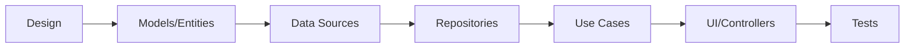

# Systems Architecture and Development Standards

## 🎯 Document Purpose
This document defines the complete technical standards, architecture principles, and development conventions for AI-assisted code generation. All code must strictly adhere to these specifications.

---

## 📋 Technology Stack Specifications

### Backend Stack
```yaml
runtime: Node.js
framework: Express
language: TypeScript
environment: dotenv

security:
  - cors (configured for Flutter client)
  - express-rate-limit (API protection)

logging: Custom logging solution or Winston

web_scraping:
  - axios (HTTP requests)
  - cheerio (HTML parsing)
  - puppeteer (browser automation)

utilities:
  - path (file paths)
  - fs (file system)

testing:
  framework: Jest
  coverage: Minimum 80%
  types: unit, integration, e2e
```

### Data Layer
```yaml
apis:
  - Google APIs (email access)
  
vector_database:
  type: Weaviate
  deployment: Docker containerized
  
backend_services:
  platform: Supabase
  management: Supabase CLI
  features: auth, database, storage
```

### Frontend Stack
```yaml
framework: Flutter SDK
language: Dart

architecture:
  pattern: Domain-Driven Design (DDD)
  layout: Feature-based modules
  
configuration:
  - .env support
  - Environment-specific configs

state_management:
  - flutter_bloc (primary)
  - equatable (state comparison)

ui_pattern:
  style: Cupertino (iOS-style)
  navigation: CupertinoTabView
  routing: Custom tab/view routing

networking:
  http_client: dio
  interceptors: auth, logging, retry

storage:
  local_db: hive_ce
  system: path_provider
  
utilities:
  - package_info_plus
  - file_picker
  - mime
  - flutter_slidable
  - cupertino_icons
```

### ⚠️ Prohibited Technologies
```yaml
forbidden:
  - dartz: NEVER use - adds unnecessary complexity
  reason: Clarity and maintainability over functional programming abstractions
```

---

## 🏗️ Architecture Principles

### 1. Layered Architecture (Clean Architecture)
```
┌─────────────────────────────────────────┐
│          Presentation Layer             │
│     (UI Components, Controllers)        │
├─────────────────────────────────────────┤
│           Domain Layer                  │
│    (Use Cases, Business Logic)          │
├─────────────────────────────────────────┤
│         Data/Infrastructure Layer       │
│   (Repositories, APIs, Databases)       │
└─────────────────────────────────────────┘
```

### 2. Core Principles
- **Separation of Concerns**: Each layer has distinct responsibilities
- **Dependency Rule**: Dependencies point inward (presentation → domain → data)
- **Testability First**: Design for testing from the start
- **SOLID Principles**: Apply consistently across all code

### 3. Domain-Driven Design Rules
- Features are self-contained modules
- Each feature contains: models, repositories, services, UI
- Shared logic goes in `core/` or `shared/` directories
- No cross-feature dependencies at the same architectural level

---

## 📁 Project Structure Standard

```
project-name/
├── client/                           # Flutter application
│   ├── lib/
│   │   ├── core/                    # Shared utilities, constants, themes
│   │   │   ├── constants/
│   │   │   ├── themes/
│   │   │   ├── utils/
│   │   │   └── widgets/
│   │   ├── features/                # Feature modules (DDD)
│   │   │   └── [feature_name]/
│   │   │       ├── data/
│   │   │       │   ├── datasources/
│   │   │       │   ├── models/
│   │   │       │   └── repositories/
│   │   │       ├── domain/
│   │   │       │   ├── entities/
│   │   │       │   ├── repositories/
│   │   │       │   └── usecases/
│   │   │       └── presentation/
│   │   │           ├── bloc/
│   │   │           ├── pages/
│   │   │           └── widgets/
│   │   └── main.dart
│   ├── test/
│   └── .env
│
├── server/                          # Node.js/Express backend
│   ├── src/
│   │   ├── controllers/            # Route handlers
│   │   ├── services/               # Business logic
│   │   ├── middleware/             # Auth, validation, logging
│   │   ├── models/                 # Data models
│   │   ├── repositories/           # Data access layer
│   │   ├── types/                  # TypeScript type definitions
│   │   ├── utils/                  # Helper functions
│   │   └── index.ts               # Entry point
│   ├── config/                     # Configuration files
│   │   ├── database.ts
│   │   ├── server.ts
│   │   └── services.ts
│   ├── tests/
│   │   ├── unit/
│   │   ├── integration/
│   │   └── e2e/
│   ├── .env
│   └── package.json
│
├── shared/                         # Shared types/interfaces
│   └── types/
│
├── docker-compose.yml              # Container orchestration
└── README.md
```

---

## 🔧 Development Workflow

### 1. Feature Development Process


### 2. Implementation Order
1. **High-Level Design**: Architecture diagrams, API contracts
2. **Data Layer**: Models, data sources, repositories
3. **Domain Layer**: Entities, use cases, business rules
4. **Infrastructure Tests**: Unit and integration tests
5. **Presentation Layer**: UI components, state management
6. **End-to-End Tests**: Full feature validation

---

## 🌐 Network and Deployment Standards

### Port Allocation
```yaml
development:
  backend_ports: 8090-8999
  frontend_ports: 3000-3999
  database_ports: 5432, 5433 (PostgreSQL)
  vector_db_ports: 8080 (Weaviate)
  
production:
  use_environment_variables: true
  reverse_proxy: nginx/traefik
```

### IP Configuration
```yaml
localhost_ranges:
  development: 192.168.100.0/24
  docker_network: 172.17.0.0/16
  
startup_requirements:
  - Log all bound IP addresses
  - Display active port ranges
  - Check for port conflicts
  - Validate environment variables
```

### Server Startup Script Template
```typescript
// Required in every server startup
console.log('=== Server Configuration ===');
console.log(`Environment: ${process.env.NODE_ENV}`);
console.log(`Port: ${PORT}`);
console.log(`Bound IPs: ${getNetworkInterfaces()}`);
console.log(`Database: ${process.env.DATABASE_URL ? 'Connected' : 'Not configured'}`);
```

---

## 💻 Code Standards

### TypeScript Configuration
```json
{
  "compilerOptions": {
    "target": "ES2022",
    "module": "commonjs",
    "strict": true,
    "esModuleInterop": true,
    "skipLibCheck": true,
    "forceConsistentCasingInFileNames": true,
    "resolveJsonModule": true,
    "declaration": true,
    "outDir": "./dist",
    "rootDir": "./src"
  }
}
```

### Naming Conventions
```typescript
// Files
feature-name.controller.ts    // Controllers
feature-name.service.ts       // Services
feature-name.repository.ts    // Repositories
feature-name.model.ts         // Models

// Classes & Interfaces
class UserController {}       // PascalCase
interface IUserService {}     // Interface prefix with 'I'

// Functions & Variables
const getUserById = () => {}  // camelCase
const MAX_RETRY_COUNT = 3;    // UPPER_SNAKE_CASE for constants
```

### Error Handling Pattern
```typescript
// Always use custom error classes
class AppError extends Error {
  constructor(
    public statusCode: number,
    public message: string,
    public isOperational = true
  ) {
    super(message);
  }
}

// Consistent error responses
{
  success: false,
  error: {
    message: string,
    code: string,
    details?: any
  }
}
```

---

## 🧪 Testing Requirements

### Test Structure
```typescript
describe('FeatureName', () => {
  describe('ComponentName', () => {
    it('should perform expected behavior', () => {
      // Arrange
      // Act
      // Assert
    });
  });
});
```

### Coverage Requirements
- Unit Tests: 80% minimum
- Integration Tests: Critical paths
- E2E Tests: User journeys

### Testing Libraries
- Backend: Jest, Supertest
- Frontend: flutter_test, mocktail

---

## 📝 Documentation Standards

### Code Documentation
```typescript
/**
 * @description Retrieves user by ID from database
 * @param {string} userId - Unique user identifier
 * @returns {Promise<User>} User object
 * @throws {NotFoundError} When user doesn't exist
 */
async function getUserById(userId: string): Promise<User> {
  // Implementation
}
```

### API Documentation
- Document all endpoints, parameters, responses
- Include example requests/responses
- Maintain API documentation in markdown format

---

## 🚀 Deployment Checklist

### Pre-deployment
- [ ] All tests passing
- [ ] Environment variables configured
- [ ] Database migrations run
- [ ] API documentation updated
- [ ] Security headers configured
- [ ] Rate limiting enabled

### Container Requirements
```yaml
docker-compose:
  version: '3.8'
  services:
    backend:
      build: ./server
      environment:
        - NODE_ENV=production
      healthcheck:
        test: ["CMD", "curl", "-f", "http://localhost:8090/health"]
    
    weaviate:
      image: semitechnologies/weaviate:latest
      environment:
        - PERSISTENCE_DATA_PATH=/var/lib/weaviate
```

---

## 🔒 Security Standards

### Required Security Measures
1. **Authentication**: JWT with refresh tokens
2. **Authorization**: Role-based access control (RBAC)
3. **Input Validation**: Sanitize all inputs
4. **Rate Limiting**: Configure per endpoint
5. **CORS**: Whitelist specific origins
6. **HTTPS**: Required in production
7. **Environment Variables**: Never commit secrets

### Security Headers
```typescript
app.use(helmet({
  contentSecurityPolicy: {
    directives: {
      defaultSrc: ["'self'"],
      styleSrc: ["'self'", "'unsafe-inline'"]
    }
  }
}));
```

---

## 📊 Monitoring and Logging

### Logging Standards
```typescript
// Log levels: error, warn, info, debug
logger.info('Server started', {
  port: PORT,
  environment: NODE_ENV,
  timestamp: new Date().toISOString()
});
```

### Required Metrics
- Response times
- Error rates
- Database query performance
- API usage by endpoint

---

## ⚡ Performance Guidelines

### Backend Optimization
- Use database indexes
- Implement caching (Redis)
- Paginate large datasets
- Use connection pooling

### Frontend Optimization
- Lazy load features
- Optimize images
- Minimize bundle size
- Use state management efficiently

---

## 🎨 UI/UX Standards

### Flutter Specific
- Follow Cupertino design guidelines
- Consistent spacing: 8, 16, 24, 32
- Error states for all screens
- Loading indicators for async operations
- Accessibility: Screen readers, contrast ratios

---

## 🔄 Version Control

### Git Workflow
```bash
main (production)
├── develop (staging)
    └── feature/feature-name
    └── bugfix/bug-description
    └── hotfix/critical-fix
```

### Commit Convention
```
type(scope): subject

body (optional)

footer (optional)
```

Types: feat, fix, docs, style, refactor, test, chore

---

## 📚 References

- **Clean Architecture**: Follow Uncle Bob's principles
- **DDD**: Eric Evans' Domain-Driven Design
- **SOLID**: Apply all five principles
- **12-Factor App**: For cloud-native applications

---

## ⚠️ Critical Reminders

1. **NEVER use dartz package** - Complexity over clarity
2. **Always implement proper error handling**
3. **Test infrastructure before domain logic**
4. **Document breaking changes**
5. **Security is not optional**
6. **Performance monitoring from day one**

---

## 🤖 AI Code Generation Instructions

When generating code:
1. Always follow the exact project structure
2. Use specified technology stack only
3. Implement proper error handling
4. Include appropriate tests
5. Add comprehensive documentation
6. Follow naming conventions strictly
7. Respect the layered architecture
8. Never introduce forbidden dependencies