# ROME Framework - Phase Data Flow

**Document UID:** ROME-FLOW-001
**Date:** 2026-01-07
**Purpose:** Visual representation of data flow through ROME phases

---

## Complete Phase Data Flow Diagram

```mermaid
flowchart TD
    %% External Inputs
    USER[User Requirements<br/>PRD, BRD, Ideas]

    %% Phase 0: Bootstrap
    P0[P0: BOOTSTRAP<br/>Agent: Bootstrap]
    P0_OUT[Output:<br/>• Project structure<br/>• ARTIFACTS/ folder<br/>• SOURCE/ folder<br/>• _user_input/ folder]

    USER --> P0
    P0 -->|"Operations:<br/>• Create directories<br/>• Initialize structure"| P0_OUT

    %% Phase 1: AORDL
    P1[P1: AORDL REQUIREMENTS<br/>Agent: Talib P1]
    P1_IN[Input:<br/>• User needs<br/>• PRD/BRD docs<br/>• Business requirements]
    P1_OPS[Operations:<br/>• Create AORDL requirements<br/>• Validate 13 required fields<br/>• Transform to BDD format]
    P1_OUT[Output:<br/>• ARTIFACTS/_requirements/aordl/*.yaml<br/>• AORDL requirement files<br/>• BDD test scenarios]

    P0_OUT --> P1_IN
    P1_IN --> P1
    P1 --> P1_OPS
    P1_OPS --> P1_OUT

    %% Quality Gate P1→P2
    QG12{Sarah Quality Gate<br/>P1→P2<br/>AORDL Valid?}
    P1_OUT --> QG12
    QG12 -->|BLOCK| P1
    QG12 -->|APPROVE| P2_IN

    %% Phase 2: Analysis
    P2[P2: ANALYSIS<br/>Agent: Talib P2]
    P2_IN[Input:<br/>• ARTIFACTS/_requirements/aordl/*.yaml<br/>• AORDL requirements]
    P2_OPS[Operations:<br/>• Analyze requirements<br/>• Extract entities<br/>• Identify dependencies<br/>• Decompose features<br/>• Generate user stories]
    P2_OUT[Output:<br/>• ARTIFACTS/_analysis/entities.md<br/>• ARTIFACTS/_analysis/dependencies.md<br/>• ARTIFACTS/_analysis/user-stories.md<br/>• Entity models<br/>• Data relationships]

    P2_IN --> P2
    P2 --> P2_OPS
    P2_OPS --> P2_OUT

    %% Quality Gate P2→P3
    QG23{Sarah Quality Gate<br/>P2→P3<br/>Analysis Complete?}
    P2_OUT --> QG23
    QG23 -->|BLOCK| P2
    QG23 -->|APPROVE| P3_IN

    %% Phase 3: Design
    P3[P3: DESIGN<br/>Agents: PMA, Clara]
    P3_IN[Input:<br/>• ARTIFACTS/_analysis/entities.md<br/>• ARTIFACTS/_analysis/dependencies.md<br/>• Entity models]
    P3_OPS_PMA[PMA Operations:<br/>• Design architecture<br/>• Define API endpoints<br/>• Design data models<br/>• Design authentication<br/>• Define tech stack]
    P3_OPS_CLARA[Clara Operations:<br/>• Validate designs<br/>• Check completeness<br/>• Verify data dictionary<br/>• Ensure consistency]
    P3_OUT[Output:<br/>• ARTIFACTS/_design/architecture.md<br/>• ARTIFACTS/_design/api-spec.yaml<br/>• ARTIFACTS/_design/data-dictionary.md<br/>• ARTIFACTS/_design/tech-stack.yaml<br/>• Architecture diagrams<br/>• Component designs]

    P3_IN --> P3
    P3 --> P3_OPS_PMA
    P3_OPS_PMA --> P3_OPS_CLARA
    P3_OPS_CLARA --> P3_OUT

    %% Quality Gate P3→P4
    QG34{Sarah Quality Gate<br/>P3→P4<br/>Design Valid?<br/>Data Dictionary OK?}
    P3_OUT --> QG34
    QG34 -->|BLOCK| P3
    QG34 -->|APPROVE| P4_IN

    %% Phase 4: Configuration
    P4[P4: CONFIGURATION<br/>Agent: Lucien]
    P4_IN[Input:<br/>• ARTIFACTS/_design/architecture.md<br/>• ARTIFACTS/_design/tech-stack.yaml<br/>• ARTIFACTS/_design/data-dictionary.md]
    P4_OPS[Operations:<br/>• Scaffold workspace<br/>• Configure build system<br/>• Setup test framework<br/>• Create project structure<br/>• Generate tech specs<br/>• Setup CI/CD]
    P4_OUT[Output:<br/>• ARTIFACTS/_config/workspace.yaml<br/>• ARTIFACTS/_config/build-config.json<br/>• ARTIFACTS/_config/scaffolding-manifest.json<br/>• SOURCE/ directories<br/>• Build tools configured<br/>• Test framework ready]

    P4_IN --> P4
    P4 --> P4_OPS
    P4_OPS --> P4_OUT

    %% Quality Gate P4→P5
    QG45{Sarah Quality Gate<br/>P4→P5<br/>Workspace Ready?<br/>Config Valid?}
    P4_OUT --> QG45
    QG45 -->|BLOCK| P4
    QG45 -->|APPROVE| P5_IN

    %% Phase 5: Generation (Parallel)
    P5_IN[Input:<br/>• ARTIFACTS/_config/scaffolding-manifest.json<br/>• ARTIFACTS/_design/api-spec.yaml<br/>• ARTIFACTS/_design/data-dictionary.md<br/>• All previous artifacts]

    P5_ASHOK[P5A: BACKEND<br/>Agent: Ashok]
    P5_ASHOK_OPS[Operations:<br/>• Generate database schema<br/>• Generate ORM models<br/>• Generate API endpoints<br/>• Generate auth middleware<br/>• Generate seed data]
    P5_ASHOK_OUT[Output:<br/>• SOURCE/src/backend/models/<br/>• SOURCE/src/backend/controllers/<br/>• SOURCE/src/backend/middleware/<br/>• SOURCE/migrations/<br/>• SOURCE/seeds/]

    P5_REENA[P5B: FRONTEND<br/>Agent: Reena]
    P5_REENA_OPS[Operations:<br/>• Generate UI screens<br/>• Generate UI components<br/>• Generate state management<br/>• Generate API client<br/>• Generate routing]
    P5_REENA_OUT[Output:<br/>• SOURCE/src/frontend/screens/<br/>• SOURCE/src/frontend/components/<br/>• SOURCE/src/frontend/state/<br/>• SOURCE/src/frontend/services/]

    P5_CHARLIE[P5C: INTEGRATION<br/>Agent: Charlie]
    P5_CHARLIE_OPS[Operations:<br/>• Generate API integration<br/>• Generate E2E tests<br/>• Generate integration tests<br/>• Wire components together<br/>• Generate test data]
    P5_CHARLIE_OUT[Output:<br/>• SOURCE/tests/e2e/<br/>• SOURCE/tests/integration/<br/>• test data fixtures<br/>• Integration wiring]

    P5_IN --> P5_ASHOK
    P5_IN --> P5_REENA
    P5_IN --> P5_CHARLIE

    P5_ASHOK --> P5_ASHOK_OPS
    P5_ASHOK_OPS --> P5_ASHOK_OUT

    P5_REENA --> P5_REENA_OPS
    P5_REENA_OPS --> P5_REENA_OUT

    P5_CHARLIE --> P5_CHARLIE_OPS
    P5_CHARLIE_OPS --> P5_CHARLIE_OUT

    %% Convergence
    P5_OUT[Combined Output:<br/>• SOURCE/src/backend/<br/>• SOURCE/src/frontend/<br/>• SOURCE/tests/<br/>• Complete application code]

    P5_ASHOK_OUT --> P5_OUT
    P5_REENA_OUT --> P5_OUT
    P5_CHARLIE_OUT --> P5_OUT

    %% Quality Gate P5→Done
    QG5D{Sarah Quality Gate<br/>P5→DONE<br/>Code Valid?<br/>Tests Pass?<br/>Traceability OK?}
    P5_OUT --> QG5D
    QG5D -->|BLOCK| P5_IN
    QG5D -->|APPROVE| DONE

    %% Final Output
    DONE[DELIVERABLE:<br/>Working Application<br/>• Complete codebase<br/>• Passing tests<br/>• Full traceability<br/>• Documentation]

    %% Styling
    classDef phaseStyle fill:#4A90E2,stroke:#2E5C8A,stroke-width:2px,color:#fff
    classDef inputStyle fill:#E8F4F8,stroke:#4A90E2,stroke-width:1px
    classDef outputStyle fill:#D4EDDA,stroke:#28A745,stroke-width:1px
    classDef opsStyle fill:#FFF3CD,stroke:#FFC107,stroke-width:1px
    classDef qgStyle fill:#F8D7DA,stroke:#DC3545,stroke-width:2px
    classDef doneStyle fill:#28A745,stroke:#1E7E34,stroke-width:3px,color:#fff

    class P0,P1,P2,P3,P4,P5_ASHOK,P5_REENA,P5_CHARLIE phaseStyle
    class P0_OUT,P1_IN,P2_IN,P3_IN,P4_IN,P5_IN inputStyle
    class P1_OUT,P2_OUT,P3_OUT,P4_OUT,P5_ASHOK_OUT,P5_REENA_OUT,P5_CHARLIE_OUT,P5_OUT outputStyle
    class P1_OPS,P2_OPS,P3_OPS_PMA,P3_OPS_CLARA,P4_OPS,P5_ASHOK_OPS,P5_REENA_OPS,P5_CHARLIE_OPS opsStyle
    class QG12,QG23,QG34,QG45,QG5D qgStyle
    class DONE doneStyle
```



---

## Data Flow Summary

### Phase-by-Phase Handovers

| From Phase | To Phase | Handover Artifacts | Quality Gate |
|------------|----------|-------------------|--------------|
| P0 (Bootstrap) | P1 (AORDL) | Project structure, ARTIFACTS/ folder, SOURCE/ folder | None |
| P1 (AORDL) | P2 (Analysis) | ARTIFACTS/_requirements/aordl/*.yaml (AORDL files) | Sarah validates AORDL structure |
| P2 (Analysis) | P3 (Design) | ARTIFACTS/_analysis/entities.md, dependencies.md, user-stories.md | Sarah validates analysis completeness |
| P3 (Design) | P4 (Config) | ARTIFACTS/_design/architecture.md, api-spec.yaml, data-dictionary.md | Sarah validates design + data dictionary |
| P4 (Config) | P5 (Generation) | ARTIFACTS/_config/scaffolding-manifest.json, SOURCE/ scaffolded | Sarah validates workspace configuration |
| P5 (Generation) | Done | SOURCE/ (complete codebase, tests) | Sarah validates code + tests + traceability |

### Operations Per Phase

**P0 - Bootstrap:**
- Create directory structure (ARTIFACTS/, SOURCE/, _user_input/)
- Create ARTIFACTS subdirectories (_requirements/, _analysis/, _design/, _config/)
- Initialize project configuration

**P1 - AORDL (Talib P1):**
- Capture requirements in AORDL format (13 required fields)
- Validate AORDL syntax
- Transform to BDD scenarios
- Store in ARTIFACTS/_requirements/aordl/*.yaml

**P2 - Analysis (Talib P2):**
- Parse AORDL requirements
- Extract entities and relationships
- Identify dependencies between requirements
- Decompose into functional units
- Generate user stories
- Store in ARTIFACTS/_analysis/

**P3 - Design (PMA + Clara):**
- PMA: Design system architecture
- PMA: Define API endpoints and data models
- PMA: Design authentication, error handling, logging
- PMA: Create data dictionary
- Clara: Validate design completeness
- Clara: Check data dictionary consistency
- Store in ARTIFACTS/_design/

**P4 - Configuration (Lucien):**
- Scaffold workspace based on tech stack
- Configure build system (package.json, etc.)
- Setup test framework (Jest, Pytest, etc.)
- Generate scaffolding manifest
- Setup CI/CD pipelines
- Store in ARTIFACTS/_config/ and scaffold SOURCE/

**P5 - Generation (Ashok + Reena + Charlie, Parallel):**
- Ashok: Generate backend (models, controllers, middleware, migrations)
- Reena: Generate frontend (screens, components, state management)
- Charlie: Generate integration layer (API client, tests, wiring)
- Store in SOURCE/src/backend/, SOURCE/src/frontend/, SOURCE/tests/

**QA - Sarah (All Gates):**
- Gate P1→P2: Validate AORDL structure
- Gate P2→P3: Validate requirements coverage
- Gate P3→P4: Validate design completeness + data dictionary
- Gate P4→P5: Validate workspace configuration
- Gate P5→Done: Validate code generation + tests + traceability

---

## Artifact Types

### Input Types
- **User Requirements:** Natural language, PRD, BRD
- **AORDL Files:** Structured YAML requirements (13 fields)
- **Analysis Artifacts:** Entity models, dependency graphs, user stories
- **Design Artifacts:** Architecture docs, API specs, data dictionary
- **Configuration:** Scaffolding manifests, build configs

### Output Types
- **Requirements:** AORDL YAML files, BDD scenarios
- **Analysis:** Entity models, dependency maps, functional decomposition
- **Design:** Architecture diagrams, API specifications, data dictionary
- **Configuration:** Project structure, build configs, test framework
- **Code:** Backend models/controllers, frontend components/screens, integration tests
- **Tests:** Unit tests, integration tests, E2E tests

### Artifact Locations
```
project/
├── _user_input/              # P0 created (user provides PRDs/BRDs)
│   └── raw-requirements/
├── ARTIFACTS/                # P0 created (workflow artifacts)
│   ├── _requirements/        # P1 output
│   │   └── aordl/
│   │       └── REQ-*.yaml
│   ├── _analysis/            # P2 output
│   │   ├── entities.md
│   │   ├── dependencies.md
│   │   └── user-stories.md
│   ├── _design/              # P3 output
│   │   ├── architecture.md
│   │   ├── api-spec.yaml
│   │   ├── data-dictionary.md
│   │   └── tech-stack.yaml
│   └── _config/              # P4 output
│       ├── workspace.yaml
│       ├── build-config.json
│       └── scaffolding-manifest.json
└── SOURCE/                   # P4 scaffolded, P5 populated
    ├── src/
    │   ├── backend/
    │   └── frontend/
    └── tests/
        ├── unit/
        ├── integration/
        └── e2e/
```

---

## Parallel Execution

### P5 Generation Agents Run Concurrently

```
Time →

     Ashok  ████████████████  (Backend generation)

     Reena  ██████████████████  (Frontend generation)

     Charlie ████████████  (Integration + Tests)
              ↓
           Merge outputs → Sarah validation → Done
```

**Dependencies:**
- **Ashok (Backend)** runs first: Creates database schema and API specifications
- **Reena (Frontend)** starts after Ashok completes: Builds against Ashok's API specs
- **Charlie (Integration)** starts after both complete: Integrates backend + frontend, generates tests
- All outputs converge before Sarah's final validation

**Parallelization:** Within each agent's layer, work can be parallelized across multiple features/stories.

---

## Traceability Chain

```
_user_input/raw-requirements/user-requirements.md (User Requirement)
    ↓
ARTIFACTS/_requirements/REQ-001.yaml (AORDL Requirement)
    ↓
ARTIFACTS/_analysis/entities.md (User entity)
    ↓
ARTIFACTS/_design/api-spec.yaml (User API spec)
    ↓
ARTIFACTS/_config/scaffolding-manifest.json (User model scaffold)
    ↓
SOURCE/src/backend/models/User.model.ts
SOURCE/src/backend/controllers/UserController.ts
SOURCE/src/frontend/screens/UserScreen.tsx
    ↓
SOURCE/tests/user.test.ts
SOURCE/tests/user-integration.test.ts
```

Sarah validates this traceability chain at final quality gate.

---

**End of Data Flow Documentation**
