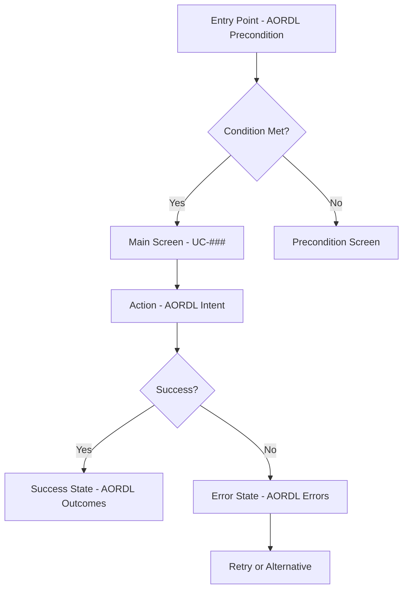

# Design Validation Skill

## Purpose

Clara's primary responsibility: transform use cases into visual designs that enable P5 robots to implement UI without design ambiguity.

## When to Use

Invoke this skill when:
- **Creating design system**: Validate colors, typography, components
- **Creating wireframes**: Validate screen layouts against use cases
- **Creating user flows**: Validate journeys against AORDL Actor and Intent
- **Creating accessibility specs**: Validate WCAG compliance
- **Creating mockups**: Validate visual specifications
- **Before handoff to PMA**: Self-validate deliverables

## Quick Reference

### Clara's P3 Deliverables

```
ARTIFACTS/dev/design/
├── design-system.md       # Colors, typography, spacing, components
├── wireframes/            # Low-fidelity screen layouts
├── user-flows.md          # Visual user journey maps (Mermaid)
├── accessibility.md       # WCAG compliance guidelines
└── mockups/               # High-fidelity mockups or descriptions
```

---

## Validation Checklist 1: Design System

### ✅ Color Palette Validation

- [ ] **Primary color defined** with light/dark variants
- [ ] **Secondary color defined** with light/dark variants
- [ ] **Neutral grays** (at least 5 shades: 50, 100, 500, 700, 900)
- [ ] **Semantic colors** (Success, Warning, Error, Info)
- [ ] **Contrast ratios meet WCAG AA**:
  - Text on primary: ≥ 4.5:1
  - Text on secondary: ≥ 4.5:1
  - Large text: ≥ 3:1
- [ ] **No hardcoded colors** outside design system

**AORDL Link**: NonFunctional.Usability → Accessibility color requirements

### ✅ Typography Validation

- [ ] **Font family specified** (web-safe or with fallbacks)
- [ ] **Heading hierarchy defined** (H1-H4 minimum)
- [ ] **Body text variants** (Large, Base, Small)
- [ ] **Font sizes use rem/em** (not px) for accessibility
- [ ] **Line heights specified** (1.5 for body, 1.2 for headings)
- [ ] **Font weights defined** (Regular, Semibold, Bold)

**AORDL Link**: NonFunctional.Usability → Readability requirements

### ✅ Spacing System Validation

- [ ] **Base unit defined** (typically 4px or 8px)
- [ ] **Spacing scale consistent** (xs, sm, md, lg, xl, 2xl, 3xl)
- [ ] **No magic numbers** (all spacing from scale)
- [ ] **Responsive spacing considered** (mobile vs desktop)

### ✅ Component Validation

- [ ] **Button states defined** (default, hover, active, disabled, loading)
- [ ] **Button sizes defined** (Small, Medium, Large)
- [ ] **Input field states** (default, focus, error, disabled)
- [ ] **Card component defined** (padding, border, shadow)
- [ ] **All interactive components have 44x44px minimum** (WCAG touch target)

**AORDL Link**: NonFunctional.Usability → Interaction design requirements

---

## Validation Checklist 2: Wireframes

### ✅ Coverage Validation

- [ ] **Every UC-### has wireframe** (100% use case coverage)
- [ ] **Every AORDL Actor role represented** (role-specific screens)
- [ ] **Every screen referenced in use-cases.md has wireframe**

**AORDL Link**: Actor → Screen access, Intent → Screen purpose

### ✅ Screen Layout Validation

- [ ] **Screen title/heading clear**
- [ ] **Primary action visible** (maps to AORDL Intent)
- [ ] **Navigation elements present** (header, sidebar, breadcrumbs)
- [ ] **Data display areas identified** (tables, lists, cards)
- [ ] **Form fields mapped to data-dictionary.yaml**
- [ ] **Empty states designed** (AORDL Preconditions not met)
- [ ] **Loading states designed**
- [ ] **Error states designed** (AORDL Errors)

**AORDL Link**: Intent → Primary action, Outcomes → Success feedback

### ✅ Form Wireframe Validation

- [ ] **All fields from data-dictionary.yaml included**
- [ ] **Required fields marked** (AORDL Invariants)
- [ ] **Field labels clear** (no technical jargon)
- [ ] **Field validation indicators** (inline error space)
- [ ] **Submit button labeled** (action verb from AORDL Intent)
- [ ] **Cancel/back action present**

**AORDL Link**: Invariants → Validation rules, Errors → Field errors

### ✅ Mobile Responsiveness (if platform=mobile/web)

- [ ] **Touch targets ≥ 44x44px** (WCAG)
- [ ] **Forms single-column on mobile**
- [ ] **Navigation adapted for mobile** (hamburger menu, bottom nav)
- [ ] **Content readable without zoom**

---

## Validation Checklist 3: User Flows

### ✅ Flow Completeness

- [ ] **Every AORDL Actor has flow diagram**
- [ ] **Every UC-### included in flows**
- [ ] **Happy path documented** (AORDL Outcomes achieved)
- [ ] **Alternative paths documented** (AORDL Preconditions, Errors)
- [ ] **Entry points identified** (AORDL Preconditions)
- [ ] **Exit points identified** (AORDL Postconditions)

**AORDL Link**: Actor → Role-based flows, Intent → User actions

### ✅ Flow Diagram Quality



**Validation:**
- [ ] **Nodes labeled with UC-### or REQ-###**
- [ ] **Decision points reflect AORDL conditions**
- [ ] **Success paths lead to AORDL Outcomes**
- [ ] **Error paths lead to AORDL Error handling**
- [ ] **All paths terminate** (no infinite loops)

### ✅ Role-Based Flow Validation

- [ ] **Different flows for different AORDL Actors**
- [ ] **Role permissions reflected** (show/hide screens)
- [ ] **Handoff between roles documented**

**AORDL Link**: Actor → Role differentiation

---

## Validation Checklist 4: Accessibility

### ✅ WCAG Compliance Level

Determine from AORDL NonFunctional.Usability:
- [ ] **WCAG Level A** (minimum)
- [ ] **WCAG Level AA** (recommended)
- [ ] **WCAG Level AAA** (stringent)

### ✅ Visual Accessibility

- [ ] **Color contrast ratios specified** (4.5:1 for text, 3:1 for large text)
- [ ] **Color not sole indicator** (use icons + text)
- [ ] **Focus indicators visible** (2px outline minimum)
- [ ] **Text resizable to 200%** without loss of functionality

### ✅ Interactive Accessibility

- [ ] **Keyboard navigation order documented**
- [ ] **Focus management in modals/dialogs**
- [ ] **Touch targets ≥ 44x44px** (mobile)
- [ ] **Click targets ≥ 24x24px** (desktop)
- [ ] **Disabled state visually distinct**

### ✅ Screen Reader Support

- [ ] **ARIA labels specified for interactive elements**
- [ ] **Heading hierarchy logical** (H1 → H2 → H3)
- [ ] **Form labels associated with inputs**
- [ ] **Error messages announced** (role="alert")
- [ ] **Loading states announced**

### ✅ Accessible Forms

- [ ] **Field labels visible** (not placeholder-only)
- [ ] **Required fields indicated** (not color-only)
- [ ] **Error messages descriptive** (not just "Invalid")
- [ ] **Error summary at top of form**
- [ ] **Success feedback announced**

**AORDL Link**: NonFunctional.Usability → Accessibility requirements

---

## Validation Checklist 5: Mockups

### ✅ Visual Specification Completeness

- [ ] **Every wireframe has mockup or description**
- [ ] **Design system colors applied**
- [ ] **Design system typography applied**
- [ ] **Design system spacing applied**
- [ ] **Component states shown** (hover, focus, active)

### ✅ Interaction States

- [ ] **Button hover state designed**
- [ ] **Button loading state designed** (spinner or skeleton)
- [ ] **Form focus state designed**
- [ ] **Form error state designed** (field highlight + message)
- [ ] **Form success state designed** (checkmark, confirmation)

### ✅ Feedback Mechanisms

- [ ] **Success messages designed** (AORDL Outcomes)
- [ ] **Error messages designed** (AORDL Errors)
- [ ] **Loading indicators designed**
- [ ] **Progress indicators designed** (if multi-step)
- [ ] **Confirmation dialogs designed**

**AORDL Link**: Outcomes → Success feedback, Errors → Error messages

---

## Common Anti-Patterns to Avoid

### ❌ Design System Anti-Patterns

- **Inconsistent naming**: Use semantic names (primary, secondary) not visual names (blue, red)
- **Too many variants**: Limit to 2-3 button styles, avoid bloat
- **No accessibility consideration**: Always check contrast ratios
- **Hardcoded values**: Use design tokens, not magic numbers

### ❌ Wireframe Anti-Patterns

- **Too high-fidelity**: Wireframes should be low-fi (boxes and labels)
- **Missing states**: Always show empty, loading, error states
- **No annotations**: Label key elements with UC-### references
- **Ignoring data-dictionary**: Form fields must match data model

### ❌ User Flow Anti-Patterns

- **No error paths**: Users don't always succeed, show alternatives
- **No entry/exit points**: Flows need clear start and end
- **Missing role differentiation**: Different actors see different flows
- **No AORDL traceability**: Flows must link to UC-###, REQ-###

### ❌ Accessibility Anti-Patterns

- **Color-only indicators**: Add icons or text
- **Too small touch targets**: Mobile minimum 44x44px
- **No keyboard support**: All actions must be keyboard-accessible
- **Missing ARIA labels**: Screen readers need semantic labels

---

## AORDL-to-Design Mapping

### AORDL Actor → Design

| AORDL Actor | Design Impact |
|-------------|---------------|
| Specific role (e.g., "ProjectManager") | Role-based screens, navigation menus, permissions UI |
| Multiple actors | Different user flows, role switcher if needed |

### AORDL Intent → Design

| AORDL Intent | Design Impact |
|--------------|---------------|
| "create project" | Screen with form, "Create" button, success confirmation |
| "view dashboard" | Screen layout with data widgets, navigation to dashboard |
| "approve request" | Approval workflow UI, approve/reject buttons |

### AORDL Outcomes → Design

| AORDL Outcomes | Design Impact |
|----------------|---------------|
| "Project created with ID" | Success message with project ID displayed |
| "User redirected to dashboard" | Navigation transition, breadcrumb update |

### AORDL Preconditions → Design

| AORDL Preconditions | Design Impact |
|---------------------|---------------|
| "User logged in" | Login screen, auth guards, session timeout UI |
| "Project exists" | Empty state if no projects, "Create first project" CTA |

### AORDL Invariants → Design

| AORDL Invariants | Design Impact |
|--------------------|---------------|
| "Name must be 3-50 chars" | Character counter, inline validation |
| "Email must be unique" | Real-time validation, error message |

### AORDL Errors → Design

| AORDL Errors | Design Impact |
|--------------|---------------|
| "Network timeout" | Retry button, offline mode indicator |
| "Invalid credentials" | Inline error on login form, "Forgot password" link |

---

## Self-Validation Workflow

### Before Creating Deliverable

1. **Read inputs**:
   ```bash
   Read: ARTIFACTS/dev/design/use-cases.md
   Read: ARTIFACTS/dev/design/data-dictionary.yaml
   Read: ARTIFACTS/dev/design/tech-stack.md
   ```

2. **Identify platform** (web/mobile/desktop)

3. **Identify AORDL Actors** (from use-cases.md)

4. **List all UC-###** requiring design

### While Creating Deliverable

1. **Use design-system.md** for all visual decisions
2. **Reference use-cases.md** for screen requirements
3. **Reference data-dictionary.yaml** for form fields
4. **Annotate with UC-### and REQ-###** for traceability

### After Creating Deliverable

1. **Run validation checklist** (above)
2. **Check 100% UC-### coverage**
3. **Check accessibility compliance**
4. **Log completion** to activity log

### Example Self-Validation

```yaml
timestamp: 2025-12-29T18:00:00Z
robot: Clara
phase: P3
action: COMPLETED
artifact: ARTIFACTS/dev/design/wireframes/
description: |
  Created wireframes for all 25 use cases (UC-001 to UC-025).
  Validation results:
  - ✓ 100% UC coverage (25/25)
  - ✓ All screens have empty/loading/error states
  - ✓ Touch targets ≥ 44x44px (mobile platform)
  - ✓ Form fields match data-dictionary.yaml
  - ✓ AORDL traceability annotations present
status: SUCCESS
next_robot: PMA
```

---

## Integration with PMA

Clara reports to PMA, not directly to quality gates.

### Handoff to PMA

When deliverables complete:

```markdown
# Clara → PMA Handoff

**Date**: 2025-12-29T18:00:00Z

## Deliverables Completed

- ✓ design-system.md (colors, typography, 8 components)
- ✓ wireframes/ (25 screens for UC-001 to UC-025)
- ✓ user-flows.md (5 user journeys, 3 role-based flows)
- ✓ accessibility.md (WCAG AA compliance guidelines)
- ✓ mockups/ (descriptions for 10 key screens)

## Validation Summary

- UC coverage: 100% (25/25)
- AORDL traceability: Complete (all screens link to UC/REQ)
- Accessibility: WCAG AA compliant
- Platform: Mobile-first responsive web

## For Charlie (P5)

All visual specifications ready for implementation:
- Use design-system.md for all styling decisions
- Reference wireframes/ for screen layouts
- Follow accessibility.md for WCAG compliance
- Check mockups/ for interaction details

## Open Items

None - all design work complete.
```

**PMA decides** when to request GATE-P3 (Clara does not request gates).

---

## Related Skills

- `activity-logging` - Log design progress
- `rome-protocols` - ROME framework compliance
- `ui-design-patterns` - Cross-platform design patterns

---

**Skill Version**: 1.0.0
**Last Updated**: 2025-12-29
**Robot**: Clara only
**Priority**: HIGH
