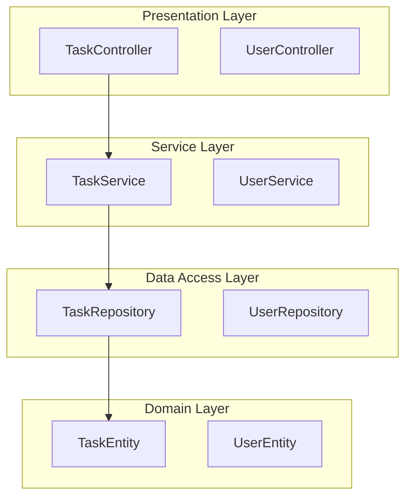

# /rome-p3:architecture

Generate system architecture diagrams from design artifacts.

## Metadata
- **Command ID**: rome-p3:architecture
- **Version**: 1.0.0
- **Phase**: P3 (Design)
- **Agent**: PMA
- **Plugin**: rome-p3-design@1.0.0

## Description

Generates visual architecture diagrams in Mermaid format from P3 design artifacts. Supports layered architecture diagrams, deployment diagrams, and data flow diagrams. Used by PMA during Step 10 (System Architecture) of the P3 workflow.

## Usage

### Generate Layered Architecture Diagram

```bash
/rome-p3:architecture --diagram_type layered
```

### Generate Deployment Diagram

```bash
/rome-p3:architecture --diagram_type deployment
```

### Generate Data Flow Diagram

```bash
/rome-p3:architecture --diagram_type dataflow
```

## Parameters

### Required
- `component_structure_file` (string): Path to component structure JSON
  - Default: `ARTIFACTS/03-design/architecture/components.json`

### Optional
- `diagram_type` (string): Type of diagram to generate
  - Options: `layered`, `deployment`, `dataflow`
  - Default: `layered`
- `output_file` (string): Output path for Mermaid diagram
  - Default: `ARTIFACTS/03-design/architecture/system-diagram.mmd`

## Diagram Types

### Layered Diagram
Visualizes architectural layers:
- **Presentation Layer**: Controllers
- **Service Layer**: Business Logic
- **Data Access Layer**: Repositories
- **Domain Layer**: Entities, DTOs

Shows component dependencies across layers.

### Deployment Diagram
Visualizes infrastructure topology:
- Client Application
- Load Balancer
- API Server
- Database
- Cache

Shows deployment architecture and network topology.

### Data Flow Diagram
Visualizes data transformations:
- Shows data flow between components
- Documents transformation steps
- Traces data lineage

## Inputs

- `ARTIFACTS/03-design/architecture/components.json` - Component structure

## Outputs

- Mermaid diagram syntax (`.mmd` file)
- Can be visualized with Seez MCP server
- Included in `system-architecture.md`

## Integration

Output diagrams are:
1. Written to `ARTIFACTS/03-design/architecture/`
2. Referenced in `system-architecture.md`
3. Visualized via Seez for sponsor review
4. Included in `phase3-handover.md`

## Example Output



## Notes

- Invokes `generate-architecture-diagram` skill (Tier 2)
- Output is Seez-compatible Mermaid syntax
- Used during PMA Step 10 (System Architecture)
- Supports sponsor design review visualization
