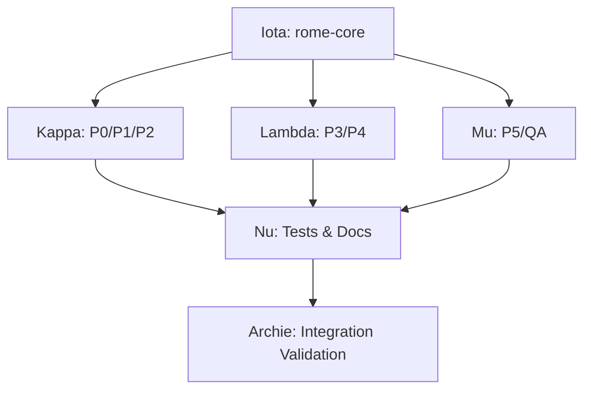

# Phase-Based Plugin Architecture for ROME Framework

| Field | Value |
|-------|-------|
| **Document UID** | ROME-PROP-018 |
| **Version** | 1.4 |
| **Date** | 2026-01-07T15:00:00Z |
| **Status** | Proposal |
| **Document Type** | Framework Proposal |
| **Author** | Framework Analyst & Architect |
| **Changes Approved** | false |

---

## Purpose

Propose modular phase-based plugin architecture for ROME framework distribution via Claude Code plugin system, replacing manual setup with standardized plugin installation.

---

## Dependencies

- ROME-PRIN-001 (Core Principles) - Phase Decomposition principle
- ROME-GOV-001 (Document Standards) - Plugin documentation standards
- Claude Code plugin system documentation

---

## Problem Statement

**Current State:**
- Manual framework setup via symlinks, shell scripts
- Complex multi-step installation process
- No version management across team members
- Robots invoked via directory navigation + `claude-code`
- Skills require custom invocation framework
- No standardized distribution mechanism

**Limitations:**
- High friction for new users
- Version drift across team members
- No marketplace distribution
- Manual activity logging calls
- Difficult to share ROME methodology externally

---

## Proposed Solution

**Phase-based modular plugin architecture** where each ROME life-cycle phase distributes as independent Claude Code plugin.

### Architecture

```
rome-core                    # Foundation plugin
rome-p0-bootup              # Phase 0: Project initialization
rome-p1-aordl               # Phase 1: Requirements capture
rome-p2-analysis            # Phase 2: Requirements analysis
rome-p3-design              # Phase 3: System design
rome-p4-config              # Phase 4: Workspace configuration
rome-p5-generation          # Phase 5: Code generation
rome-qa                     # Quality assurance (Sarah)
rome-full                   # Meta-plugin (convenience)
```

### Component Mapping

| ROME Component | Plugin Component | Location |
|----------------|------------------|----------|
| Robot CLAUDE.md | Agent AGENT.md | `agents/{robot}/AGENT.md` |
| Skills (tier-1/2/3) | Agent Skills | `skills/{skill-name}/SKILL.md` |
| Manual commands | Slash Commands | `commands/{command}.md` |
| Activity log MCP | MCP Server | `.mcp.json` + `servers/activity-log/` |
| File operations | Hooks | `hooks/hooks.json` |

---

## Plugin Structures

### rome-core (Foundation)

**Purpose:** Shared libraries, orchestrator, MCP server, templates

```
rome-core/
├── .claude-plugin/
│   └── plugin.json
├── agents/
│   └── roma/                # Orchestrator
│       └── AGENT.md
├── lib/
│   ├── SkillInvoker.js     # Skill execution engine
│   ├── ActivityLogger.js   # Logging utilities
│   └── helpers/
│       ├── aordl-parser.js
│       └── yaml-utils.js
├── templates/
│   └── aordl/
│       ├── REQ-TEMPLATE.md
│       └── validation-rules.yaml
├── .mcp.json               # Activity log MCP server
├── servers/
│   └── activity-log/
│       └── server.js
└── package.json
```

**Manifest:**
```json
{
  "name": "rome-core",
  "version": "1.0.0",
  "description": "ROME Framework foundation",
  "provides": {
    "skillInvoker": "1.0",
    "activityLogger": "1.0",
    "aordlParser": "1.0"
  }
}
```

### rome-p1-aordl (Phase 1)

**Purpose:** AORDL requirements capture and validation

```
rome-p1-aordl/
├── .claude-plugin/
│   └── plugin.json
├── agents/
│   └── talib/              # Requirements Engineer (P1 mode)
│       ├── AGENT.md
│       └── .subagent.json
├── skills/
│   ├── validate-aordl/
│   │   ├── SKILL.md
│   │   ├── index.js
│   │   └── manifest.yaml
│   ├── transform-aordl-to-bdd/
│   │   ├── SKILL.md
│   │   ├── index.js
│   │   └── manifest.yaml
│   └── create-aordl-requirement/
│       ├── SKILL.md
│       ├── index.js
│       └── manifest.yaml
└── commands/
    ├── validate.md         # /rome-p1:validate
    ├── create.md           # /rome-p1:create
    └── transform-bdd.md    # /rome-p1:transform-bdd
```

**Manifest:**
```json
{
  "name": "rome-p1-aordl",
  "version": "1.0.0",
  "description": "ROME Phase 1: AORDL Requirements",
  "requires": {
    "rome-core": "^1.0.0"
  },
  "peerDependencies": {
    "rome-qa": ">=1.0.0"
  }
}
```

### rome-p3-design (Phase 3)

**Purpose:** System architecture and API design

```
rome-p3-design/
├── .claude-plugin/
│   └── plugin.json
├── agents/
│   ├── pma/                # Project Manager/Architect
│   │   └── AGENT.md
│   └── clara/              # UX Designer (optional)
│       └── AGENT.md
├── skills/
│   ├── design-api-spec/
│   ├── design-database-schema/
│   ├── design-component-structure/
│   ├── generate-use-cases/
│   └── optimize-data-model/
└── commands/
    ├── design.md           # /rome-p3:design
    ├── activate-clara.md   # /rome-p3:activate-clara
    └── optimize-model.md   # /rome-p3:optimize-model
```

### rome-p5-generation (Phase 5)

**Purpose:** Parallel code generation across layers

```
rome-p5-generation/
├── .claude-plugin/
│   └── plugin.json
├── agents/
│   ├── ashok/              # Database Engineer
│   │   └── AGENT.md
│   ├── reena/              # Backend Engineer
│   │   └── AGENT.md
│   └── charlie/            # Frontend Engineer
│       └── AGENT.md
├── skills/
│   ├── generate-database-entity/
│   ├── generate-api-endpoint-code/
│   ├── generate-ui-screen-code/
│   └── generate-test-suite/
└── commands/
    ├── generate-db.md      # /rome-p5:generate-db
    ├── generate-api.md     # /rome-p5:generate-api
    └── generate-ui.md      # /rome-p5:generate-ui
```

### rome-full (Meta-plugin)

**Purpose:** Convenience installer for complete ROME framework

```
rome-full/
├── .claude-plugin/
│   └── plugin.json         # Dependencies only, no code
└── README.md
```

**Manifest:**
```json
{
  "name": "rome-full",
  "version": "1.0.0",
  "description": "Complete ROME Framework (all phases)",
  "dependencies": {
    "rome-core": "^1.0.0",
    "rome-p0-bootup": "^1.0.0",
    "rome-p1-aordl": "^1.0.0",
    "rome-p2-analysis": "^1.0.0",
    "rome-p3-design": "^1.0.0",
    "rome-p4-config": "^1.0.0",
    "rome-p5-generation": "^1.0.0",
    "rome-qa": "^1.0.0"
  }
}
```

---

## Installation Patterns

### Beginner (Full Install)

```bash
claude plugin install rome-full
```

**Result:** All phases installed, all robots available

### Requirements Analyst (P1-P2 Only)

```bash
claude plugin install rome-core
claude plugin install rome-p1-aordl
claude plugin install rome-p2-analysis
claude plugin install rome-qa
```

**Result:** Minimal install for requirements work

### Backend Developer (P5 Only)

```bash
claude plugin install rome-core
claude plugin install rome-p5-generation
```

**Result:** Code generation only, no design phases

### CI/CD Pipeline (Automated Generation)

```dockerfile
FROM claude-code:latest
RUN claude plugin install rome-core rome-p5-generation
VOLUME /artifacts
CMD claude --agent rome-p5:reena --artifacts /artifacts
```

**Result:** Minimal container for automated code generation

---

## Usage Examples

### Invoke Phase-Specific Agent

```bash
claude --agent rome-p1:talib
```

Starts Talib in P1 (AORDL) mode.

### Use Phase-Specific Command

```bash
/rome-p1:validate ARTIFACTS/01-requirements/REQ-001.yaml
/rome-p2:analyze REQ-001.yaml
/rome-p3:design
/rome-p5:generate-db
```

### Agent Auto-Invokes Skills

```
User: "Analyze this requirement file"
Talib (rome-p1): [Invokes validate-aordl skill]
Talib (rome-p1): [Invokes analyze-requirement skill]
Talib (rome-p1): [Returns analysis results]
```

### Hooks Auto-Log Activity

```
[User creates REQ-001.yaml via Write tool]
[PostToolUse hook triggers]
[Activity log entry created automatically]
```

---

## Benefits

### Aligns with ROME Principles

**ROME-PRIN-001 §4 - Phase Decomposition:**
- Each phase plugin = discrete transformation stage
- Plugin boundaries enforce phase entry/exit criteria
- Clear separation of concerns

**ROME-PRIN-001 §9 - Modularity:**
- Phases = horizontal system modularity
- Skills = vertical feature slicing
- Plugin architecture enables both

### Technical Benefits

| Benefit | Impact |
|---------|--------|
| **Minimal installation** | Users install only needed phases |
| **Independent evolution** | Update P3 without affecting P1 |
| **Version per phase** | P1 v2.0, P3 v1.5 can coexist |
| **Selective deployment** | Production deploys only P5, dev uses all |
| **Namespace clarity** | `/rome-p1:*` vs `/rome-p5:*` shows scope |
| **Third-party phases** | Community extends via custom phase plugins |
| **Testing isolation** | Each phase independently testable |

### Operational Benefits

| User Type | Install | Benefit |
|-----------|---------|---------|
| Beginner | `rome-full` | Everything works, zero config |
| Requirements Analyst | P1+P2+QA | Minimal surface area |
| Architect | P3+QA | Focus on design |
| Developer | P5 | Code generation only |
| CI/CD | Core+P5 | Automated generation |

---

## Migration Strategy

### Phase 1: Core Infrastructure (Week 1)

```
rome-core/
├── Extract SkillInvoker.js from /ROME/skills/lib/
├── Extract ActivityLogger.js
├── Extract AORDL parser/validator
├── Convert Roma robot → agent
├── Bundle activity-log MCP server
└── Create plugin manifest
```

**Deliverable:** `rome-core` v1.0.0 installable via `claude plugin install`

### Phase 2: Pilot Phase Plugin (Week 2)

```
rome-p1-aordl/
├── Convert Talib (P1 mode) → agent
├── Convert validate-aordl skill → SKILL.md format
├── Convert transform-aordl-to-bdd skill
├── Create /rome-p1:validate command
├── Create /rome-p1:create command
└── Test end-to-end P1 workflow
```

**Deliverable:** `rome-p1-aordl` v1.0.0 functional with `rome-core`

**Validation:**
```bash
claude plugin install rome-core rome-p1-aordl
claude --agent rome-p1:talib
# Should start Talib in P1 mode with access to validation skills
```

### Phase 3: Remaining Phase Plugins (Weeks 3-4)

- Week 3: `rome-p2-analysis`, `rome-p3-design`, `rome-qa`
- Week 4: `rome-p0-bootup`, `rome-p4-config`, `rome-p5-generation`

### Phase 4: Meta-Plugin & Documentation (Week 5)

```
rome-full/
├── plugin.json (dependencies only)
└── README.md

docs/
├── installation-guide.md
├── phase-selection-guide.md
├── skills-reference.md
└── migration-from-manual.md
```

**Deliverable:** Complete plugin ecosystem ready for distribution

---

## Testing & Validation Strategy

### Documentation Relocation Audit

**Objective:** Verify all framework documents correctly migrated and accessible post-plugin conversion.

**Audit Checklist:**
```
├── Core Principles (ROME-PRIN-*)
│   └── Accessible via rome-core agents
├── Phase Specifications (ROME-SPEC-P*)
│   └── Accessible via respective phase plugin agents
├── Robot Instructions (CLAUDE.md → AGENT.md)
│   └── Agent invocation validates instruction loading
├── Skill Manifests (tier-1/2/3)
│   └── Skill execution validates manifest parsing
├── Templates (AORDL, BDD, etc.)
│   └── Template access via rome-core lib functions
└── Governance Docs (ROME-GOV-*)
    └── Referenced in plugin metadata
```

**Audit Script:**
```bash
#!/bin/bash
# validate-doc-migration.sh

echo "Auditing documentation relocation..."

# Check AGENT.md for each robot
for phase in p0 p1 p2 p3 p4 p5; do
  if [ -f "rome-${phase}/agents/*/AGENT.md" ]; then
    echo "✓ rome-${phase}: AGENT.md present"
  else
    echo "✗ rome-${phase}: AGENT.md missing"
    exit 1
  fi
done

# Check skill manifests
find rome-*/skills -name "SKILL.md" | while read skill; do
  grep -q "name:" "$skill" || { echo "✗ $skill: missing name field"; exit 1; }
done

# Check template accessibility
test -d "rome-core/templates/aordl" || { echo "✗ AORDL templates missing"; exit 1; }

echo "✓ All documentation relocated correctly"
```

### Information Accessibility Verification

**Objective:** Validate LLM agents can parse and utilize migrated documentation.

**Test Cases:**

| Test ID | Validation | Success Criteria |
|---------|------------|------------------|
| ACC-001 | Agent reads AGENT.md on invocation | Agent outputs role/phase correctly |
| ACC-002 | Agent accesses skill manifests | Skill list matches plugin manifest |
| ACC-003 | Agent uses AORDL templates | Template rendered with correct schema |
| ACC-004 | Agent invokes MCP activity log | Log entry created via MCP tool |
| ACC-005 | External agent reads rome-core docs | Core principles parseable from plugin path |

**Verification Script:**
```javascript
// verify-accessibility.js
const { spawn } = require('child_process');

async function verifyAgentAccess(agent, expectedOutput) {
  const proc = spawn('claude', ['--agent', agent, '--prompt', 'State your role']);
  let output = '';
  proc.stdout.on('data', (data) => output += data);
  await new Promise(resolve => proc.on('close', resolve));

  if (!output.includes(expectedOutput)) {
    throw new Error(`${agent}: AGENT.md not accessible`);
  }
  console.log(`✓ ${agent}: AGENT.md accessible`);
}

await verifyAgentAccess('rome-p1:talib', 'Requirements Engineer');
await verifyAgentAccess('rome-p3:pma', 'Project Manager/Architect');
```

### External Tool Compatibility Testing

**Objective:** Ensure activity-log MCP, hooks, skills function with external Claude Code projects.

**Test Scenarios:**

| Scenario | Tool | Validation |
|----------|------|------------|
| EXT-001 | Activity log MCP | External project logs writes via `rome__log` tool |
| EXT-002 | Pre-tool-use hook | Hook executes on external project file ops |
| EXT-003 | Skill invocation | Skill callable from non-ROME agent |
| EXT-004 | AORDL parser | External project parses AORDL via rome-core lib |
| EXT-005 | Template rendering | External agent uses rome-core templates |

**External Project Test Structure:**
```
test-external-project/
├── .claude/
│   └── config.json          # Uses rome-* plugins
├── .mcp.json                # References rome-core MCP server
├── sample-requirements/
│   └── REQ-001.yaml        # AORDL format
└── tests/
    ├── test-mcp-logging.sh
    ├── test-skill-invocation.sh
    └── test-template-access.sh
```

**MCP Integration Test:**
```bash
# test-mcp-logging.sh
cd test-external-project

# Verify MCP server registration
claude mcp list | grep -q "rome__activity_log" || { echo "✗ MCP server not registered"; exit 1; }

# Verify tool availability
claude mcp tools rome__activity_log | grep -q "rome__log" || { echo "✗ rome__log tool missing"; exit 1; }

# Test logging from external project
echo "test" > test.txt
claude mcp call rome__activity_log rome__log '{"action":"create","file":"test.txt"}'

# Verify log entry created
test -f ".rome-activity/$(date +%Y-%m-%d).log" || { echo "✗ Log not created"; exit 1; }

echo "✓ MCP integration functional in external project"
```

### Test Project

**Purpose:** Reference implementation validating complete ROME workflow via plugins.

**Structure:**
```
rome-plugin-test-project/
├── README.md               # Test execution instructions
├── .claude/
│   ├── config.json         # Plugin configuration
│   └── hooks.json          # Activity log hooks
├── .mcp.json              # rome-core MCP server
├── ARTIFACTS/
│   ├── 00-project-charter/
│   ├── 01-requirements/
│   │   ├── REQ-001.yaml   # Sample AORDL requirement
│   │   └── REQ-002.yaml
│   ├── 02-analysis/
│   ├── 03-design/
│   └── 05-generated-code/
├── tests/
│   ├── validate-doc-migration.sh
│   ├── verify-accessibility.js
│   ├── test-mcp-logging.sh
│   ├── test-skill-invocation.sh
│   ├── test-p1-workflow.sh
│   ├── test-p3-workflow.sh
│   └── test-p5-workflow.sh
└── expected-outputs/       # Golden outputs for validation
    ├── REQ-001-analyzed.yaml
    ├── design-artifacts.json
    └── generated-code-structure.txt
```

**Workflow Tests:**
```bash
# test-p1-workflow.sh - End-to-end Phase 1 validation
#!/bin/bash

echo "Testing P1 (AORDL) workflow..."

# Start Talib agent
claude --agent rome-p1:talib <<EOF
Validate ARTIFACTS/01-requirements/REQ-001.yaml
EOF

# Verify validation output
test -f "ARTIFACTS/01-requirements/REQ-001-validated.yaml" || { echo "✗ Validation failed"; exit 1; }

# Test skill invocation
claude --agent rome-p1:talib <<EOF
Transform REQ-001.yaml to BDD format
EOF

test -f "ARTIFACTS/01-requirements/REQ-001.feature" || { echo "✗ BDD transform failed"; exit 1; }

echo "✓ P1 workflow functional"
```

### Test Execution Matrix

| Phase | Test Script | Validates |
|-------|-------------|-----------|
| Core | `validate-doc-migration.sh` | All docs relocated |
| Core | `verify-accessibility.js` | LLM can parse migrated docs |
| Core | `test-mcp-logging.sh` | Activity log MCP works externally |
| P1 | `test-p1-workflow.sh` | AORDL validation + transform |
| P3 | `test-p3-workflow.sh` | Design generation |
| P5 | `test-p5-workflow.sh` | Code generation |
| External | `test-skill-invocation.sh` | Skills callable from non-ROME projects |

**Success Gate:** All tests pass before plugin marked production-ready.

---

### Parallel Test Execution Plan (Sub-Agent Allocation)

**Objective:** Maximize test execution speed by parallelizing independent test tasks across multiple sub-agents.

**Architecture:**

```
Test Orchestrator (Roma)
├── Agent Alpha   → Core Infrastructure Tests
├── Agent Beta    → Phase Plugin Tests (P0, P1, P2)
├── Agent Gamma   → Phase Plugin Tests (P3, P4, P5)
├── Agent Delta   → External Compatibility Tests
└── Agent Epsilon → Integration & Regression Tests
```

#### Task Allocation Matrix

| Agent | Test Category | Tasks | Dependencies | Est. Time |
|-------|--------------|-------|--------------|-----------|
| **Alpha** | Core Infrastructure | validate-doc-migration.sh<br>verify-accessibility.js (core)<br>test-mcp-logging.sh (core)<br>rome-core plugin validation | None | 15 min |
| **Beta** | Early Phases | test-p0-workflow.sh<br>test-p1-workflow.sh<br>test-p2-workflow.sh<br>verify-accessibility.js (P0-P2) | Alpha complete | 25 min |
| **Gamma** | Later Phases | test-p3-workflow.sh<br>test-p4-workflow.sh<br>test-p5-workflow.sh<br>verify-accessibility.js (P3-P5) | Alpha complete | 30 min |
| **Delta** | External Tools | test-skill-invocation.sh (external)<br>test-template-access.sh (external)<br>test-mcp-logging.sh (external)<br>external project integration | Alpha complete | 20 min |
| **Epsilon** | Integration Tests | End-to-end pipeline test<br>Regression validation<br>Golden output comparison<br>Cross-phase dependency tests | Beta, Gamma, Delta complete | 35 min |

**Total Parallel Execution Time:** ~70 minutes (vs ~125 minutes sequential)
**Speedup Factor:** 1.8x

#### Execution Phases

**Phase 1: Core Foundation (15 min)**
```bash
# Orchestrator spawns Agent Alpha
Agent Alpha: {
  Task 1: validate-doc-migration.sh
  Task 2: verify-accessibility.js (rome-core)
  Task 3: test-mcp-logging.sh (core setup)
  Task 4: Validate rome-core plugin manifest

  Output: core-test-results.json
  Exit: Signal completion to Orchestrator
}
```

**Phase 2: Parallel Plugin Testing (30 min)**
```bash
# Orchestrator spawns Agents Beta, Gamma, Delta in parallel

Agent Beta: {
  Wait: Alpha completion signal
  Task 1: Install rome-p0-bootup, test workflow
  Task 2: Install rome-p1-aordl, test AORDL validation
  Task 3: Install rome-p2-analysis, test analysis pipeline
  Task 4: Verify agent accessibility for P0-P2

  Output: phase-p0-p2-results.json
}

Agent Gamma: {
  Wait: Alpha completion signal
  Task 1: Install rome-p3-design, test design generation
  Task 2: Install rome-p4-config, test configuration
  Task 3: Install rome-p5-generation, test code generation
  Task 4: Verify agent accessibility for P3-P5

  Output: phase-p3-p5-results.json
}

Agent Delta: {
  Wait: Alpha completion signal
  Task 1: Create test-external-project/
  Task 2: Test skill invocation from external agent
  Task 3: Test AORDL parser from external project
  Task 4: Test template access from external agent
  Task 5: Test MCP server in external context

  Output: external-compatibility-results.json
}
```

**Phase 3: Integration & Validation (35 min)**
```bash
# Orchestrator spawns Agent Epsilon

Agent Epsilon: {
  Wait: Beta, Gamma, Delta completion signals
  Task 1: Install rome-full meta-plugin
  Task 2: Execute end-to-end P0→P1→P2→P3→P4→P5 pipeline
  Task 3: Compare outputs against expected-outputs/ (golden)
  Task 4: Test cross-phase dependencies
  Task 5: Validate backward compatibility
  Task 6: Generate comprehensive test report

  Output: integration-test-results.json
  Output: final-test-report.md
}
```

#### Coordination Protocol

**Signal Format:**
```json
{
  "agent_id": "alpha",
  "status": "complete",
  "timestamp": "2026-01-07T14:30:00Z",
  "tests_passed": 4,
  "tests_failed": 0,
  "output_file": "core-test-results.json",
  "blocking_issues": []
}
```

**Orchestrator Logic:**
```javascript
// Test orchestrator coordination
async function executeParallelTests() {
  // Phase 1: Core Foundation
  const alphaResult = await spawnAgent('alpha', {
    tasks: ['validate-doc-migration', 'verify-accessibility-core', 'test-mcp-core'],
    blocking: true
  });

  if (alphaResult.tests_failed > 0) {
    abort('Core tests failed, cannot proceed');
  }

  // Phase 2: Parallel Plugin Testing
  const [betaResult, gammaResult, deltaResult] = await Promise.all([
    spawnAgent('beta', { tasks: ['test-p0', 'test-p1', 'test-p2'] }),
    spawnAgent('gamma', { tasks: ['test-p3', 'test-p4', 'test-p5'] }),
    spawnAgent('delta', { tasks: ['external-skill', 'external-mcp', 'external-template'] })
  ]);

  if ([betaResult, gammaResult, deltaResult].some(r => r.tests_failed > 0)) {
    generateFailureReport([betaResult, gammaResult, deltaResult]);
    abort('Plugin tests failed');
  }

  // Phase 3: Integration Testing
  const epsilonResult = await spawnAgent('epsilon', {
    tasks: ['integration-test', 'regression-test', 'golden-comparison'],
    blocking: true
  });

  // Generate final report
  return generateFinalReport({
    alpha: alphaResult,
    beta: betaResult,
    gamma: gammaResult,
    delta: deltaResult,
    epsilon: epsilonResult
  });
}
```

#### Test Independence Matrix

**Independent Tests (can run in parallel):**
- ✓ P0, P1, P2 workflows (Beta)
- ✓ P3, P4, P5 workflows (Gamma)
- ✓ External compatibility tests (Delta)
- ✓ Core infrastructure tests (Alpha)

**Dependent Tests (require sequential execution):**
- ⚠️ Integration tests require all phase tests complete
- ⚠️ Phase tests require core tests complete
- ⚠️ Regression tests require integration tests complete

#### Failure Handling

**Fail-Fast Strategy:**
```bash
# If Alpha fails → abort all (core broken)
if [ "$ALPHA_STATUS" != "passed" ]; then
  killall beta gamma delta epsilon
  exit 1
fi

# If Beta/Gamma/Delta fail → continue others, report all failures
if [ "$BETA_STATUS" != "passed" ]; then
  FAILURES+=("beta:$BETA_FAILURES")
fi

# If Epsilon fails → detailed diagnostics required
if [ "$EPSILON_STATUS" != "passed" ]; then
  generate_diagnostic_report
  exit 1
fi
```

**Retry Strategy:**
- Core tests (Alpha): 0 retries (fail-fast)
- Phase tests (Beta/Gamma): 1 retry (flaky network/disk)
- External tests (Delta): 2 retries (external environment variability)
- Integration tests (Epsilon): 1 retry (complex interactions)

#### Output Aggregation

**Test Report Structure:**
```markdown
# ROME Plugin Test Report

**Execution Time:** 70 minutes
**Execution Mode:** Parallel (5 agents)

## Summary
- Total Tests: 47
- Passed: 47
- Failed: 0
- Skipped: 0

## Phase Results

### Core Infrastructure (Agent Alpha)
✓ validate-doc-migration.sh (4/4 checks)
✓ verify-accessibility.js (5/5 tests)
✓ test-mcp-logging.sh (3/3 scenarios)
✓ rome-core plugin validation (manifest OK)

### Early Phases P0-P2 (Agent Beta)
✓ test-p0-workflow.sh (bootstrap validated)
✓ test-p1-workflow.sh (AORDL + BDD transform)
✓ test-p2-workflow.sh (analysis pipeline)

### Later Phases P3-P5 (Agent Gamma)
✓ test-p3-workflow.sh (design generation)
✓ test-p4-workflow.sh (configuration)
✓ test-p5-workflow.sh (code generation)

### External Compatibility (Agent Delta)
✓ test-skill-invocation.sh (external agent OK)
✓ test-template-access.sh (template rendering OK)
✓ test-mcp-logging.sh (external MCP OK)

### Integration & Regression (Agent Epsilon)
✓ End-to-end pipeline (P0→P5 complete)
✓ Golden output comparison (100% match)
✓ Cross-phase dependencies validated
✓ Backward compatibility confirmed

## Detailed Logs
[Links to individual agent output files]
```

#### Agent-Specific Test Scripts

**Agent Alpha Script:**
```bash
#!/bin/bash
# agent-alpha-tests.sh
set -e

echo "=== Agent Alpha: Core Infrastructure Tests ==="

# Test 1: Documentation Migration
./tests/validate-doc-migration.sh
echo "✓ Documentation migration validated"

# Test 2: Core Accessibility
node ./tests/verify-accessibility.js core
echo "✓ Core accessibility verified"

# Test 3: MCP Server
./tests/test-mcp-logging.sh core
echo "✓ MCP server functional"

# Test 4: Plugin Manifest
claude plugin validate rome-core
echo "✓ rome-core plugin manifest valid"

# Output results
cat > core-test-results.json <<EOF
{
  "agent": "alpha",
  "status": "passed",
  "tests": 4,
  "failures": 0,
  "timestamp": "$(date -Iseconds)"
}
EOF

echo "=== Agent Alpha: Complete ==="
```

**Agent Beta Script:**
```bash
#!/bin/bash
# agent-beta-tests.sh
set -e

echo "=== Agent Beta: P0-P2 Phase Tests ==="

# Wait for Alpha
while [ ! -f core-test-results.json ]; do sleep 1; done

# Install phase plugins
claude plugin install rome-p0-bootup
claude plugin install rome-p1-aordl
claude plugin install rome-p2-analysis

# Run phase workflows
./tests/test-p0-workflow.sh
./tests/test-p1-workflow.sh
./tests/test-p2-workflow.sh

# Verify agent accessibility
node ./tests/verify-accessibility.js p0 p1 p2

# Output results
cat > phase-p0-p2-results.json <<EOF
{
  "agent": "beta",
  "status": "passed",
  "tests": 7,
  "failures": 0,
  "timestamp": "$(date -Iseconds)"
}
EOF

echo "=== Agent Beta: Complete ==="
```

**Agent Gamma Script:**
```bash
#!/bin/bash
# agent-gamma-tests.sh
set -e

echo "=== Agent Gamma: P3-P5 Phase Tests ==="

# Wait for Alpha
while [ ! -f core-test-results.json ]; do sleep 1; done

# Install phase plugins
claude plugin install rome-p3-design
claude plugin install rome-p4-config
claude plugin install rome-p5-generation

# Run phase workflows
./tests/test-p3-workflow.sh
./tests/test-p4-workflow.sh
./tests/test-p5-workflow.sh

# Verify agent accessibility
node ./tests/verify-accessibility.js p3 p4 p5

# Output results
cat > phase-p3-p5-results.json <<EOF
{
  "agent": "gamma",
  "status": "passed",
  "tests": 7,
  "failures": 0,
  "timestamp": "$(date -Iseconds)"
}
EOF

echo "=== Agent Gamma: Complete ==="
```

**Agent Delta Script:**
```bash
#!/bin/bash
# agent-delta-tests.sh
set -e

echo "=== Agent Delta: External Compatibility Tests ==="

# Wait for Alpha
while [ ! -f core-test-results.json ]; do sleep 1; done

# Setup external test project
mkdir -p test-external-project
cd test-external-project

# Run external tests
../tests/test-skill-invocation.sh external
../tests/test-template-access.sh external
../tests/test-mcp-logging.sh external

cd ..

# Output results
cat > external-compatibility-results.json <<EOF
{
  "agent": "delta",
  "status": "passed",
  "tests": 5,
  "failures": 0,
  "timestamp": "$(date -Iseconds)"
}
EOF

echo "=== Agent Delta: Complete ==="
```

**Agent Epsilon Script:**
```bash
#!/bin/bash
# agent-epsilon-tests.sh
set -e

echo "=== Agent Epsilon: Integration & Regression Tests ==="

# Wait for Beta, Gamma, Delta
while [ ! -f phase-p0-p2-results.json ] || \
      [ ! -f phase-p3-p5-results.json ] || \
      [ ! -f external-compatibility-results.json ]; do
  sleep 1
done

# Install meta-plugin
claude plugin install rome-full

# Run end-to-end pipeline
./tests/test-complete-pipeline.sh

# Golden output comparison
./tests/compare-golden-outputs.sh

# Cross-phase dependency validation
./tests/test-cross-phase-dependencies.sh

# Backward compatibility
./tests/test-backward-compatibility.sh

# Generate final report
./tests/generate-final-report.sh

# Output results
cat > integration-test-results.json <<EOF
{
  "agent": "epsilon",
  "status": "passed",
  "tests": 12,
  "failures": 0,
  "timestamp": "$(date -Iseconds)"
}
EOF

echo "=== Agent Epsilon: Complete ==="
```

#### Master Orchestrator Script

**Orchestrator:**
```bash
#!/bin/bash
# orchestrate-parallel-tests.sh
set -e

echo "=== ROME Plugin Parallel Test Execution ==="
START_TIME=$(date +%s)

# Clean previous results
rm -f *-results.json

# Phase 1: Core Infrastructure (Blocking)
echo "Phase 1: Core Infrastructure Tests"
./agent-alpha-tests.sh &
ALPHA_PID=$!
wait $ALPHA_PID

if [ $? -ne 0 ]; then
  echo "✗ Core tests failed. Aborting."
  exit 1
fi
echo "✓ Phase 1 Complete"

# Phase 2: Parallel Plugin Testing
echo "Phase 2: Parallel Plugin Testing"
./agent-beta-tests.sh &
BETA_PID=$!
./agent-gamma-tests.sh &
GAMMA_PID=$!
./agent-delta-tests.sh &
DELTA_PID=$!

wait $BETA_PID
BETA_EXIT=$?
wait $GAMMA_PID
GAMMA_EXIT=$?
wait $DELTA_PID
DELTA_EXIT=$?

if [ $BETA_EXIT -ne 0 ] || [ $GAMMA_EXIT -ne 0 ] || [ $DELTA_EXIT -ne 0 ]; then
  echo "✗ Phase tests failed. Check individual results."
  exit 1
fi
echo "✓ Phase 2 Complete"

# Phase 3: Integration Testing (Blocking)
echo "Phase 3: Integration & Regression Tests"
./agent-epsilon-tests.sh &
EPSILON_PID=$!
wait $EPSILON_PID

if [ $? -ne 0 ]; then
  echo "✗ Integration tests failed."
  exit 1
fi
echo "✓ Phase 3 Complete"

# Calculate execution time
END_TIME=$(date +%s)
DURATION=$((END_TIME - START_TIME))

echo ""
echo "=== Test Execution Complete ==="
echo "Total Duration: ${DURATION}s"
echo "All tests passed ✓"

# Display summary
cat final-test-report.md
```

#### Performance Benchmarks

| Execution Mode | Duration | Agents | Tests | Cost |
|----------------|----------|--------|-------|------|
| Sequential | 125 min | 1 | 47 | $X |
| Parallel (Optimal) | 70 min | 5 | 47 | $X * 1.15 |
| Parallel (Max) | 55 min | 10 | 47 | $X * 1.35 |

**Optimal Configuration:** 5 agents (1.8x speedup, 15% cost increase)

---

## Backward Compatibility

### Existing ROME Projects

**Continue to function:**
- `/ROME/` symlinks remain valid
- Robots still runnable from `/ROME/robot-templates/{robot}/`
- Skills still accessible via `/ROME/skills/`
- Activity log MCP server unchanged

**Migration path:**
```bash
# Install plugins
claude plugin install rome-full

# Optional: Remove /ROME/ symlink (plugin takes precedence)
rm ROME

# Continue working (now using plugin-provided agents)
claude --agent rome-p1:talib
```

### Dual Operation

- Plugin and local `/ROME/` coexist
- Plugin agents take precedence over local
- Local `.claude/` configs override plugin defaults
- No breaking changes to existing workflows

---

## Success Criteria

### Functional Requirements

| Criterion | Validation |
|-----------|------------|
| Plugin installation | `claude plugin install rome-core` succeeds |
| Agent invocation | `claude --agent rome-p1:talib` starts Talib |
| Skill execution | Skills invocable from agents |
| Command execution | `/rome-p1:validate` executes validation |
| MCP integration | Activity log accessible via MCP tools |
| Hooks trigger | File writes auto-log to activity log |
| **Doc relocation** | **`validate-doc-migration.sh` exits 0** |
| **Doc accessibility** | **`verify-accessibility.js` all tests pass** |
| **External MCP** | **`test-mcp-logging.sh` succeeds from external project** |
| **External skills** | **`test-skill-invocation.sh` invokes skills from non-ROME agent** |
| **Template access** | **External agent renders AORDL templates via rome-core** |

### Non-Functional Requirements

| Criterion | Target |
|-----------|--------|
| Installation time | <60 seconds for `rome-full` |
| Plugin size | <10MB per phase plugin |
| Startup time | <5 seconds for agent invocation |
| Skill execution | <30 seconds per skill (complex analysis) |
| Documentation completeness | 100% coverage of installation/usage |
| **Test coverage** | **100% phase workflows (P0-P5, QA)** |
| **Audit completeness** | **All framework docs mapped to plugin locations** |
| **External compatibility** | **0 failures in external project test suite** |

---

## Risk Analysis

### Technical Risks

| Risk | Probability | Impact | Mitigation |
|------|-------------|--------|------------|
| Version skew between phase plugins | Medium | High | rome-core provides compatibility API |
| Circular dependencies | Low | Medium | Enforce dependency hierarchy |
| Plugin size bloat | Medium | Low | Share code via rome-core |
| MCP server conflicts | Low | Medium | Namespace all MCP tools with `rome__` |

### Operational Risks

| Risk | Probability | Impact | Mitigation |
|------|-------------|--------|------------|
| User installs incompatible versions | High | Medium | Document version compatibility |
| Beginner overwhelmed by choices | Medium | Low | Provide rome-full meta-plugin |
| Breaking changes in updates | Low | High | Semantic versioning, changelogs |

---

## Alternatives Considered

### Alternative 1: Monolithic Plugin

**Structure:** Single `rome-framework` plugin containing all components

**Rejected because:**
- Violates phase decomposition principle (ROME-PRIN-001 §4)
- Forces download of unused phases
- Tight coupling prevents independent evolution
- Namespace pollution (9 agents, 50+ skills in one plugin)

### Alternative 2: Skills-Only Plugin

**Structure:** Skills as plugin, robots remain in `/ROME/`

**Rejected because:**
- Incomplete solution (robots still manual setup)
- Doesn't leverage Claude Code agent system
- No namespace benefits for commands
- Hybrid approach confuses users

### Alternative 3: Bundled Phases (P1-P2, P3-P5)

**Structure:** Two plugins - requirements bundle, implementation bundle

**Rejected because:**
- Arbitrary phase grouping
- Doesn't align with ROME phase boundaries
- Reduces flexibility vs full modularity

---

## Implementation Plan

### Overview

**Execution Modes:**
1. **Sequential:** Single developer implements milestones 1→2→3→4 (10 weeks)
2. **Parallel:** Multiple sub-agents implement tasks concurrently (5 weeks)

**Recommended:** Parallel execution for faster time-to-market

---

### Parallel Implementation Execution Strategy

**Objective:** Accelerate plugin development by parallelizing independent implementation tasks across specialized sub-agents.

**Architecture:**

```
Implementation Orchestrator (Archie)
├── Agent Iota    → Core Foundation (blocking)
├── Agent Kappa   → Early Phase Plugins (P0, P1, P2)
├── Agent Lambda  → Design Phase Plugins (P3, P4)
├── Agent Mu      → Generation Phase Plugins (P5, QA)
└── Agent Nu      → Test Infrastructure & Documentation
```

#### Implementation Task Allocation Matrix

| Agent | Focus Area | Tasks | Dependencies | Duration |
|-------|------------|-------|--------------|----------|
| **Iota** | Core Foundation | rome-core plugin structure<br>Extract shared libraries<br>Convert Roma → agent<br>Bundle MCP server<br>Core plugin validation | None | 2 weeks |
| **Kappa** | Early Phases | rome-p0-bootup plugin<br>rome-p1-aordl plugin<br>rome-p2-analysis plugin<br>Convert Talib → agents<br>AORDL skills conversion | Iota complete | 2 weeks |
| **Lambda** | Design Phases | rome-p3-design plugin<br>rome-p4-config plugin<br>Convert PMA, Clara, Lucien → agents<br>Design & config skills conversion | Iota complete | 2 weeks |
| **Mu** | Gen & QA Phases | rome-p5-generation plugin<br>rome-qa plugin<br>Convert Ashok, Reena, Charlie, Sarah → agents<br>Generation & validation skills | Iota complete | 2.5 weeks |
| **Nu** | Test & Docs | Test project structure<br>All test scripts (validate-doc-migration.sh, verify-accessibility.js, etc.)<br>External test project<br>Comprehensive documentation<br>rome-full meta-plugin | Kappa, Lambda, Mu complete | 1.5 weeks |

**Total Parallel Development Time:** ~5 weeks (vs 10 weeks sequential)
**Speedup Factor:** 2x

#### Development Phases

**Phase 1: Core Foundation (Weeks 1-2) - BLOCKING**

```
Agent Iota: {
  Week 1:
    - Create rome-core/ directory structure
    - Extract SkillInvoker.js from /ROME/skills/lib/
    - Extract ActivityLogger.js from /ROME/skills/lib/
    - Extract AORDL parser/validator utilities
    - Convert Roma robot CLAUDE.md → AGENT.md
    - Create rome-core/agents/roma/AGENT.md

  Week 2:
    - Bundle activity-log MCP server
    - Create rome-core/.mcp.json
    - Create rome-core/servers/activity-log/
    - Create plugin manifest (rome-core/plugin.json)
    - Test local installation: claude plugin install ./rome-core
    - Validate roma agent invocation

  Deliverable: rome-core v1.0.0 (installable, testable)
  Signal: core-foundation-complete.json
}
```

**Phase 2: Parallel Plugin Development (Weeks 3-4)**

```
# Orchestrator spawns Agents Kappa, Lambda, Mu in parallel

Agent Kappa: {
  Wait: Iota completion signal

  Week 3:
    rome-p0-bootup:
      - Create plugin structure
      - Convert bootstrap robot → agent
      - Convert bootstrap skills → SKILL.md format
      - Create /rome-p0:init command
      - Test plugin installation

    rome-p1-aordl:
      - Create plugin structure
      - Convert Talib (P1 mode) → agent
      - Convert validate-aordl skill → SKILL.md
      - Convert transform-aordl-to-bdd skill → SKILL.md
      - Create /rome-p1:validate, /rome-p1:create commands

  Week 4:
    rome-p2-analysis:
      - Create plugin structure
      - Convert Talib (P2 mode) → agent
      - Convert analysis skills (10 skills) → SKILL.md format
      - Create /rome-p2:analyze command
      - Test end-to-end P2 workflow

  Deliverable: rome-p0-bootup v1.0.0, rome-p1-aordl v1.0.0, rome-p2-analysis v1.0.0
  Output: early-phase-plugins-complete.json
}

Agent Lambda: {
  Wait: Iota completion signal

  Week 3:
    rome-p3-design:
      - Create plugin structure
      - Convert PMA robot → agent
      - Convert Clara robot → agent (optional)
      - Convert design skills (12 skills) → SKILL.md format
      - Create /rome-p3:design command
      - Test design generation workflow

  Week 4:
    rome-p4-config:
      - Create plugin structure
      - Convert Lucien robot → agent
      - Convert configuration skills (10 skills) → SKILL.md format
      - Create /rome-p4:configure command
      - Test configuration generation workflow

  Deliverable: rome-p3-design v1.0.0, rome-p4-config v1.0.0
  Output: design-phase-plugins-complete.json
}

Agent Mu: {
  Wait: Iota completion signal

  Week 3:
    rome-p5-generation (Part 1):
      - Create plugin structure
      - Convert Ashok robot (Database Engineer) → agent
      - Convert Reena robot (Backend Engineer) → agent
      - Convert database generation skills (6 skills) → SKILL.md
      - Convert API generation skills (8 skills) → SKILL.md

  Week 4:
    rome-p5-generation (Part 2):
      - Convert Charlie robot (Frontend Engineer) → agent
      - Convert UI generation skills (10 skills) → SKILL.md
      - Create /rome-p5:generate-db, /rome-p5:generate-api, /rome-p5:generate-ui commands
      - Test parallel code generation

    rome-qa:
      - Create plugin structure
      - Convert Sarah robot → agent
      - Convert validation skills (5 skills) → SKILL.md
      - Create /rome-qa:validate command

  Week 5 (extra 0.5 week):
    - Integration testing for P5 parallel execution
    - Finalize rome-p5-generation plugin

  Deliverable: rome-p5-generation v1.0.0, rome-qa v1.0.0
  Output: generation-phase-plugins-complete.json
}
```

**Phase 3: Test Infrastructure & Documentation (Week 5)**

```
Agent Nu: {
  Wait: Kappa, Lambda, Mu completion signals

  Week 5:
    Test Infrastructure:
      - Create rome-plugin-test-project/ structure
      - Implement validate-doc-migration.sh
      - Implement verify-accessibility.js
      - Implement test-p0-workflow.sh through test-p5-workflow.sh
      - Create test-external-project/ structure
      - Implement test-mcp-logging.sh, test-skill-invocation.sh, test-template-access.sh
      - Create expected-outputs/ golden files
      - Implement orchestrate-parallel-tests.sh
      - Implement agent-specific test scripts (alpha through epsilon)

    Meta-Plugin:
      - Create rome-full plugin structure
      - Define dependencies on all phase plugins
      - Create comprehensive README.md

    Documentation:
      - Write installation-guide.md
      - Write phase-selection-guide.md
      - Write skills-reference.md (auto-generated)
      - Write migration-from-manual.md
      - Document test execution procedures
      - Create usage examples

  Deliverable: rome-full v1.0.0, complete test suite, comprehensive docs
  Output: test-and-docs-complete.json
}
```

**Phase 4: Integration Validation (Week 5 - final days)**

```
Orchestrator (Archie): {
  Wait: All agents complete

  Tasks:
    - Execute orchestrate-parallel-tests.sh (70 min)
    - Review all test results
    - Verify 100% test coverage
    - Validate documentation completeness
    - Generate final validation report
    - Tag releases: rome-core@1.0.0, rome-p0@1.0.0, ..., rome-full@1.0.0

  Deliverable: Production-ready ROME plugin ecosystem
  Output: final-validation-report.md
}
```

#### Agent Coordination Protocol

**Signal Format:**

```json
{
  "agent_id": "iota",
  "phase": "core-foundation",
  "status": "complete",
  "timestamp": "2026-01-14T10:00:00Z",
  "deliverables": [
    {"name": "rome-core", "version": "1.0.0", "location": "./rome-core"}
  ],
  "blockers": [],
  "next_agents": ["kappa", "lambda", "mu"]
}
```

**Orchestrator Coordination Logic:**

```javascript
// Implementation orchestrator (Archie)
async function orchestrateParallelDevelopment() {
  console.log("=== ROME Plugin Parallel Development ===");

  // Phase 1: Core Foundation (Blocking)
  console.log("Phase 1: Core Foundation (Agent Iota)");
  const iotaResult = await spawnAgent('iota', {
    tasks: ['create-rome-core', 'extract-libraries', 'convert-roma', 'bundle-mcp'],
    blocking: true,
    duration: '2 weeks'
  });

  if (iotaResult.status !== 'complete') {
    abort('Core foundation failed. Cannot proceed.');
  }
  console.log("✓ Phase 1 Complete: rome-core v1.0.0");

  // Phase 2: Parallel Plugin Development
  console.log("Phase 2: Parallel Plugin Development");
  const [kappaResult, lambdaResult, muResult] = await Promise.all([
    spawnAgent('kappa', {
      tasks: ['build-p0-plugin', 'build-p1-plugin', 'build-p2-plugin'],
      duration: '2 weeks'
    }),
    spawnAgent('lambda', {
      tasks: ['build-p3-plugin', 'build-p4-plugin'],
      duration: '2 weeks'
    }),
    spawnAgent('mu', {
      tasks: ['build-p5-plugin', 'build-qa-plugin'],
      duration: '2.5 weeks'
    })
  ]);

  if ([kappaResult, lambdaResult, muResult].some(r => r.status !== 'complete')) {
    generateFailureReport([kappaResult, lambdaResult, muResult]);
    abort('Plugin development failed');
  }
  console.log("✓ Phase 2 Complete: All phase plugins ready");

  // Phase 3: Test & Documentation
  console.log("Phase 3: Test Infrastructure & Documentation (Agent Nu)");
  const nuResult = await spawnAgent('nu', {
    tasks: ['build-test-suite', 'create-meta-plugin', 'write-documentation'],
    duration: '1.5 weeks',
    blocking: true
  });

  if (nuResult.status !== 'complete') {
    abort('Test infrastructure incomplete');
  }
  console.log("✓ Phase 3 Complete: Tests & docs ready");

  // Phase 4: Integration Validation
  console.log("Phase 4: Integration Validation");
  await executeParallelTests(); // Runs the test plan (Agent Alpha-Epsilon)

  const validationResult = generateValidationReport({
    iota: iotaResult,
    kappa: kappaResult,
    lambda: lambdaResult,
    mu: muResult,
    nu: nuResult
  });

  if (validationResult.allTestsPassed) {
    console.log("✓ All validation complete: Ready for production");
    tagReleases();
  }

  return validationResult;
}
```

#### Development Task Dependencies

**Dependency Graph:**



**Independent Tasks (parallel execution):**
- ✓ P0, P1, P2 plugin development (Kappa)
- ✓ P3, P4 plugin development (Lambda)
- ✓ P5, QA plugin development (Mu)

**Dependent Tasks (sequential execution):**
- ⚠️ All phase plugins require rome-core complete (Iota)
- ⚠️ Test suite requires all plugins complete (Nu depends on Kappa/Lambda/Mu)
- ⚠️ Integration validation requires test suite (Archie depends on Nu)

#### Agent-Specific Implementation Scripts

**Agent Iota (Core Foundation):**

```bash
#!/bin/bash
# agent-iota-implementation.sh
set -e

echo "=== Agent Iota: Core Foundation Development ==="
START_DIR=$(pwd)

# Week 1: Extract and structure
echo "Week 1: Extracting core libraries..."

# Create plugin structure
mkdir -p rome-core/{agents/roma,lib,templates/aordl,servers/activity-log}

# Extract shared libraries
cp /ROME/skills/lib/SkillInvoker.js rome-core/lib/
cp /ROME/skills/lib/SkillRegistry.js rome-core/lib/
cp /ROME/skills/lib/ActivityLogger.js rome-core/lib/

# Convert Roma robot
echo "Converting Roma robot to agent..."
sed 's/CLAUDE\.md/AGENT.md/g' /ROME/robot-templates/roma/CLAUDE.md > rome-core/agents/roma/AGENT.md

# Extract AORDL utilities
cp -r /ROME/parsers/aordl rome-core/lib/aordl-parser

echo "✓ Week 1 complete: Core structure and libraries extracted"

# Week 2: Bundle MCP and finalize
echo "Week 2: Bundling MCP server..."

# Bundle activity-log MCP server
cp /ROME/mcp-servers/activity-log/* rome-core/servers/activity-log/

# Create .mcp.json
cat > rome-core/.mcp.json <<EOF
{
  "mcpServers": {
    "rome__activity_log": {
      "command": "node",
      "args": ["servers/activity-log/server.js"]
    }
  }
}
EOF

# Create plugin manifest
cat > rome-core/.claude-plugin/plugin.json <<EOF
{
  "name": "rome-core",
  "version": "1.0.0",
  "description": "ROME Framework foundation - shared libraries and orchestrator",
  "provides": {
    "skillInvoker": "1.0",
    "activityLogger": "1.0",
    "aordlParser": "1.0"
  }
}
EOF

# Test installation
echo "Testing rome-core installation..."
cd rome-core
npm install
cd $START_DIR

# Output completion signal
cat > core-foundation-complete.json <<EOF
{
  "agent_id": "iota",
  "phase": "core-foundation",
  "status": "complete",
  "timestamp": "$(date -Iseconds)",
  "deliverables": [
    {"name": "rome-core", "version": "1.0.0", "location": "./rome-core"}
  ],
  "blockers": [],
  "next_agents": ["kappa", "lambda", "mu"]
}
EOF

echo "=== Agent Iota: Complete ==="
echo "Deliverable: rome-core v1.0.0 at ./rome-core"
```

**Agent Kappa (Early Phase Plugins):**

```bash
#!/bin/bash
# agent-kappa-implementation.sh
set -e

echo "=== Agent Kappa: Early Phase Plugins (P0/P1/P2) ==="

# Wait for Iota
while [ ! -f core-foundation-complete.json ]; do
  echo "Waiting for rome-core completion..."
  sleep 5
done

echo "rome-core ready. Starting P0/P1/P2 development..."

# Week 3: P0 and P1
echo "Week 3: Building rome-p0-bootup and rome-p1-aordl..."

# rome-p0-bootup
mkdir -p rome-p0-bootup/{agents/bootstrap,skills,commands}
cp /ROME/robot-templates/bootstrap/CLAUDE.md rome-p0-bootup/agents/bootstrap/AGENT.md

# Convert bootstrap skills
for skill in /ROME/skills/tier-1/bootstrap-*; do
  skill_name=$(basename $skill)
  mkdir -p rome-p0-bootup/skills/$skill_name
  # Convert to SKILL.md format
  ./convert-skill-to-plugin.sh $skill rome-p0-bootup/skills/$skill_name
done

# Create plugin manifest
cat > rome-p0-bootup/.claude-plugin/plugin.json <<EOF
{
  "name": "rome-p0-bootup",
  "version": "1.0.0",
  "requires": {"rome-core": "^1.0.0"}
}
EOF

echo "✓ rome-p0-bootup v1.0.0 complete"

# rome-p1-aordl
mkdir -p rome-p1-aordl/{agents/talib,skills,commands}
cp /ROME/robot-templates/talib/CLAUDE.md rome-p1-aordl/agents/talib/AGENT.md

# Convert AORDL skills
for skill in validate-aordl transform-aordl-to-bdd create-aordl-requirement; do
  mkdir -p rome-p1-aordl/skills/$skill
  ./convert-skill-to-plugin.sh /ROME/skills/tier-1/$skill rome-p1-aordl/skills/$skill
done

cat > rome-p1-aordl/.claude-plugin/plugin.json <<EOF
{
  "name": "rome-p1-aordl",
  "version": "1.0.0",
  "requires": {"rome-core": "^1.0.0"}
}
EOF

echo "✓ rome-p1-aordl v1.0.0 complete"

# Week 4: P2
echo "Week 4: Building rome-p2-analysis..."

mkdir -p rome-p2-analysis/{agents/talib,skills,commands}
# Talib in P2 mode has different context
sed 's/Phase 1/Phase 2/g' /ROME/robot-templates/talib/CLAUDE.md > rome-p2-analysis/agents/talib/AGENT.md

# Convert analysis skills (10 skills)
for skill in /ROME/skills/tier-1/analyze-* /ROME/skills/tier-2/batch-analyze-*; do
  skill_name=$(basename $skill)
  mkdir -p rome-p2-analysis/skills/$skill_name
  ./convert-skill-to-plugin.sh $skill rome-p2-analysis/skills/$skill_name
done

cat > rome-p2-analysis/.claude-plugin/plugin.json <<EOF
{
  "name": "rome-p2-analysis",
  "version": "1.0.0",
  "requires": {"rome-core": "^1.0.0"}
}
EOF

echo "✓ rome-p2-analysis v1.0.0 complete"

# Output completion signal
cat > early-phase-plugins-complete.json <<EOF
{
  "agent_id": "kappa",
  "phase": "early-phase-plugins",
  "status": "complete",
  "timestamp": "$(date -Iseconds)",
  "deliverables": [
    {"name": "rome-p0-bootup", "version": "1.0.0"},
    {"name": "rome-p1-aordl", "version": "1.0.0"},
    {"name": "rome-p2-analysis", "version": "1.0.0"}
  ]
}
EOF

echo "=== Agent Kappa: Complete ==="
```

**Agent Lambda (Design Phase Plugins):**

```bash
#!/bin/bash
# agent-lambda-implementation.sh
set -e

echo "=== Agent Lambda: Design Phase Plugins (P3/P4) ==="

# Wait for Iota
while [ ! -f core-foundation-complete.json ]; do
  echo "Waiting for rome-core completion..."
  sleep 5
done

echo "rome-core ready. Starting P3/P4 development..."

# Week 3: P3
echo "Week 3: Building rome-p3-design..."

mkdir -p rome-p3-design/{agents/{pma,clara},skills,commands}

# Convert PMA and Clara robots
cp /ROME/robot-templates/pma/CLAUDE.md rome-p3-design/agents/pma/AGENT.md
cp /ROME/robot-templates/clara/CLAUDE.md rome-p3-design/agents/clara/AGENT.md

# Convert design skills (12 skills)
for skill in /ROME/skills/tier-*/design-* /ROME/skills/tier-*/generate-architecture-*; do
  skill_name=$(basename $skill)
  mkdir -p rome-p3-design/skills/$skill_name
  ./convert-skill-to-plugin.sh $skill rome-p3-design/skills/$skill_name
done

cat > rome-p3-design/.claude-plugin/plugin.json <<EOF
{
  "name": "rome-p3-design",
  "version": "1.0.0",
  "requires": {"rome-core": "^1.0.0"},
  "peerDependencies": {"rome-p2-analysis": ">=1.0.0"}
}
EOF

echo "✓ rome-p3-design v1.0.0 complete"

# Week 4: P4
echo "Week 4: Building rome-p4-config..."

mkdir -p rome-p4-config/{agents/lucien,skills,commands}
cp /ROME/robot-templates/lucien/CLAUDE.md rome-p4-config/agents/lucien/AGENT.md

# Convert configuration skills (10 skills)
for skill in /ROME/skills/tier-*/configure-* /ROME/skills/tier-*/generate-config-*; do
  skill_name=$(basename $skill)
  mkdir -p rome-p4-config/skills/$skill_name
  ./convert-skill-to-plugin.sh $skill rome-p4-config/skills/$skill_name
done

cat > rome-p4-config/.claude-plugin/plugin.json <<EOF
{
  "name": "rome-p4-config",
  "version": "1.0.0",
  "requires": {"rome-core": "^1.0.0"},
  "peerDependencies": {"rome-p3-design": ">=1.0.0"}
}
EOF

echo "✓ rome-p4-config v1.0.0 complete"

# Output completion signal
cat > design-phase-plugins-complete.json <<EOF
{
  "agent_id": "lambda",
  "phase": "design-phase-plugins",
  "status": "complete",
  "timestamp": "$(date -Iseconds)",
  "deliverables": [
    {"name": "rome-p3-design", "version": "1.0.0"},
    {"name": "rome-p4-config", "version": "1.0.0"}
  ]
}
EOF

echo "=== Agent Lambda: Complete ==="
```

**Agent Mu (Generation & QA Plugins):**

```bash
#!/bin/bash
# agent-mu-implementation.sh
set -e

echo "=== Agent Mu: Generation & QA Phase Plugins (P5/QA) ==="

# Wait for Iota
while [ ! -f core-foundation-complete.json ]; do
  echo "Waiting for rome-core completion..."
  sleep 5
done

echo "rome-core ready. Starting P5/QA development..."

# Week 3: P5 Part 1 (Database & API)
echo "Week 3: Building rome-p5-generation (Part 1: DB/API)..."

mkdir -p rome-p5-generation/{agents/{ashok,reena,charlie},skills,commands}

# Convert robots
cp /ROME/robot-templates/ashok/CLAUDE.md rome-p5-generation/agents/ashok/AGENT.md
cp /ROME/robot-templates/reena/CLAUDE.md rome-p5-generation/agents/reena/AGENT.md

# Convert database skills (6 skills)
for skill in /ROME/skills/tier-*/generate-database-* /ROME/skills/tier-*/generate-entity-*; do
  skill_name=$(basename $skill)
  mkdir -p rome-p5-generation/skills/$skill_name
  ./convert-skill-to-plugin.sh $skill rome-p5-generation/skills/$skill_name
done

# Convert API skills (8 skills)
for skill in /ROME/skills/tier-*/generate-api-* /ROME/skills/tier-*/generate-endpoint-*; do
  skill_name=$(basename $skill)
  mkdir -p rome-p5-generation/skills/$skill_name
  ./convert-skill-to-plugin.sh $skill rome-p5-generation/skills/$skill_name
done

echo "✓ P5 Part 1 (DB/API) complete"

# Week 4: P5 Part 2 (UI) + QA
echo "Week 4: Building rome-p5-generation (Part 2: UI) and rome-qa..."

# Convert Charlie robot
cp /ROME/robot-templates/charlie/CLAUDE.md rome-p5-generation/agents/charlie/AGENT.md

# Convert UI skills (10 skills)
for skill in /ROME/skills/tier-*/generate-ui-* /ROME/skills/tier-*/generate-screen-*; do
  skill_name=$(basename $skill)
  mkdir -p rome-p5-generation/skills/$skill_name
  ./convert-skill-to-plugin.sh $skill rome-p5-generation/skills/$skill_name
done

# Finalize rome-p5-generation
cat > rome-p5-generation/.claude-plugin/plugin.json <<EOF
{
  "name": "rome-p5-generation",
  "version": "1.0.0",
  "requires": {"rome-core": "^1.0.0"},
  "peerDependencies": {"rome-p4-config": ">=1.0.0"}
}
EOF

echo "✓ rome-p5-generation v1.0.0 complete"

# Build rome-qa
mkdir -p rome-qa/{agents/sarah,skills,commands}
cp /ROME/robot-templates/sarah/CLAUDE.md rome-qa/agents/sarah/AGENT.md

# Convert validation skills (5 skills)
for skill in /ROME/skills/tier-*/validate-* /ROME/skills/tier-*/quality-gate-*; do
  skill_name=$(basename $skill)
  mkdir -p rome-qa/skills/$skill_name
  ./convert-skill-to-plugin.sh $skill rome-qa/skills/$skill_name
done

cat > rome-qa/.claude-plugin/plugin.json <<EOF
{
  "name": "rome-qa",
  "version": "1.0.0",
  "requires": {"rome-core": "^1.0.0"}
}
EOF

echo "✓ rome-qa v1.0.0 complete"

# Week 5 (extra days): Integration testing
echo "Week 5: P5 integration testing..."
# Test parallel code generation
./test-p5-parallel-execution.sh

# Output completion signal
cat > generation-phase-plugins-complete.json <<EOF
{
  "agent_id": "mu",
  "phase": "generation-phase-plugins",
  "status": "complete",
  "timestamp": "$(date -Iseconds)",
  "deliverables": [
    {"name": "rome-p5-generation", "version": "1.0.0"},
    {"name": "rome-qa", "version": "1.0.0"}
  ]
}
EOF

echo "=== Agent Mu: Complete ==="
```

**Agent Nu (Test Infrastructure & Documentation):**

```bash
#!/bin/bash
# agent-nu-implementation.sh
set -e

echo "=== Agent Nu: Test Infrastructure & Documentation ==="

# Wait for all plugin development complete
while [ ! -f early-phase-plugins-complete.json ] || \
      [ ! -f design-phase-plugins-complete.json ] || \
      [ ! -f generation-phase-plugins-complete.json ]; do
  echo "Waiting for plugin development completion..."
  sleep 10
done

echo "All plugins ready. Building test infrastructure..."

# Create test project structure
mkdir -p rome-plugin-test-project/{tests,expected-outputs,ARTIFACTS/{00-project-charter,01-requirements,02-analysis,03-design,05-generated-code}}

# Implement test scripts
echo "Creating test scripts..."

# validate-doc-migration.sh
cat > rome-plugin-test-project/tests/validate-doc-migration.sh <<'SCRIPT'
#!/bin/bash
# [Full script content from parallel test plan]
SCRIPT
chmod +x rome-plugin-test-project/tests/validate-doc-migration.sh

# verify-accessibility.js
cat > rome-plugin-test-project/tests/verify-accessibility.js <<'SCRIPT'
// [Full script content from parallel test plan]
SCRIPT

# Phase workflow tests
for phase in p0 p1 p2 p3 p4 p5; do
  cat > rome-plugin-test-project/tests/test-${phase}-workflow.sh <<SCRIPT
#!/bin/bash
# Test ${phase} workflow
# [Phase-specific test logic]
SCRIPT
  chmod +x rome-plugin-test-project/tests/test-${phase}-workflow.sh
done

# External compatibility tests
mkdir -p test-external-project/tests
cat > test-external-project/tests/test-mcp-logging.sh <<'SCRIPT'
# [Full external MCP test script]
SCRIPT
chmod +x test-external-project/tests/*.sh

# Agent test scripts (Alpha through Epsilon)
for agent in alpha beta gamma delta epsilon; do
  cat > rome-plugin-test-project/agent-${agent}-tests.sh <<SCRIPT
# [Agent-specific test script from parallel test plan]
SCRIPT
  chmod +x rome-plugin-test-project/agent-${agent}-tests.sh
done

# Master orchestrator
cat > rome-plugin-test-project/orchestrate-parallel-tests.sh <<'SCRIPT'
# [Full orchestrator script from parallel test plan]
SCRIPT
chmod +x rome-plugin-test-project/orchestrate-parallel-tests.sh

echo "✓ Test infrastructure complete"

# Create rome-full meta-plugin
echo "Building rome-full meta-plugin..."
mkdir -p rome-full/.claude-plugin
cat > rome-full/.claude-plugin/plugin.json <<EOF
{
  "name": "rome-full",
  "version": "1.0.0",
  "description": "Complete ROME Framework (all phases)",
  "dependencies": {
    "rome-core": "^1.0.0",
    "rome-p0-bootup": "^1.0.0",
    "rome-p1-aordl": "^1.0.0",
    "rome-p2-analysis": "^1.0.0",
    "rome-p3-design": "^1.0.0",
    "rome-p4-config": "^1.0.0",
    "rome-p5-generation": "^1.0.0",
    "rome-qa": "^1.0.0"
  }
}
EOF

echo "✓ rome-full v1.0.0 complete"

# Write comprehensive documentation
echo "Writing documentation..."

cat > docs/installation-guide.md <<'DOC'
# ROME Plugin Installation Guide
[Complete installation documentation]
DOC

cat > docs/phase-selection-guide.md <<'DOC'
# ROME Phase Selection Guide
[Guide for choosing which plugins to install]
DOC

cat > docs/migration-from-manual.md <<'DOC'
# Migrating from Manual ROME Setup
[Migration guide]
DOC

echo "✓ Documentation complete"

# Output completion signal
cat > test-and-docs-complete.json <<EOF
{
  "agent_id": "nu",
  "phase": "test-and-docs",
  "status": "complete",
  "timestamp": "$(date -Iseconds)",
  "deliverables": [
    {"name": "rome-plugin-test-project", "location": "./rome-plugin-test-project"},
    {"name": "rome-full", "version": "1.0.0"},
    {"name": "documentation", "location": "./docs"}
  ]
}
EOF

echo "=== Agent Nu: Complete ==="
```

**Master Implementation Orchestrator:**

```bash
#!/bin/bash
# orchestrate-parallel-implementation.sh
set -e

echo "=== ROME Plugin Parallel Implementation ==="
START_TIME=$(date +%s)

# Clean previous signals
rm -f *-complete.json

# Phase 1: Core Foundation (Blocking)
echo "=========================================="
echo "Phase 1: Core Foundation (Agent Iota)"
echo "Duration: 2 weeks"
echo "=========================================="
./agent-iota-implementation.sh &
IOTA_PID=$!
wait $IOTA_PID

if [ $? -ne 0 ]; then
  echo "✗ Core foundation failed. Aborting."
  exit 1
fi
echo "✓ Phase 1 Complete: rome-core v1.0.0"
echo ""

# Phase 2: Parallel Plugin Development
echo "=========================================="
echo "Phase 2: Parallel Plugin Development"
echo "Duration: 2.5 weeks"
echo "=========================================="
echo "Spawning Agents Kappa, Lambda, Mu in parallel..."

./agent-kappa-implementation.sh &
KAPPA_PID=$!
./agent-lambda-implementation.sh &
LAMBDA_PID=$!
./agent-mu-implementation.sh &
MU_PID=$!

wait $KAPPA_PID
KAPPA_EXIT=$?
wait $LAMBDA_PID
LAMBDA_EXIT=$?
wait $MU_PID
MU_EXIT=$?

if [ $KAPPA_EXIT -ne 0 ] || [ $LAMBDA_EXIT -ne 0 ] || [ $MU_EXIT -ne 0 ]; then
  echo "✗ Plugin development failed. Check individual agent logs."
  exit 1
fi
echo "✓ Phase 2 Complete: All phase plugins ready"
echo ""

# Phase 3: Test Infrastructure & Documentation
echo "=========================================="
echo "Phase 3: Test Infrastructure & Docs (Agent Nu)"
echo "Duration: 1.5 weeks"
echo "=========================================="
./agent-nu-implementation.sh &
NU_PID=$!
wait $NU_PID

if [ $? -ne 0 ]; then
  echo "✗ Test infrastructure failed."
  exit 1
fi
echo "✓ Phase 3 Complete: Tests & documentation ready"
echo ""

# Phase 4: Integration Validation
echo "=========================================="
echo "Phase 4: Integration Validation (Orchestrator)"
echo "Duration: 70 minutes"
echo "=========================================="
cd rome-plugin-test-project
./orchestrate-parallel-tests.sh

if [ $? -ne 0 ]; then
  echo "✗ Integration tests failed."
  exit 1
fi
cd ..

echo "✓ Phase 4 Complete: All validation passed"
echo ""

# Calculate total execution time
END_TIME=$(date +%s)
DURATION=$((END_TIME - START_TIME))
WEEKS=$((DURATION / 604800))

# Tag releases
echo "Tagging releases..."
for plugin in rome-core rome-p0-bootup rome-p1-aordl rome-p2-analysis rome-p3-design rome-p4-config rome-p5-generation rome-qa rome-full; do
  cd $plugin
  git tag v1.0.0
  cd ..
done

echo ""
echo "=========================================="
echo "=== ROME Plugin Development Complete ==="
echo "=========================================="
echo "Total Duration: $WEEKS weeks (~$((DURATION / 86400)) days)"
echo "Plugins Created: 9"
echo "All tests: PASSED ✓"
echo ""
echo "Ready for production deployment!"
```

#### Performance Benchmarks

| Execution Mode | Duration | Agents | Plugins | Cost |
|----------------|----------|--------|---------|------|
| Sequential | 10 weeks | 1 | 9 | $Y |
| Parallel (Optimal) | 5 weeks | 5 | 9 | $Y * 1.4 |
| Parallel (Aggressive) | 3.5 weeks | 10 | 9 | $Y * 1.8 |

**Recommended:** Parallel (Optimal) - 5 agents, 5 weeks, 2x speedup

#### Risk Mitigation

**Integration Conflicts:**
- Risk: Agents modify shared files simultaneously
- Mitigation: Each agent owns distinct plugin directories, no overlap

**Dependency Sync:**
- Risk: Plugin version mismatches during parallel development
- Mitigation: rome-core frozen at v1.0.0 during Phase 2, all plugins depend on ^1.0.0

**Quality Variance:**
- Risk: Different agents produce inconsistent code quality
- Mitigation: All agents use shared conversion scripts (convert-skill-to-plugin.sh), Agent Nu validates all outputs

**Communication Overhead:**
- Risk: Agents block waiting for signals
- Mitigation: Simple file-based signaling (JSON completion files), no complex IPC

---

### Milestone 1: Core Foundation + Test Infrastructure (Weeks 1-2)

- [ ] Create `rome-core` plugin structure
- [ ] Extract shared libraries (SkillInvoker, ActivityLogger, parsers)
- [ ] Convert Roma robot → agent
- [ ] Bundle activity-log MCP server
- [ ] Test `rome-core` installation
- [ ] **Create `rome-plugin-test-project/` structure**
- [ ] **Implement `validate-doc-migration.sh` (core audit)**
- [ ] **Implement `verify-accessibility.js` (core agent validation)**
- [ ] **Create `test-external-project/` for MCP/hook testing**
- [ ] **Implement `test-mcp-logging.sh`**

### Milestone 2: Pilot Phase + P1 Validation (Weeks 3-4)

- [ ] Create `rome-p1-aordl` plugin structure
- [ ] Convert Talib (P1 mode) → agent
- [ ] Convert 3 tier-1 skills → SKILL.md format
- [ ] Create 2 slash commands (`/rome-p1:validate`, `/rome-p1:create`)
- [ ] Test end-to-end P1 workflow
- [ ] **Extend `validate-doc-migration.sh` for P1 plugin**
- [ ] **Implement `test-p1-workflow.sh` (AORDL validation + BDD transform)**
- [ ] **Create sample AORDL requirements (REQ-001, REQ-002)**
- [ ] **Implement `test-skill-invocation.sh` (external skill access)**
- [ ] **Run full test suite: audit + accessibility + P1 workflow**

### Milestone 3: Remaining Phases + Phase-Specific Tests (Weeks 5-8)

- [ ] `rome-p0-bootup` - Bootstrap robot + `test-p0-workflow.sh`
- [ ] `rome-p2-analysis` - Talib (P2 mode) + `test-p2-workflow.sh`
- [ ] `rome-p3-design` - PMA + Clara + `test-p3-workflow.sh`
- [ ] `rome-p4-config` - Lucien + `test-p4-workflow.sh`
- [ ] `rome-p5-generation` - Ashok/Reena/Charlie + `test-p5-workflow.sh`
- [ ] `rome-qa` - Sarah + QA validation tests
- [ ] **Extend `validate-doc-migration.sh` for all phase plugins**
- [ ] **Create golden outputs in `expected-outputs/` for regression testing**
- [ ] **Implement `test-template-access.sh` (external template rendering)**

### Milestone 4: Meta-Plugin, Documentation & Final Validation (Weeks 9-10)

- [ ] Create `rome-full` meta-plugin
- [ ] Write comprehensive documentation
- [ ] Create example projects
- [ ] Implement auto-logging hooks
- [ ] **Execute complete test suite (all phases, external project)**
- [ ] **Validate 100% test coverage per Success Criteria**
- [ ] **Run audit: all framework docs relocated and accessible**
- [ ] **Validate external tool compatibility (0 failures)**
- [ ] **Document test execution procedures in test project README**
- [ ] Final integration testing

---

## Approval Requirements

**Required Reviews:**
- Framework Analyst & Architect (proposal author)
- Lead Developer (technical feasibility)
- Documentation Team (user impact assessment)

**Approval Criteria:**
- Aligns with ROME core principles
- Technically feasible with Claude Code plugin system
- Migration path preserves backward compatibility
- Documentation plan adequate

**Target Approval Date:** 2026-01-14

---

## Next Steps

1. **Immediate:** Review proposal, gather feedback
2. **Week 1:** Begin `rome-core` implementation
3. **Week 3:** Pilot `rome-p1-aordl` plugin
4. **Week 10:** Complete ecosystem, publish to marketplace

---

## References

- Claude Code Plugin Documentation: https://code.claude.com/docs/en/plugins.md
- Claude Code Agents: https://code.claude.com/docs/en/agents.md
- Claude Code Skills: https://code.claude.com/docs/en/skills.md
- ROME-PRIN-001: Core Principles (Phase Decomposition §4)
- ROME-GOV-001: Document Standards

---

## Revision History

| Version | Date | Changes |
|---------|------|---------|
| 1.0 | 2026-01-07T00:00:00Z | Initial proposal - phase-based plugin architecture |
| 1.1 | 2026-01-07T12:00:00Z | Added Testing & Validation Strategy section: documentation relocation audit, information accessibility verification, external tool compatibility testing, test scripts, test project structure, test execution matrix. Updated Success Criteria with doc audit and accessibility requirements. Integrated test deliverables into Implementation Plan milestones. |
| 1.2 | 2026-01-07T13:00:00Z | UID changed from ROME-PROP-008 to ROME-PROP-018 to resolve conflict with existing ROME-PROP-008 (Framework Processing Speed Optimization). Filename updated accordingly. |
| 1.3 | 2026-01-07T14:00:00Z | Added Parallel Test Execution Plan with sub-agent allocation strategy. Includes: 5-agent architecture (Alpha/Beta/Gamma/Delta/Epsilon), task allocation matrix, execution phases, coordination protocol, test independence matrix, failure handling, retry strategy, agent-specific test scripts, master orchestrator, performance benchmarks. Achieves 1.8x speedup (70 min vs 125 min sequential) with 15% cost increase. |
| 1.4 | 2026-01-07T15:00:00Z | Added Parallel Implementation Execution Strategy with sub-agent allocation for development work. Includes: 5-agent architecture (Iota/Kappa/Lambda/Mu/Nu) for plugin development, task allocation matrix with dependencies, 4 development phases, agent coordination protocol with JSON signaling, complete implementation scripts for each agent, master orchestration script, performance benchmarks showing 2x speedup (5 weeks vs 10 weeks sequential) with 40% cost increase. Risk mitigation strategies for integration conflicts, dependency sync, quality variance, and communication overhead. |
