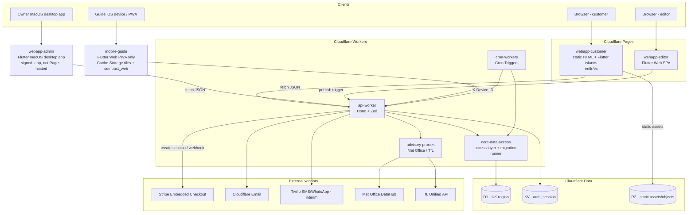

# FOB — System Architecture (P3 Design)

| | |
|---|---|
| **Author** | PMA (Principal Architect), dispatch `pma-P3` |
| **Phase** | P3 (Design) |
| **Date** | 2026-07-21 |
| **Status** | PROPOSED (rev 2) — for GATE-P3 / sponsor sign-off. Revised for sponsor-directed deviations DEV-1..DEV-4. |
| **Binds to** | FOB-TSPEC-001 (TDR-01..17), Architecture_Allocation.md, Module_Map.md, Data_Dictionary.md |
| **Scope** | 78 AORDL requirements across 11 REQ-owning modules |

> Governing rule: `prose suggests; TDRs bind`. Every architectural choice below either implements an APPROVED TDR (cited inline as `satisfies: TDR-##`) or is left open where a TDR is `PROPOSED`. No alternative stack is invented.

---

## 1. Overview

FOB (Friends on Bikes) is a Cloudflare-native tour-operations platform. It is a set of frontends (public marketing/booking site, Owner back-office, content editor, guide field app) served by a single Hono API Worker over Cloudflare D1 (UK), KV, and Cron.

> **Build-from-scratch (DEV-4 / TDR-12 superseded by sponsor).** This is a **greenfield** build. `admin-rome` is **no longer the canonical source repo** and no code, schema, or interop is reused from it or `guide_app`. All DDL is **authored fresh** from `Data_Dictionary.md` + the module specs during P4/P5. The Cloudflare stack (Workers/Pages/D1-UK/KV/R2/Cron) and local-D1 Wrangler dev workflow are unchanged; only the "reuse the built repo" framing is removed.

The 78 requirements decompose into **11 REQ-owning modules** — `core-auth` (AUTH), `core-consent-audit` (CNA), `core-notifications` (NOTIF), `core-seo` (SEO), `booking` (BOOK), `pre-sales` (PRE), `tour-operations` (OPS), `fleet-equipment` (FLEET), `post-tour` (POST), `pre-tour` (TOUR), `back-office` (BO) — supported by two zero-REQ infrastructure modules: `core-data-access` (DATA, the single D1 access layer + migration runner) and `core-design-system` (DS, the shared forest-palette token set). These 13 modules are realized by **7 deployable components**.

---

## 2. Components (7) and their module mapping

| Component | Kind (TDR-13) | Realizes modules | Responsibility |
|---|---|---|---|
| `webapp-customer` | Static HTML/CSS/JS + Flutter Web **island** widgets, per-locale dirs `en/fr/es` | PRE (W11–W15), BOOK (W5–W10), TOUR (W16–W20), POST (W21, W3), CNA (W3/W4 capture), SEO (crawlable output), DS | Public marketing/booking/tour-hub site. SEO-first: server-static HTML for crawlers, Flutter islands for interactive widgets (availability, checkout mount, tour hub). |
| `webapp-admin` | **Flutter macOS desktop app** (DEV-6 / TDR-13 revised — Web SPA retired, no SEO) | BO (A17–A20), BOOK owner surfaces (A7, A18, A20), FLEET (A12–A16), OPS admin (A10/A11), PRE (A9), NOTIF (A3/A4), CNA (A5), SEO (A6 publish), AUTH (A1/A2), DS | Owner planning/oversight console: departure calendar, booking browser, fleet, enquiries, incident/hazard review, deliverability, publish trigger. |
| `webapp-editor` | Full Flutter Web SPA (no SEO) | SEO content authoring, DS | Content-authoring surface feeding the static publish (SEO01/02 source content). Thin this run (RCA catalogue is presumed/out of scope); topology-present, publish control shared with `webapp-admin` (A6, SEO03). |
| `mobile-guide` | Flutter **Web PWA only** (DEV-3 / TDR-13 revised — iOS-native primary dropped) | OPS (G2–G13), AUTH (guide device recognition) | Field playbook app for guides: readiness gates, rider check-in, incident/hazard logging. Offline-critical once a tour starts (TDR-16), served as an installable PWA (no App Store distribution). |
| `api-worker` | Cloudflare Worker — **Hono + Zod** | Middle/services layer for ALL 78 REQs; owns AUTH middleware, NOTIF send path (Cloudflare Email Sending, DR-18), Stripe webhooks, the Cloudflare Email Routing inbound handler (REQ-NOTIF05), Met Office/TfL proxies | The single request/business-logic tier at the Cloudflare edge. Every frontend and cron talks to D1/KV only through this Worker. |
| `core-data-access` | Library inside `api-worker` (DATA module) | DATA (all D1 tables) | Single D1 access pattern + run-once, in-order migration runner + transaction helper. All persistence flows through it (TDR-03). |
| `cron-workers` | Cloudflare Cron Triggers (Worker handlers) | CNA04, NOTIF sends, PRE07, BOOK09, TOUR02/03/10, FLEET07, POST02 | Scheduled jobs: `gdpr-cleanup` (03:00), `send-reminders` (08:00), `send-review-requests` (09:00), plus abandonment sweep, weather, no-show, compliance check. |

`core-data-access` and `cron-workers` are code modules co-deployed with `api-worker` (same Worker bundle / Wrangler project), not separate network services — but are called out as distinct architectural components because they are distinct responsibilities with distinct binding TDRs (TDR-03, TDR-01 Cron).

---

## 3. Deployment topology (Cloudflare-native) {#topology}

**satisfies: TDR-01** (Workers/Pages/D1-UK/KV/R2/Cron), **TDR-11** (deploy target `friendsonbikes.uk`).

**Excluded by TDR-02 (cited):** no Durable Objects, no Cloudflare Queues, no AI Gateway, no Vectorize, no Workers AI, no Cloudflare Access. Capacity concurrency (normally a DO use-case) is instead an atomic D1 decrement (TDR-08); idempotency (normally a queue use-case) is a D1 store (TDR-05); auth (normally Access) is JWT+KV (TDR-07).

---

## 4. Request & data flow

### 4.1 Customer booking flow (BOOK, representative money path)
1. `webapp-customer` availability island reads `GET /tours/:id/availability` (PRE03 → reads `departures`).
2. Customer selects → `POST /bookings` creates a `draft` and performs the **atomic D1 transactional decrement** of `departures.held_count` (BOOK01, **satisfies: TDR-08**).
3. Attendee details (BOOK02), waiver/T&C + marketing consent (BOOK03 → CNA01 write to `consents`).
4. `POST /bookings/:id/checkout-session` creates a Stripe **Embedded Checkout** session (`ui_mode:'embedded'`), returns client secret; client mounts it (BOOK04, **satisfies: TDR-06**). `payments` row inserted `INSERT OR IGNORE` on `session_id` (**satisfies: TDR-05**).
5. Fulfilment is driven **only** by the `checkout.session.completed` webhook at `POST /webhooks/stripe` — never the return page (BOOK05, **satisfies: TDR-06**). Idempotency guarded by `webhook_events` D1 store (**satisfies: TDR-05**). A reconciliation sweep (`POST /admin/payments/reconcile`) repairs any booking a missed/undelivered webhook left `pending`.
6. On confirmation (webhook or reconciliation), the **booking-outcome dispatcher** picks a flavour from the payment position (paid-in-full / deposit / reserved-unpaid) and sends the allocated template once via NOTIF01/NOTIF11 (Cloudflare Email Sending, DR-18 — supersedes Postmark/TDR-09), idempotency-keyed per (booking, flavour), with a plain-text fallback. This is the email half of UXC-FBK-1; the on-screen R1 confirmation is the other half.
7. **Island hosting (2026-07-26):** the booking + Stripe-payment island is mounted inside the themed static page `en/book/` (not served standalone) via the engine `hostElement`, resolving assets under `en/book/flutter/` (`<base href>` + `entrypointBaseUrl`); the Stripe return lands on the themed `en/book/return/` R1 page.

### 4.2 Guide field flow (OPS, offline-critical)
`mobile-guide` (Flutter **Web PWA only**, DEV-3) authenticates every request with `X-Device-ID` (AUTH03, **satisfies: TDR-07**). Because the PWA cannot use native-only FMTC/default `sembast`, tiles are cached via a **service worker / Cache-Storage** layer and data persists in **`sembast_web` (IndexedDB)** (DEV-2 / TDR-16 revised — `flutter_map`, CyclOSM, `flutter_bloc`, `go_router`, GetIt retained). It syncs readiness/check-in/incident writes to `api-worker` when connectivity allows. **Offline-mid-tour caveat:** browser storage quota and eviction policies are weaker than native storage — the offline-critical guarantee now depends on pre-caching tiles/data before a tour starts and on the browser not evicting under pressure (surfaced as a risk in the AIB).

### 4.3 Owner back-office flow (BO orchestration)
`webapp-admin` drives departure create/edit/cancel via BOOK11–13 (the data ops live in `booking` to keep the graph acyclic). A material date/time change or a cancel triggers a customer notice by BO calling `pre-tour` REQ-TOUR05/07 — BO depends on TOUR; BOOK never does (Module_Map §2).

### 4.4 Scheduled flow (cron)
`cron-workers` run `gdpr-cleanup` (CNA04), `send-reminders` T-1 (TOUR02), weather advisory (TOUR03 via Met Office proxy), abandonment sweep (BOOK09), no-show (TOUR10), compliance check (FLEET07), review requests T+24h (POST02). All persist through `core-data-access`.

---

## 5. How each binding TDR is realized

| TDR | Realization in this architecture | Where |
|---|---|---|
| **TDR-01** | 7 components on Workers/Pages/D1-UK/KV/R2/Cron; §3 topology diagram | §2, §3, #topology |
| **TDR-02** | DO/Queues/AI/Access explicitly excluded; replaced by D1 decrement + D1 idempotency + JWT/KV | §3 exclusion note |
| **TDR-03** | `core-data-access` is the sole D1 access path + run-once ordered migration runner | §2, data-dictionary.md |
| **TDR-06** | Stripe Embedded Checkout; webhook-only fulfilment | §4.1, api-contracts.md#stripe |
| **TDR-07** | JWT HS256 1h + KV sessions (Owner/customer signed-link); guides via `X-Device-ID` | §4.2, api-contracts.md#auth |
| **TDR-08** | Atomic D1 transactional capacity decrement in `POST /bookings` and modify/cancel | §4.1, api-contracts.md#capacity |
| **TDR-13** | webapp-customer static+islands; **webapp-admin Flutter macOS desktop (DEV-6 — Web SPA retired)**; webapp-editor Flutter Web SPA; mobile-guide **Web PWA only** (DEV-3) | §2 |
| **TDR-14** | Static publish is manual, operator-triggered only — no on-content-change trigger | §6 #publish |
| **TDR-16** | mobile-guide stack: flutter_map/CyclOSM/**Cache-Storage tiles**/**sembast_web (IndexedDB)**/flutter_bloc/go_router/GetIt (DEV-2 — FMTC + native sembast swapped for PWA) | §4.2, component-specs.md#mobile-guide |

Also honored (bind other phases but reflected here): TDR-04 (money pence / ISO-8601 UTC — data-dictionary.md), TDR-05 (D1 idempotency store), TDR-09 (Postmark), TDR-15 (design system — **web-admin adopts the sponsor parchment mockup tokens, DEV-1**), TDR-17 (Met Office/TfL via Worker proxy). **TDR-12 is superseded by DEV-4:** `admin-rome` is no longer canonical; this is a greenfield build with fresh-authored DDL.

---

## 6. Static publish model {#publish}

**satisfies: TDR-14.** The public `webapp-customer` site is regenerated by an **operator-triggered** rebuild only. `webapp-admin` (macOS desktop, DEV-6) and `webapp-editor` expose the publish control (A6, SEO03) which calls `POST /publish` — from the desktop app this is a cross-origin call from a native client, not a same-origin browser request; the Worker regenerates crawlable per-locale HTML (SEO01) and the sitemap/index (SEO02) from current content and pushes to Cloudflare Pages/R2. There is **no** automated on-content-change trigger (DR-10). SEO01/02 output is the static HTML itself (the frontend *is* the deliverable); the content export reads presumed `marketing`/`route-catalogue` read APIs (out of Lean-6 scope).

---

## 7. Non-functional posture

- **Performance:** edge-served static + Worker; D1 UK-region reads; islands hydrate only interactive widgets.
- **Security:** JWT HS256 1h, server-side expiry checks (never trust client expiry, AUTH04); card data never touches FOB (Stripe-hosted fields, BOOK04); consent/audit append-only ledgers; hashed capture IPs.
- **Data residency:** D1 UK region (TDR-03).
- **Resilience/offline:** guide app offline-critical mid-tour (TDR-16); idempotent sends and webhooks tolerate retries.
- **Auditability:** every money/safety action writes `audit_log` (CNA03), append-only.

---

## 8. Open items surfaced to sponsor (not silent deviations)
- TDR-10 (PROPOSED): SMS/WhatsApp vendor undecided — interim direct Twilio, no orchestration lock-in. Architecture keeps `message.provider` a plain string, not an enum.
- D-NOTIF-2: **CLOSED by DR-18 (EML reintegration, 2026-07-26)** — Cloudflare Email Sending/Routing supersedes Postmark (TDR-09) as the v1 email path, on the strength of the EML PoC's live-tested integration. Inbound routing (REQ-NOTIF05) and the `remote: true` send binding both land in `api-worker`.
- OPS08 mid-tour event log entity is not yet named in the dictionary (Stage 6a follow-up) — designed here as a `mid_tour_events` table placeholder (see data-dictionary.md note).
- `retired` / `awaiting_external_service` bike states and scheduled-maintenance/certification-gate REQs have ratified *direction* but no authored REQ — not built (must-not-invent, FOB-TSPEC context).

---

## 9. CR-002 (CHG-001) — HTML email templates impact (REQ-NOTIF10, 2026-07-27)

**No new components; no topology change.** Sponsor-ratified CR-002 Phase 1 (block-editor HTML bodies, house shell, live preview, HTML test-send) lands entirely inside two existing components:

- **`api-worker` (NOTIF):** additive migration `0006` adds `email_templates.body_blocks` + `body_html` (data-dictionary.md CR-002 note); new pure block→HTML renderer + house shell; `renderTemplate` fills text **and** HTML bodies; `lib/cloudflare-email.ts` MIME builder gains `multipart/alternative` (text first, HTML last, quoted-printable UTF-8) — text-only sends are byte-unchanged; template CRUD + test-send routes amended (api-contracts.md #cr-002).
- **`webapp-admin` (email feature):** template editor gains a 5-block editor and a client-side live preview pane fed by the use_case sample merge data; test-send now delivers the HTML version. Preview is client-rendered (no new endpoint), pinned to the worker renderer by shared golden fixtures.

Risk LOW/MEDIUM: additive schema, plain-text fallback preserved as an invariant, no scripts/non-inline styles by construction; residual risk is email-client rendering variance, mitigated by the fixed house shell + real-inbox test-send. Out of scope (later phases): asset uploads, raw HTML/Markdown authoring, attachments.

---

## 10. CHG-008 (CT-3) — Resend outbound email transport (REQ-NOTIF01, 2026-07-28)

**No new components; no topology change.** Sponsor direction reverses TDR-09's no-ESP stance for *outbound* only: transactional email dispatch moves from Cloudflare Email Sending (DR-18) to **Resend**, a deliverability-grade transactional provider verified (DKIM+SPF) for `friendsonbikes.uk`. Inbound stays exactly as-is: Cloudflare Email Routing → the Worker's `email()` handler (REQ-NOTIF05) is untouched.

**Why:** Cloudflare Email Sending only delivers to addresses verified in the zone — it cannot satisfy REQ-NOTIF01's amended invariant that *any syntactically valid recipient* is accepted without pre-verification. Resend delivers to arbitrary recipients with domain-level SPF/DKIM alignment.

**Design (all inside `api-worker`, behind the existing single `send()` seam):**
- New `src/lib/resend-email.ts` adapter (`sendResendEmail()`) alongside `sendCloudflareEmail()`, same result shape (`ok`/`messageId`/`message`). Callers of `send()` are unchanged.
- Transport selected by `env.EMAIL_TRANSPORT ∈ {resend, cloudflare, debug}`: **production/staging → `resend`**, **local dev default → `debug`** (simulated send, console-rendered — supersedes the ad-hoc `EMAIL_DEBUG` behaviour) unless overridden. Keeping `cloudflare` selectable preserves an instant rollback path and the working DR-18 code.
- Resend **native `{from,to,subject,text,html,headers}` payload**, not raw MIME (see api-contracts.md #chg-008 rationale). Bodies come from the *same* `renderTemplate` outputs — REQ-NOTIF10 multipart parity holds; test-sends ride the identical transport (REQ-NOTIF01 invariant).
- Failure semantics: provider HTTP error / rate limit → message row keeps status `delivery_pending` and records the provider error in a **new additive `failure_reason` column** (migration `0007`, data-dictionary.md #chg-008); never silently dropped. **No retry storm:** the D1 idempotency-key claim precedes the provider call and is not released on failure — at most one automatic attempt per key; re-delivery is a deliberate ops action.
- Config: `RESEND_API_KEY` via `wrangler secret put` per env (fob-api-worker gets its own copy; the POC key on `email-poc-worker` is not shared); `EMAIL_TRANSPORT` as a per-env `[vars]` entry; `NOTIFICATIONS_EMAIL_FROM` unchanged (`bookings@friendsonbikes.uk`).

Risk LOW: additive schema, seam-preserving adapter, rollback = flip `EMAIL_TRANSPORT`. Residual risks: Resend availability/rate limits (mitigated: failures recorded, idempotent), API-key custody (secret store only, per-worker key). Supersedes the outbound half of DR-18; §8's D-NOTIF-2 note now reads outbound=Resend, inbound=Cloudflare.

## 11. CR-004 (CHG-012) — owner-initiated booking email + A19 master/detail (REQ-NOTIF11, 2026-07-28)

Architecturally a **thin composition over existing seams** — no new component, no topology change, no schema change:

- One new operator-guarded route (`POST /admin/bookings/:id/send-email`) that chains the already-delivered pieces: booking merge-vars builder (shared with the automatic outcome dispatcher), CR-002 merge substitution for both bodies, CHG-008 `send()` transport dispatch. Owner-initiated sends use a fresh idempotency key per action (explicit human intent is never deduplicated), unlike the per-(booking, flavour) keys of automatic sends.
- Booking↔message linkage stays the established `event`-string convention (`booking-send:{bookingId}:{templateId}`), the same mechanism `booking-outcome:*` sends use — the archive and booking views correlate on it; the `message` table is untouched.
- `{{personal_message}}` is a plain merge field; support-detection and preview are **client-side** (token scan of template rows; CR-002 Dart mirror renderer with real booking data) — consistent with the CR-002 "no server preview endpoint" decision.
- **A19 master/detail** is an admin-only presentation rework to the A5d idiom; component boundaries and API contracts are unchanged (screen spec owned by Clara in P3-UX).

Risk posture LOW/MEDIUM per the ratified CR: every load-bearing mechanism (rendering, escaping, transport, linkage, preview parity fixtures) is reused, not rebuilt.
