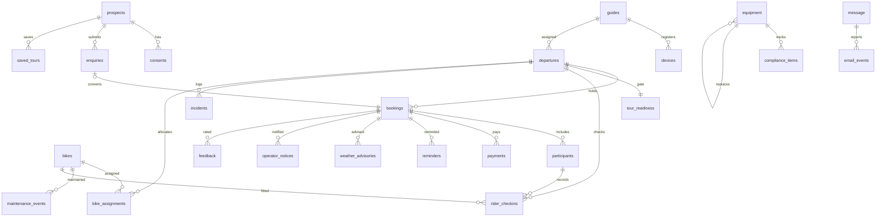

# FOB — Consolidated Data Model (P3 Design)

| | |
|---|---|
| **Author** | PMA, dispatch `pma-P3` |
| **Phase** | P3 (Design) · **Status** PROPOSED |
| **Derived from** | `Data_Dictionary.md` (Stage 6a, v0.9), ratified module specs |
| **Binds** | **TDR-03** (D1 UK via `core-data-access` + migration runner), **TDR-04** (money = integer pence; timestamps ISO-8601 UTC), TDR-05 (D1 idempotency), TDR-07 (KV session) |
| **Note** | Rev 2 — DDL authored fresh (greenfield, DEV-4). See §2. |

## 1. Conventions {#conventions}
- **Persistence: Cloudflare D1 (UK region), single access pattern via `core-data-access` (satisfies: TDR-03).** No table is written by more than one module; cross-module access is through the owning module's read API.
- **Money:** stored as **integer pence** — `price_total_pence`, `amount_pence`, `refund_amount_pence`, `deposit_required_pence`, `cost` (satisfies: TDR-04). Never floats.
- **Timestamps:** **ISO-8601, UTC** (e.g. `2026-07-20T14:03:00Z`) (satisfies: TDR-04).
- **Primary keys:** UUID for D1 rows (matches built `consents`/`prospects`); the KV `auth_session` uses its token string as natural key (satisfies: TDR-07 — KV, not D1).
- **Booleans:** `0`/`1` in D1.
- **Enums:** every closed value set registered once in §4; a new value is a dictionary revision, never a spec-local addition.

## 2. Migration-runner approach {#migration-runner}
**satisfies: TDR-03.** Schema is applied by a **run-once, in-order** migration runner inside `core-data-access`: numbered migration files (`0001_*.sql`, `0002_*.sql`, …) applied sequentially against local D1 in dev (Wrangler, no in-memory substitute) and prod/staging D1. The runner records applied migrations in a `_migrations` table and skips already-applied ones (run-once).

**DDL authored fresh (DEV-4 / greenfield).** `admin-rome` is no longer canonical — **no schema is reused from it or any PoC**. All table DDL is **authored from this data model + the module specs** during P4/P5. The `Built`/`Referenced`/`New` labels below are provenance-of-*definition* only (which upstream doc first specified the entity), **not** an instruction to reuse existing DDL: every table is written new from spec. There is no "confirm against admin-rome" step.

## 3. Entities (D1 unless noted)

### Auth & identity (`core-auth`)
- **`auth_session`** *(KV, not D1 — satisfies TDR-07)* — `token`(key), `actor_type`(enum `auth_actor_type`), `actor_id`, `booking_id`(nullable, customer scope), `created_at`, `expires_at`(=created+1h), `revoked_at`. Invariant: never outlives 1h; revoke deletes the KV record synchronously.
- **`devices`** *(Referenced)* — `device_id`(`X-Device-ID`), `guide_id`(FK guides), `status`.
- **`guides`** *(Referenced)* — `id`, `name`.

### Consent & audit (`core-consent-audit`)
- **`consents`** *(Built, append-only)* — `id`, `prospect_id`, `consent_type`(enum), `granted`, `source`, `evidence`, `ip_address_hash`, `granted_at`. Current state = latest row per `(prospect_id, consent_type)`.
- **`audit_log`** *(New, append-only, immutable)* — `id`, `occurred_at`, `actor_type`(enum), `actor_id?`, `subject_type`, `subject_id?`, `action`, `detail?`, `complete`(default true; false on missing actor/subject).

### Notifications (`core-notifications`)
- **`message`** *(New)* — `id`, `message_type`(enum), `recipient`, `event`, `idempotency_key`(unique), `provider`(plain string; `postmark` v1 — D-NOTIF-2 open), `provider_ref?`, `status`(enum), `created_at`, `sent_at?`.
- **`email_events`** *(Referenced)* — `id`, `message_id`(FK), `event_type`, `occurred_at`.
- **`webhook_events`** *(Referenced — idempotency store, satisfies TDR-05)* — `idempotency_key`, `processed_at`. Shared idempotency pattern for Stripe + notification sends (`INSERT OR IGNORE`).

### Pre-sales (`pre-sales`)
- **`prospects`** *(Built)* — `id`, `name?`, `email?`, `phone?`, `whatsapp_ok`, `preferred_channel?`, `locale?`, `source?`, `first_seen_at`, `last_seen_at`, `created_at`, `deleted_at?`. Invariant: email OR phone non-null; erasure blanks PII + sets `deleted_at` (row retained, CNA04).
- **`enquiries`** *(New)* — `id`, `prospect_id`(FK), `type`(enum), `party_size?`, `preferred_dates?`, `preferred_channel`, `message?`, `source_tour_id?`, `status`(enum), `sla_due_at`, `responded_at?`, `created_at`.
- **`saved_tours`** *(New)* — `id`, `prospect_id`(FK), `tour_id`, `save_method`, `nudge_status`(enum), `nudge_sent_at?`, `unsubscribed_at?`, `created_at`. Unique per `(prospect_id, tour_id)`.

### Booking (`booking`)
- **`departures`** *(Referenced)* — `id`, `tour_id`, `date`, `time`, `capacity`(≤10), `held_count`, `confirmed_count`, `grace_period_minutes`, `guide_id?`(FK guides, nullable), `status`(enum `departure_status`). **Invariant: `held_count + confirmed_count ≤ capacity`, enforced by atomic D1 decrement (satisfies TDR-08).** Unique `(tour_id, date, time)`. Readiness derived (scheduled + guide + bike_assignments), not stored.
- **`bookings`** *(Referenced)* — `id`, `departure_id`(FK), `status`(enum), `source`(enum), `party_size`(1–10), `price_total_pence`, `waiver_accepted_at?`, `terms_accepted_at?`, `emergency_contact_name/phone/relationship?`(one per booking, DR-B6), `hold_expires_at?`, `deposit_required_pence?`, `reminder_cadence?`, `created_at`, `confirmed_at?`, `cancelled_at?`. Confirm transition driven by Stripe webhook only (satisfies TDR-06).
- **`participants`** *(Referenced)* — `id`, `booking_id`(FK), `name`, `age_band`(enum), `contact_role`(enum: `leader`|`co-leader`|`attendee`, DR-B12a — replaces `is_lead_booker`; exactly one `leader` per booking), `is_lead_booker`(retained, kept in sync = `contact_role == 'leader'`, deprecated), `notes?`.
- **`payments`** *(Referenced)* — `id`, `booking_id`(FK), `session_id`, `status`(enum), `amount_pence`, `refund_amount_pence`(default 0, cumulative from `charge.amount_refunded`, TDR-06), `idempotency_key`(unique), `created_at`. Insert idempotent on `session_id` (satisfies TDR-05).
- **`bike_assignments`** *(New — DR-BO2a, booking owns)* — `id`, `departure_id`(FK), `bike_id`(FK bikes, cross-module read), `assigned_at`, `removed_at?`. Invariant: a bike never in two active assignments whose departures overlap; only `in_service` bikes assigned.

### Tour operations (`tour-operations`)
- **`tour_readiness`** *(New, 1:1 departure)* — `id`, `departure_id`(FK), `guide_id`, `kit_check_signed_at?`, `bike_inspection_signed_at?`, `risk_assessment_signed_at?`, `all_riders_cleared_at?`, `briefing_confirmed_at?`, `final_signoff_at?`, `status`(enum). Ready only when all six timestamps set, no unresolved flag.
- **`rider_checkins`** *(New)* — `id`, `departure_id`(FK), `participant_id`(FK), `bike_id?`(FK), `waiver_reconfirmed_at?`, `cleared`, `refusal_reason?`, `guide_notes?`, `created_at`. `cleared` requires `waiver_reconfirmed_at`.
- **`incidents`** *(New, immutable)* — `id`, `departure_id`(FK), `occurred_at`, `location`, `type`(enum), `severity`, `preliminary_description`, `formal_report?`, `status`(enum), `insurer_dispatch_at?`(stub, D-OPS-5).
- **`hazard_log`** *(New)* — `id`, `street_name`, `hazard_type`, `description`, `severity?`, `observed_at`, `status`(enum), `last_confirmed_at?`. Dedup by street (bump `last_confirmed_at`, no duplicate row).
- **`mid_tour_events`** *(New, placeholder — OPS08; entity not yet named in Stage 6a)* — `id`, `departure_id`(FK), `occurred_at`, `issue`, `resolution?`, `created_at`. Flagged open in architecture.md §8.

### Fleet (`fleet-equipment`)
- **`bikes`** *(New)* — `id`, `make`, `model`, `frame_size`, `colour`, `serial_number?`, `purchase_date?`, `route_eligibility`(list), `spare`, `status`(enum `bike_status`), `last_inspected_at?`, `notes?`, `created_at`. Flagged bikes not assignable until cleared (FLEET06).
- **`equipment`** *(New)* — `id`, `type`(enum), `description`, `size?`, `purchase_date`, `manufacture_date?`, `review_due_at?`, `status`(enum), `replacement_of?`(self-FK), `replacement_reason?`, `created_at`.
- **`maintenance_events`** *(New, immutable)* — `id`, `bike_id`(FK), `work_performed`, `parts_replaced?`, `time_taken?`, `cost?`(pence), `notes?`, `created_at`.
- **`compliance_items`** *(New)* — `id`, `type`(enum), `related_equipment_id?`(FK), `expiry_or_due_at`, `status`(enum), `last_alert_sent_at?`, `renewed_at?`. On-event alert only, guarded by `last_alert_sent_at` (DR-F7).

### Pre-tour (`pre-tour`)
- **`reminders`** *(New)* — `id`, `booking_id`(FK), `milestone`(`t_minus_1` only, DR-T1), `sent_at`, `channel?`(D-TOUR-2 open). At most one per booking.
- **`weather_advisories`** *(New)* — `id`, `booking_id`(FK), `classification`(enum, only `informational` reachable — D-TOUR-3), `forecast_summary`, `sent_at`, `superseded_by?`.
- **`operator_notices`** *(New)* — `id`, `booking_id`(FK), `type`(`change`/`cancellation`), `old_value?`, `new_value?`, `material`, `status`(enum), `sent_at`, `acknowledged_at?`, `remediation_choice?`(`refund`/`rebook`/`credit`).

### Post-tour (`post-tour`)
- **`feedback`** *(New)* — `id`, `booking_id`(FK), `overall_rating`(1–5), `guide_rating`(1–5), `value_rating`(1–5), `would_recommend`(enum), `free_text?`, `owner_alerted`(true when overall ≤3, DR-PT2), `created_at`.

## 4. Enum registry {#enums}
`consent_type` · `actor_type` · `auth_actor_type`(owner/secondary_operator/customer) · `message_type` · `message_status` · `schema_org_type` · `booking_status`(draft/confirmed/provisionally-confirmed/cancelled/abandoned) · `booking_source`(direct/owner-created/provisional) · `payment_status`(pending/succeeded/partially_refunded/refunded/failed) · `departure_status`(scheduled/cancelled) · `enquiry_type` · `enquiry_status` · `nudge_status` · `bike_status`(in_service/flagged_for_service/in_maintenance/awaiting_external_service/out_of_service/retired — last two declared holes DR-F8/F9) · `readiness_status`(in_progress/ready/blocked) · `incident_type` · `incident_status` · `hazard_status` · `advisory_classification`(informational only) · `operator_notice_status` · `equipment_type` · `equipment_status` · `compliance_status`. Full value lists per `Data_Dictionary.md` §3.

## 5. ER diagram {#er}

*(KV `auth_session` and D1 idempotency `webhook_events` are keyed stores, not shown as ER relations.)*
