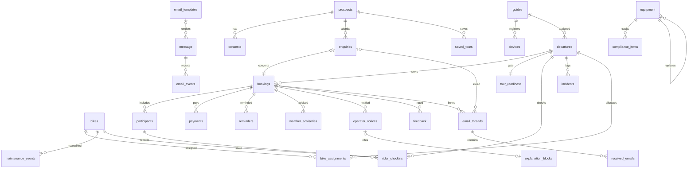

# FOB — Consolidated Data Model (P3 Design)

| | |
|---|---|
| **Author** | PMA, dispatch `pma-P3` |
| **Phase** | P3 (Design) · **Status** PROPOSED |
| **Derived from** | `Data_Dictionary.md` (Stage 6a, v0.9), ratified module specs |
| **Binds** | **TDR-03** (D1 UK via `core-data-access` + migration runner), **TDR-04** (money = integer pence; timestamps ISO-8601 UTC), TDR-05 (D1 idempotency), TDR-07 (KV session) |
| **Note** | Rev 3 — EML reintegration folded in (source: `_user_input/raw-requirements/EML-reintegration-handover/`, DR-16–19, 2026-07-26): `notify_opted_in` on `participants` (DR-19); new `core-notifications` entities `email_templates`/`explanation_blocks`/`email_threads`/`received_emails`; `operator_notices` gains explanation-block + discount fields (F3); new `back-office` `operator_settings` (DR-16); provider → Cloudflare (DR-18); EML `sent_emails`/`notification_settings` NOT created (fold into `message` / dropped, F4/F6). Rev 2 — DDL authored fresh (greenfield, DEV-4). See §2. |

## 1. Conventions {#conventions}
- **Persistence: Cloudflare D1 (UK region), single access pattern via `core-data-access` (satisfies: TDR-03).** No table is written by more than one module; cross-module access is through the owning module's read API.
- **Money:** stored as **integer pence** — `price_total_pence`, `amount_pence`, `refund_amount_pence`, `deposit_required_pence`, `cost` (satisfies: TDR-04). Never floats.
- **Timestamps:** **ISO-8601, UTC** (e.g. `2026-07-20T14:03:00Z`) (satisfies: TDR-04).
- **Primary keys:** UUID for D1 rows (matches built `consents`/`prospects`); the KV `auth_session` uses its token string as natural key (satisfies: TDR-07 — KV, not D1).
- **Booleans:** `0`/`1` in D1.
- **Enums:** every closed value set registered once in §4; a new value is a dictionary revision, never a spec-local addition.

## 2. Migration-runner approach {#migration-runner}
**satisfies: TDR-03.** Schema is applied by a **run-once, in-order** migration runner inside `core-data-access`: numbered migration files (`0001_*.sql`, `0002_*.sql`, …) applied sequentially against local D1 in dev (Wrangler, no in-memory substitute) and prod/staging D1. The runner records applied migrations in a `_migrations` table and skips already-applied ones (run-once).

**DDL authored fresh (DEV-4 / greenfield).** `admin-rome` is no longer canonical — **no schema is reused from it or any PoC**. All table DDL is **authored from this data model + the module specs** during P4/P5. The `Built`/`Referenced`/`New` labels below are provenance-of-*definition* only (which upstream doc first specified the entity), **not** an instruction to reuse existing DDL: every table is written new from spec. There is no "confirm against admin-rome" step.

## 3. Entities (D1 unless noted)

### Auth & identity (`core-auth`)
- **`auth_session`** *(KV, not D1 — satisfies TDR-07)* — `token`(key), `actor_type`(enum `auth_actor_type`), `actor_id`, `booking_id`(nullable, customer scope), `created_at`, `expires_at`(=created+1h), `revoked_at`. Invariant: never outlives 1h; revoke deletes the KV record synchronously.
- **`devices`** *(Referenced)* — `device_id`(`X-Device-ID`), `guide_id`(FK guides), `status`.
- **`guides`** *(Referenced)* — `id`, `name`.

### Consent & audit (`core-consent-audit`)
- **`consents`** *(Built, append-only)* — `id`, `prospect_id`, `consent_type`(enum), `granted`, `source`, `evidence`, `ip_address_hash`, `granted_at`. Current state = latest row per `(prospect_id, consent_type)`.
- **`audit_log`** *(New, append-only, immutable)* — `id`, `occurred_at`, `actor_type`(enum), `actor_id?`, `subject_type`, `subject_id?`, `action`, `detail?`, `complete`(default true; false on missing actor/subject).

### Notifications (`core-notifications`)
- **`message`** *(New)* — `id`, `message_type`(enum), `recipient`, `event`, `idempotency_key`(unique), `provider`(plain string; `cloudflare-email` — DR-18, supersedes `postmark`/TDR-09; D-NOTIF-2 closed), `provider_ref?`, `status`(enum), `template_id?`(FK `email_templates`, set when the send was rendered from a template), `created_at`, `sent_at?`. **The one send-log for every module's outbound email — EML's `sent_emails` retires into this (F4/§4): content-assembly modules render, then hand off to the shared `send()`/NOTIF01 path for dispatch + idempotency + delivery-status. No separate send table.**
- **`email_events`** *(Referenced)* — `id`, `message_id`(FK), `event_type`, `occurred_at`.
- **`webhook_events`** *(Referenced — idempotency store, satisfies TDR-05)* — `idempotency_key`, `processed_at`. Shared idempotency pattern for Stripe + notification sends (`INSERT OR IGNORE`).
- **`email_templates`** *(New — EML reintegration, REQ-EML10 territory)* — `id`, `use_case`(enum `email_template_use_case`), `name`, `subject`, `body`, `variables`(list of required merge fields), `status`(enum `email_template_status`: `draft`|`active`|`retired`), `created_at`, `updated_at`. Invariant: at most one `active` template per `use_case`; a `draft` is not used for sending until published. **CR-002 (CHG-001):** adds `body_blocks`(nullable TEXT, JSON) and `body_html`(nullable TEXT) — see the CR-002 amendment below. **FR-001 (2026-07-29, migration `0009`):** adds `body_source`(TEXT NOT NULL DEFAULT `'blocks'`, CHECK in `blocks`|`raw`) — how the HTML was authored. `blocks` is CR-002 behaviour unchanged: `body_html` is a rendered projection of `body_blocks` wrapped in the house shell, and a client-supplied `body_html` is still refused. `raw` means the Owner imported a complete document which REPLACES the house shell (it carries its own header and footer) and is stored verbatim, unsanitised. Defaulting to `blocks` leaves every existing template with exactly the guarantees it had. A `raw` template has `body_blocks` NULL.

#### CR-002 (CHG-001) — HTML email bodies on `email_templates` (REQ-NOTIF10, 2026-07-27)

Two additive nullable columns:

- **`body_blocks`** — `TEXT NULL`, JSON array: the Owner's block-editor structure, the **authoring source of truth**. Each element is `{ "type": <block_type>, ... }` with `block_type` ∈ `header` (logo + title; logo is the single hosted logo URL), `text` (paragraph, `{{merge}}` tokens allowed, emoji allowed), `button` (label + href, `{{merge}}` allowed in both), `divider`, `footer` (brand/legal line). The editor round-trips this structure; the Owner never sees or writes HTML.
- **`body_html`** — `TEXT NULL`: the **rendered, email-safe HTML** derived from `body_blocks` wrapped in the house shell (inline styles only, table layout, web-safe font stack, no scripts, no `<style>` block). Denormalised on purpose and regenerated by the worker on every create/update that carries `body_blocks` — the send path reads `body_html` directly with zero per-send rendering cost, while the editor round-trips `body_blocks`.

**Decision — store both, blocks canonical.** Storing only `body_html` would make the editor un-round-trippable (parsing HTML back to blocks is fragile); storing only `body_blocks` would push block→HTML rendering into the hot send path and risk preview/send divergence. So: `body_blocks` is what the Owner edits; `body_html` is a server-rendered projection, never hand-edited. If they ever disagree, `body_blocks` wins (re-render).

**Semantics:** both columns `NULL` ⇒ a plain-text-only template — sends exactly as today (`text/plain`). `body_html` non-null ⇒ the send is `multipart/alternative` (text part first, HTML part second); `body` remains the guaranteed fallback and is still `NOT NULL`. `{{merge}}` tokens survive rendering into `body_html` and are substituted at send time in **both** bodies from the same vars map. Invariant (REQ-NOTIF10): `body_html` never contains `<script>` or rely on non-inline styling — guaranteed by construction (only the fixed block renderer writes it; block field values are HTML-escaped on render).

**Migration (additive, `0006_html_email_templates.sql`):**
```sql
ALTER TABLE email_templates ADD COLUMN body_blocks TEXT;  -- JSON array, NULL = no HTML version
ALTER TABLE email_templates ADD COLUMN body_html TEXT;    -- rendered projection of body_blocks
```
No backfill, no data movement, no index change; existing rows stay `NULL` (text-only) and keep working unchanged. Rollback = ignore the columns (reads never require them).
- **`explanation_blocks`** *(New — EML reintegration, folded from retired REQ-EML05, F3)* — `id`, `booking_id?`(FK), `notice_id?`(FK `operator_notices`), `author_actor_id`(Owner), `text`(freeform, Owner-authored, manually pasted — DR-2), `created_at`. Per-send cancellation rationale attached to a notice — not a reusable template.
- **`email_threads`** *(New — EML reintegration, inbound archive, REQ-EML11-14 territory)* — `id`, `categorisation`(enum `thread_categorisation`: `linked`|`unlinked`|`ambiguous`), `booking_id?`(FK), `enquiry_id?`(FK), `candidate_refs?`(JSON — recorded when `ambiguous`; none chosen automatically), `created_at`. Categorisation is always exactly one value; only an exact, unambiguous cascade match — or a manual link (REQ-NOTIF07) — ever sets `linked`.
- **`received_emails`** *(New — EML reintegration)* — `id`, `thread_id`(FK `email_threads`), `from_address`, `subject?`, `body?`, `spam_flag`(marker only, never a delivery gate — DR-7), `references_header?`, `in_reply_to?`, `provider_ref?`, `received_at`. Every inbound message captured exactly once and forwarded exactly once regardless of spam classification (fail open toward delivery).

### Pre-sales (`pre-sales`)
- **`prospects`** *(Built)* — `id`, `name?`, `email?`, `phone?`, `whatsapp_ok`, `preferred_channel?`, `locale?`, `source?`, `first_seen_at`, `last_seen_at`, `created_at`, `deleted_at?`. Invariant: email OR phone non-null; erasure blanks PII + sets `deleted_at` (row retained, CNA04).
- **`enquiries`** *(New)* — `id`, `prospect_id`(FK), `type`(enum), `party_size?`, `preferred_dates?`, `preferred_channel`, `message?`, `source_tour_id?`, `status`(enum), `sla_due_at`, `responded_at?`, `created_at`.
- **`saved_tours`** *(New)* — `id`, `prospect_id`(FK), `tour_id`, `save_method`, `nudge_status`(enum), `nudge_sent_at?`, `unsubscribed_at?`, `created_at`. Unique per `(prospect_id, tour_id)`.

### Booking (`booking`)
- **`departures`** *(Referenced)* — `id`, `tour_id`, `date`, `time`, `capacity`(≤10), `held_count`, `confirmed_count`, `grace_period_minutes`, `guide_id?`(FK guides, nullable), `status`(enum `departure_status`). **Invariant: `held_count + confirmed_count ≤ capacity`, enforced by atomic D1 decrement (satisfies TDR-08).** Unique `(tour_id, date, time)`. Readiness derived (scheduled + guide + bike_assignments), not stored.
- **`bookings`** *(Referenced)* — `id`, `departure_id`(FK), `status`(enum), `source`(enum), `party_size`(1–10), `price_total_pence`, `waiver_accepted_at?`, `terms_accepted_at?`, `emergency_contact_name/phone/relationship?`(one per booking, DR-B6), `hold_expires_at?`, `deposit_required_pence?`, `reminder_cadence?`, `created_at`, `confirmed_at?`, `cancelled_at?`. Confirm transition driven by Stripe webhook only (satisfies TDR-06). On confirmation (or reconciliation repair, REQ-BOOK05) the booking-outcome dispatcher (`modules/notifications/booking-outcome`) selects a confirmation flavour from `Σ succeeded payments` vs `price_total_pence` and sends the allocated template once, idempotency-keyed per (booking, flavour) — REQ-NOTIF11.
- **`participants`** *(Referenced)* — `id`, `booking_id`(FK), `name`, `age_band`(enum), `contact_role`(enum: `leader`|`co-leader`|`attendee`, DR-B12a — replaces `is_lead_booker`; exactly one `leader` per booking), `notify_opted_in`(bool, default 1 — DR-19/EML reintegration; meaningful only for `co-leader` (independent all-or-nothing switch, F-18); a `leader` is always notified), `email?`(EML reintegration build-finding — the recipient fan-out (F-18) and the cascade sender-lookup (REQ-NOTIF05 step 4/DR-10) need a per-person address; the retired `co_leaders` carried one, `participants` did not), `is_lead_booker`(retained, kept in sync = `contact_role == 'leader'`, deprecated), `notes?`. Retires EML's `co_leaders` table — every booking's people live here, one row per person (DR-19).
- **`payments`** *(Referenced)* — `id`, `booking_id`(FK), `session_id`, `status`(enum), `amount_pence`, `refund_amount_pence`(default 0, cumulative from `charge.amount_refunded`, TDR-06), `idempotency_key`(unique), `created_at`. Insert idempotent on `session_id` (satisfies TDR-05).
- **`bike_assignments`** *(New — DR-BO2a, booking owns)* — `id`, `departure_id`(FK), `bike_id`(FK bikes, cross-module read), `assigned_at`, `removed_at?`. Invariant: a bike never in two active assignments whose departures overlap; only `in_service` bikes assigned.

### Tour operations (`tour-operations`)
- **`tour_readiness`** *(New, 1:1 departure)* — `id`, `departure_id`(FK), `guide_id`, `kit_check_signed_at?`, `bike_inspection_signed_at?`, `risk_assessment_signed_at?`, `all_riders_cleared_at?`, `briefing_confirmed_at?`, `final_signoff_at?`, `status`(enum). Ready only when all six timestamps set, no unresolved flag.
- **`rider_checkins`** *(New)* — `id`, `departure_id`(FK), `participant_id`(FK), `bike_id?`(FK), `waiver_reconfirmed_at?`, `cleared`, `refusal_reason?`, `guide_notes?`, `created_at`. `cleared` requires `waiver_reconfirmed_at`.
- **`incidents`** *(New, immutable)* — `id`, `departure_id`(FK), `occurred_at`, `location`, `type`(enum), `severity`, `preliminary_description`, `formal_report?`, `status`(enum), `insurer_dispatch_at?`(stub, D-OPS-5).
- **`hazard_log`** *(New)* — `id`, `street_name`, `hazard_type`, `description`, `severity?`, `observed_at`, `status`(enum), `last_confirmed_at?`. Dedup by street (bump `last_confirmed_at`, no duplicate row).
- **`mid_tour_events`** *(New, placeholder — OPS08; entity not yet named in Stage 6a)* — `id`, `departure_id`(FK), `occurred_at`, `issue`, `resolution?`, `created_at`. Flagged open in architecture.md §8.

### Fleet (`fleet-equipment`)
- **`bikes`** *(New)* — `id`, `make`, `model`, `frame_size`, `colour`, `serial_number?`, `purchase_date?`, `route_eligibility`(list), `spare`, `status`(enum `bike_status`), `last_inspected_at?`, `notes?`, `created_at`. Flagged bikes not assignable until cleared (FLEET06).
- **`equipment`** *(New)* — `id`, `type`(enum), `description`, `size?`, `purchase_date`, `manufacture_date?`, `review_due_at?`, `status`(enum), `replacement_of?`(self-FK), `replacement_reason?`, `created_at`.
- **`maintenance_events`** *(New, immutable)* — `id`, `bike_id`(FK), `work_performed`, `parts_replaced?`, `time_taken?`, `cost?`(pence), `notes?`, `created_at`.
- **`compliance_items`** *(New)* — `id`, `type`(enum), `related_equipment_id?`(FK), `expiry_or_due_at`, `status`(enum), `last_alert_sent_at?`, `renewed_at?`. On-event alert only, guarded by `last_alert_sent_at` (DR-F7).

### Pre-tour (`pre-tour`)
- **`reminders`** *(New)* — `id`, `booking_id`(FK), `milestone`(`t_minus_1` only, DR-T1), `sent_at`, `channel?`(D-TOUR-2 open). At most one per booking.
- **`weather_advisories`** *(New)* — `id`, `booking_id`(FK), `classification`(enum, only `informational` reachable — D-TOUR-3), `forecast_summary`, `sent_at`, `superseded_by?`.
- **`operator_notices`** *(New)* — `id`, `booking_id`(FK), `type`(`change`/`cancellation`), `old_value?`, `new_value?`, `material`, `status`(enum), `remediation_choice?`(`refund`/`rebook`/`credit`), `explanation_block_id?`(FK `explanation_blocks` — Owner-authored cancellation rationale, folded from retired REQ-EML05, F3), `discount_code?`, `discount_expires_at?`(single-use rebook code/voucher, tied to the Party Leader only — never a Co-leader — F-19/BR-05), `sent_at`, `acknowledged_at?`. Absorbs retired REQ-EML05/EML06 (company- and weather-initiated cancellation), reason-agnostic with a *chosen* remediation (D-TOUR-5), not always-full-refund.

### Post-tour (`post-tour`)
- **`feedback`** *(New)* — `id`, `booking_id`(FK), `overall_rating`(1–5), `guide_rating`(1–5), `value_rating`(1–5), `would_recommend`(enum), `free_text?`, `owner_alerted`(true when overall ≤3, DR-PT2), `created_at`.

### Back-office (`back-office`)
- **`operator_settings`** *(New — EML reintegration, DR-16; single row of Owner-configurable operational policy)* — `id`, `refund_cutoff_hours`(int, default 48 — at/above it a full refund is automatic; below it there is no automated calculation and the Owner enters the amount manually — DR-B5/F1), `reminder_milestones`(list, default `["t_minus_1"]` — which of `t_minus_7`/`t_minus_24h`/`t_minus_1` fire — DR-T1/F2), `cancellation_remediation_options`(list, default `["refund","rebook","credit"]` — which the Owner may offer on a business-initiated cancellation — D-TOUR-5/F3), **`reply_mode`**(TEXT NOT NULL DEFAULT `'auto'`, in `auto`|`manual` — FR-001/REQ-BO08, migration `0008`: whether the booking confirmation is sent the moment the payment outcome is known, or stands down for the Owner to send from the booking record. It governs WHEN, never WHETHER — there is no value that leaves a paying customer un-notified, and an unreadable row is treated as `auto` for that reason), **`deposit_default_pence`**(INTEGER NOT NULL DEFAULT 0 — FR-001/REQ-BO08, migration `0008`: the deposit offered by default when the Owner takes a booking. Pence per TDR-04; 0 means no default and the Owner enters an amount per booking. A flat amount, not a percentage — see REQ-BO08 OpenQuestion), `updated_at`. Additive by design: a new threshold/toggle is a new column + form field, not a new table. Replaces EML's `notification_settings` toggle-row (dropped with REQ-EML18, F6). Server-enforced: a remediation type not currently enabled is rejected server-side, not merely hidden.

## 4. Enum registry {#enums}
`consent_type` · `actor_type` · `auth_actor_type`(owner/secondary_operator/customer) · `message_type` · `message_status` · `schema_org_type` · `booking_status`(draft/confirmed/provisionally-confirmed/cancelled/abandoned) · `booking_source`(direct/owner-created/provisional) · `payment_status`(pending/succeeded/partially_refunded/refunded/failed) · `departure_status`(scheduled/cancelled) · `enquiry_type` · `enquiry_status` · `nudge_status` · `bike_status`(in_service/flagged_for_service/in_maintenance/awaiting_external_service/out_of_service/retired — last two declared holes DR-F8/F9) · `readiness_status`(in_progress/ready/blocked) · `incident_type` · `incident_status` · `hazard_status` · `advisory_classification`(informational only) · `operator_notice_status` · `equipment_type` · `equipment_status` · `compliance_status` · `email_template_status`(draft/active/retired) · `email_template_use_case`(booking_confirmation/reminder/payment_receipt/cancellation_notice/review_request + booking-outcome flavours booking_confirmed_paid/booking_deposit_received/booking_reserved_unpaid — one per templated send/process, extensible; the use_case is the process key that a template is allocated to, REQ-NOTIF10/11) · `thread_categorisation`(linked/unlinked/ambiguous) · `reminder_milestone`(t_minus_7/t_minus_24h/t_minus_1 — configurable set, `operator_settings.reminder_milestones`; default `t_minus_1` only). Full value lists per `Data_Dictionary.md` §3.

## 5. ER diagram {#er}



*(KV `auth_session` and D1 idempotency `webhook_events` are keyed stores, not shown as ER relations.)*

---

## CHG-008 (CT-3) — `message.failure_reason` + provider value (REQ-NOTIF01, 2026-07-28) {#chg-008}

**Schema check:** the `message` table (0001) has `provider`, `provider_ref`, `status` — but **no column can hold a transport failure reason**, and the `status` CHECK (`queued|sent|delivered|bounced|failed_complaint|delivery_pending`) cannot be extended additively in SQLite (CHECK constraints require a table rebuild). Decisions:

- **New additive column** — migration `0007_resend_transport.sql`:
  ```sql
  ALTER TABLE message ADD COLUMN failure_reason TEXT;  -- NULL = no transport failure recorded
  ```
  Set when the provider rejects/errors a send (provider error text + HTTP status); cleared/NULL on success. Satisfies REQ-NOTIF01's "transport failure recorded with its reason, never silently dropped".
- **Status value reused, not extended** — a transport failure records `status='delivery_pending'` (existing enum value, already the seam's failure semantic) *with* `failure_reason` populated; no table rebuild, no enum change. `failed_complaint`/`bounced` remain webhook-driven post-delivery states.
- **`provider` values** — plain string per §8/TDR-10: now `resend` (default outbound), `cloudflare-email` (rollback path), `debug` (local simulated). `provider_ref` holds Resend's message id.
- **Entity note (§ `message`)** — provider default is now `resend` via CHG-008; the 0001 DDL default `'postmark'` is historical and always overwritten by `send()`.

## CR-004 (CHG-012) — no schema change (REQ-NOTIF11, 2026-07-28) {#cr-004}

Owner-initiated booking sends introduce **no new columns or tables (decision)**. Linkage of a sent message to its booking already works by convention, not by foreign key: `message.event` carries the booking id (`booking-outcome:{bookingId}:{flavour}` today; CR-004 adds the `booking-send:{bookingId}:{templateId}` prefix), and the archive/search surfaces match on it. `message.template_id` records the template as for every templated send; `message.idempotency_key` is a fresh `booking-send:{bookingId}:{uuid}` per owner action (never suppressed). `{{personal_message}}` is a merge token inside existing `email_templates.body`/`body_html` content — not a schema attribute.
