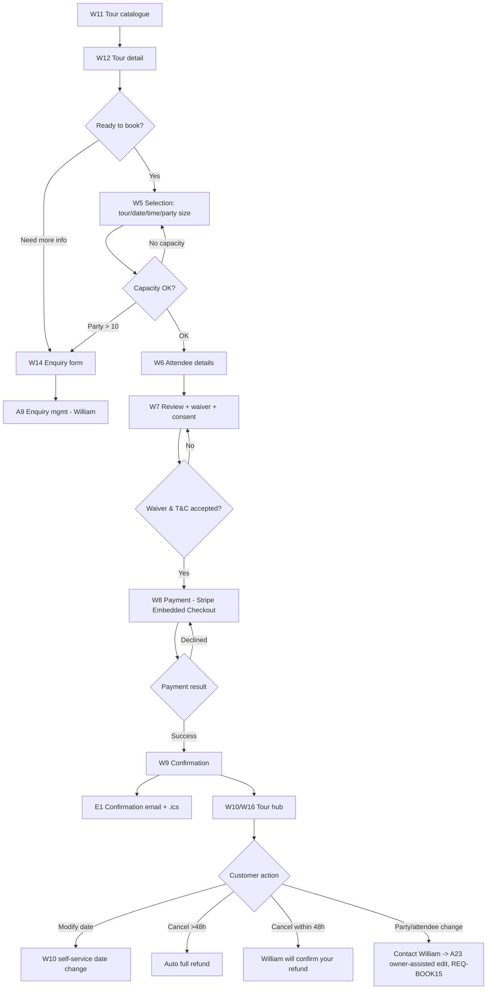
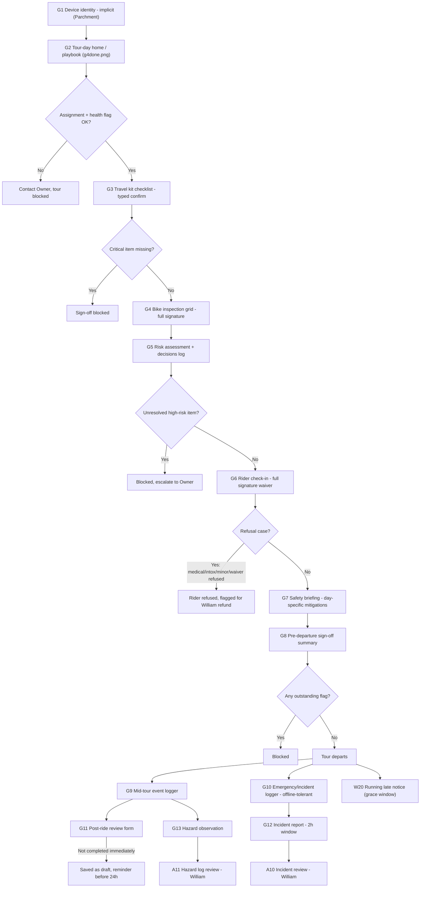
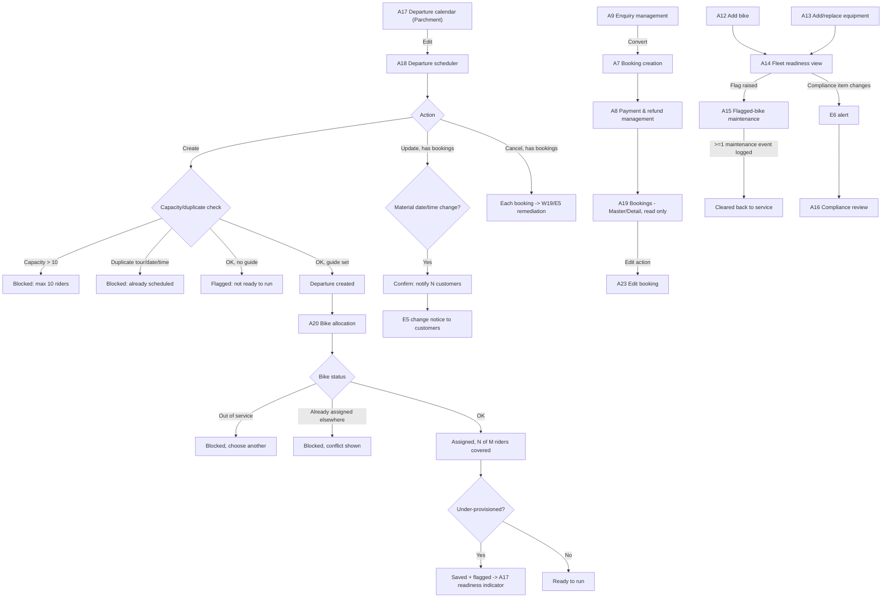
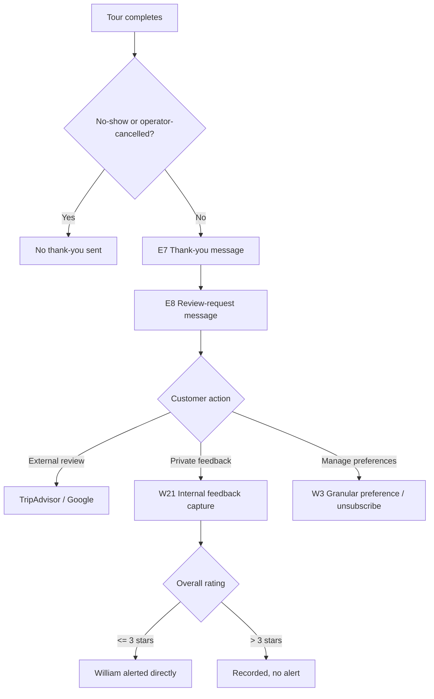
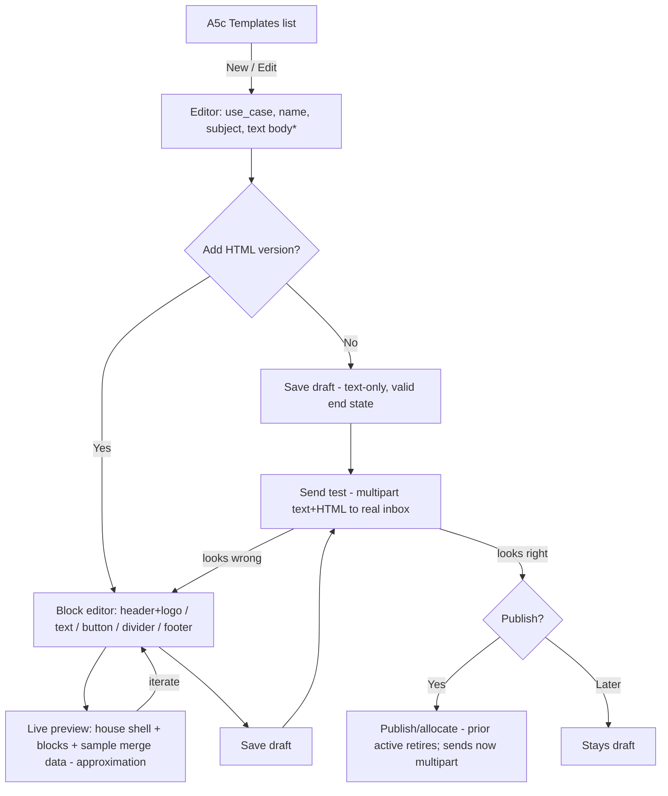
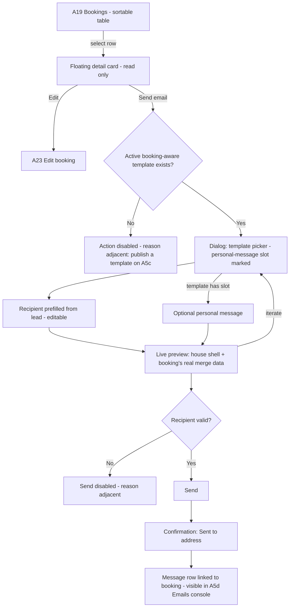

# FOB (Friends on Bikes) — User Flows

| | |
|---|---|
| **Document** | P3 User Flows (Clara, dispatch clara-P3) |
| **Status** | APPROVED baseline — required P3 output (ROME-AX-26 `designAssets` fact) |
| **Sources** | `Surface_Journey_Coverage.md` (64 named surfaces: W1–W21, A1–A20, G1–G13, E1–E8, P1–P2), `Operational_Workflows.md`, `Handover_AllModules_ClaudeDesign_Aristotle_2026-07-21.md`, `Handover_BackOffice_ClaudeDesign_Bacon_2026-07-21.md`, `Handover_Booking_ClaudeDesign_Aristotle_2026-07-20.md` |
| **Design system** | `design-system.md` (this directory) — **two brand tracks (DEV-1, sponsor-directed AIB-P3 redirect, extended)**: Flows 1, 2, 5 and their customer-webapp/editor surfaces render from **Track A — Forest** tokens (Syne/DM Sans) per TDR-15; **Flow 3 (guide day-of, G1–G13) and Flow 4 (owner admin, A1–A20) both render from Track B — Internal Apps Parchment** tokens (Playfair Display/Plus Jakarta Sans/mono, pink/lime/cyan/orange status accents), grounded in the sponsor-supplied mockups at `_user_input/design-mockups/admin-system/` and `_user_input/design-mockups/guide-system/` (identical `_ds` token bundle in both). Rendering target (static/island/SPA/native) per **TDR-13** — note Flow 4 (owner admin, A1–A20) now renders in a **Flutter macOS desktop app** per **DEV-6**, not a Web SPA. |
| **Admin mockup reference** | `_user_input/design-mockups/admin-system/scraps/` — `02-shell.png` (app shell/nav rail), `01-nav.png`/`02-tree.png` (nav tree), `05-cal.png`/`02-a17ok.png` (departure calendar), `04-sched.png` (scheduler), `01-a17ok.png`/`02-a17fix.png` (departure detail) — used directly to ground Flow 4's screen descriptions below. |
| **Guide mockup reference** | `_user_input/design-mockups/guide-system/scraps/` — `g4done.png` (G2 tour-day playbook overview), `g4check.png` (G4 bike inspection full-signature grid); plus `Guide App.dc.html`, `ios-frame.jsx` (iOS device-frame layout reference, not code) — used directly to ground Flow 3's screen descriptions below. |
| **Fixtures** | Tom (customer), Marie/Sarah (prospects), William (Owner), Emma (guide, `DEV-EMMA-01`), Hidden City tour `TOUR-HID`, departure `DEP-HID-2026-08-01-1000` |

Every step below cites its surface ID from `Surface_Journey_Coverage.md`. Screens not explicitly re-described here inherit their spec from that matrix and `design-system.md` §5–7 (Track A, customer webapp + editor) or §8 (Track B, web-admin + guide app).

---

## 1. Customer booking + payment (primary revenue journey)

**Journeys**: UJ-BOOK-01…07 · **REQs**: REQ-BOOK01–07 · **Surfaces**: W5→W6→W7→W8→W9, extending to W10/W16 post-confirmation.

### Steps
1. **W5 — Selection** [Island]: customer picks tour/date/time/party-size. Live capacity re-query on each change. Party size capped at 10.
2. **W6 — Attendee details** [Island]: one block per attendee + one emergency contact per booking. Draft state survives hold-expiry interruption.
3. **W7 — Review, waiver, consent** [Island]: inline scrollable waiver + T&C, unticked marketing checkbox. Continue disabled until waiver+T&C accepted. (Note: this is the party-level digital waiver only — a second, individual on-day re-confirmation happens later at G6.)
4. **W8 — Payment** [Island]: Stripe Embedded Checkout, inline, no redirect. Card/Apple Pay/Google Pay.
5. **W9 — Confirmation** [Island]: booking ref, meeting point, .ics + confirmation-page calendar widget (DR-T9), manage-booking link.
6. Post-confirmation, W10 becomes the **tour hub** (= W16): status badges, countdown, "what to bring," meeting point.

### Mermaid — booking + payment flow



**Design considerations**: skeleton loading on W5 slot list; inline field-level errors on W6 (no full-page reload); W8 never redirects away from page (embedded checkout is a hard product requirement — do not substitute a hosted redirect flow). Cancellation-within-48h intentionally shows no calculated refund amount (William decides case-by-case) — do not "improve" this into an auto-calculated figure.

**Owner-side counterpart**: A7 (booking creation from enquiry or provisional) and A8 (payment & refund management) mirror this flow for William-initiated bookings — see §4.

---

## 2. Pre-sales browse & enquiry (top-of-funnel, mostly static/no-script)

**Journeys**: UJ-PRE-01…08 · **REQs**: REQ-PRE01–07 · **Surfaces**: P1/P2 (crawlable), W11–W15.

### Steps
1. **P1/P2 — Crawlable marketing pages/index** [Static]: search-engine entry, no script required.
2. **W11 — Tour catalogue** [Static] (+homepage/orientation): filterable list. Empty state → reset + route to W14.
3. **W12 — Tour detail** [Static]: paused tour → no book CTA, enquiry route offered instead.
4. **W13 — Availability picker** [Island]: date fully booked → 3 alternatives suggested; party >10 → routed to W14.
5. **W14 — Group/private/corporate enquiry** [Island]: explicit SLA shown on submit ("William will reply within one business day").
6. **W15 — Saved tours** [Island]: save-by-email, transactional send (no consent needed) + separate opt-in nudge checkbox (never pre-ticked).
7. Enquiry lands at **A9 — Enquiry management** [SPA] for William (daily digest email per DR-P1; spam-flagged enquiries on separate tab, no alert).

### Mermaid — pre-sales flow

```mermaid
flowchart TD
    A[P1 Crawlable tour page / P2 index] --> B[W11 Tour catalogue]
    B --> C[W12 Tour detail]
    C --> D{Tour status}
    D -->|Paused| E[Status shown, no book CTA] --> F[Route to W14 enquiry]
    D -->|Active| G[W13 Availability picker]
    G --> H{Availability}
    H -->|Fully booked| I[3 alternative dates shown]
    H -->|Party > 10| F
    H -->|Available| J["Book" CTA -> Booking flow W5 (see Flow 1)"]
    B --> K[W15 Saved tours - save by email]
    K --> L[E4 Save-tour transactional email + optional nudge]
    F --> M[E-mail SLA confirmation]
    F --> N[A9 Enquiry management - William]
    N --> O{Enquiry disposition}
    O -->|Convert| P[A7 Booking creation - Owner side]
    O -->|Spam| Q[Spam tab, no alert]
    O -->|Overdue, unanswered| R[Stays visibly flagged, no auto-email to prospect]
```

---

## 3. Guide day-of operations (offline-first, sequential sign-off)

**Journeys**: UJ-OPS-01…12 · **REQs**: REQ-OPS01–14 · **Surfaces**: G1–G13, extends the GMT app shell. **Device/stack**: Flutter iOS-native (primary) + Web PWA fallback (TDR-13; PWA emphasis reconfirmed DEV-2/DEV-3), offline-critical once a tour starts (TDR-16: flutter_map/CyclOSM/FMTC/sembast).

> **DEV-1 extended (sponsor-directed, AIB-P3 redirect)**: this entire flow now renders from **Track B — Internal Apps Parchment** (`design-system.md` §8), the same token set as web-admin, grounded in the sponsor-supplied mockup at `_user_input/design-mockups/guide-system/` (`_ds` bundle identical to `admin-system/`). This is a **visual/token change only** — Playfair Display titles, Plus Jakarta Sans body/controls, mono ids/labels, parchment neutrals, pink/lime/cyan/orange status accents, `.fob-console` dark theme OFF — the offline-first sembast persistence, sequential gated sign-off order, full-signature-vs-typed-confirm distinction (DR-O1), and no-photo-capture scope cut (DR-O5) are all unchanged. Guide screens were forest/Syne in the prior revision; they are Parchment as of this revision.

### Steps (linear, gated — each step blocks the next until resolved)
1. **G1 — Device-identity recognition** [Native, Parchment]: implicit via `X-Device-ID` on every request, not a distinct screen.
2. **G2 — Tour-day home / playbook overview** [Native, Parchment]: matches `scraps/g4done.png` — mono eyebrow "SIX STEPS BEFORE YOU ROLL," Playfair title "Tour-day playbook," device/guide identity chip ("DEV-EMMA-01 · Emma · guide"), full-width gradient-brand hero card (tour name in Playfair, mono meta "1 Aug 2026, 10:00 · TOUR-HID · 90 min," thin progress bar, "1/6" counter), numbered step list with coloured status circles (pink=not started, lime=done) and START/DONE status pills per step; also carries a read-only bike-status snapshot from fleet-equipment.
3. **G3 — Travel kit checklist** [Native, Parchment]: typed-confirm sign-off (Plus Jakarta Sans field, mono "G3 · Typed confirm" sub-label pattern per §8.4); critical item missing blocks progression.
4. **G4 — Bike inspection grid** [Native, Parchment]: matches `scraps/g4check.png` — mono eyebrow "G4 · FULL SIGNATURE," Playfair title "Bike inspection," per-bike white cards (mono bike-ID heading e.g. "FOB-001" + row of lime-filled check chips "✓ Brakes/✓ Tyres/✓ Chain/✓ Lights"), lime-tinted "SIGNATURE DECLARATION" panel with the guide's name rendered large in Playfair italic on completion. Full signature, every bike every tour, no shortcut for same-day repeat fleets.
5. **G5 — Risk assessment + decisions log** [Native, Parchment]: typed-confirm; unresolved high-risk item blocks + escalates to Owner (orange warning treatment).
6. **G6 — Rider check-in card** [Native, Parchment]: full signature (on-day waiver re-confirmation, the "second layer" beyond W7 — which stays Track A/Forest since it's on the customer webapp). Refusal cases (medical/intoxication/unaccompanied minor/waiver refused) → refused, pink needs-action banner, flagged for William-processed refund (guide never handles money).
7. **G7 — Safety briefing script** [Native, Parchment]: day-specific mitigations pulled inline from G5.
8. **G8 — Pre-departure sign-off summary** [Native, Parchment]: any outstanding flag blocks departure.
9. Tour runs: **G9 — Mid-tour event logger**, **G10 — Emergency/incident logger** (no mobile signal → seek help via passer-by, log once possible; pink needs-action banner), **W20 "Running late" notice** (stays Track A/Forest — it's a customer-webapp surface within the per-tour grace window).
10. **G11 — Post-ride review form** [Native, Parchment]: draft-saved if not completed immediately, reminder before 24h deadline.
11. Follow-on: **G12 — Incident report** (if applicable, 2h statutory window) and **G13 — Hazard observation entry**.

### Mermaid — guide day-of flow (Track B — Internal Apps Parchment)



**Design considerations**: entire flow must function fully offline mid-tour (sembast local persistence, sync on reconnect) — unaffected by the Parchment re-skin; every sign-off uses either full signature (G4, G6 — safety-critical) or typed-confirm (G3, G5 — routine) per DR-O1; no photo capture anywhere in this flow (DR-O5, deliberate scope cut — do not add); outdoor/gloved-use legibility (44×44px touch floor, ≥16px minimum text) carried forward from the pre-DEV-1 spec despite the visual change (`design-system.md` §8.7).

---

## 4. Owner admin — departures, fleet, back-office

**Journeys**: UJ-BO-01…07, UJ-FLEET-01…05, plus A7/A8/A9/A10/A11/A3–A6 · **REQs**: REQ-BO04–06, REQ-BOOK11–14, REQ-FLEET01–08 · **Surfaces**: A1–A20 [SPA, PC/iMac wide-screen only].

> **DEV-1 (sponsor-directed, AIB-P3 redirect, extended)**: this entire flow renders from **Track B — Internal Apps Parchment** (`design-system.md` §8), grounded in the sponsor-supplied mockup at `_user_input/design-mockups/admin-system/` — the same Parchment token set now also used by Flow 3's guide app — NOT the forest/Syne system used by Flows 1, 2, 5 (customer webapp + editor). App shell: fixed left rail (Playfair "Friends on Bikes" wordmark + mono "BACK OFFICE" eyebrow), mono-uppercase grouped nav sections ("BOOKINGS & PAYMENTS," "SCHEDULING," "ALERTS & RECORDS," "CONTENT," "SAFETY") each listing surface-ID-prefixed items, William's identity pinned at rail bottom ("William · Owner"), top bar shows "PC / iMac · wide-screen console" context + "Sign out." Every screen below is one shell instance with the content region swapped. Status/readiness signals use the fixed four-hue accent system: pink = needs action/cost, lime = settled/money-back, cyan = info/trust, orange = warning — never decorative. `.fob-console` dark theme is OFF.

### 4a. Departure scheduling & bike allocation

1. **A17 — Departure calendar** [SPA, Parchment]: matches `scraps/05-cal.png`/`02-a17ok.png` — mono eyebrow "A17 · SCHEDULING," Playfair page title "Departure calendar," filter chips (This week / This month / All, active chip solid pink), then a table: Departure (Playfair tour name + date/time) / Guide / Filled (fraction, e.g. "6/10") / Readiness (coloured dot + mono label: cyan dot "GUIDE ✓" or orange dot "NO GUIDE ✗", similar bikes indicator) / row actions ("Edit" secondary, "Bikes" gradient-pink primary). Read-only — editing routes to A18. Empty state → "No departures scheduled in this range."
2. **A18 — Departure scheduler** [SPA, Parchment]: same shell (`scraps/04-sched.png`), create/update/cancel form following §8.2/§8.4 field conventions (mono labels, Playfair for tour-name display, money in Playfair pink-text where deposit/price shown). Capacity capped at 10 ("A departure can hold at most 10 riders"); duplicate (tour, date, time) blocked ("That tour is already scheduled at that time"); material date/time change on a booked departure → orange-accented confirm modal "this will notify N customers" → E5. Guide optional at create → departure flagged "not ready to run" (orange readiness dot, feeds A17).
3. **A20 — Bike allocation** [SPA, Parchment, two-panel pattern §8.5]: reached from A17/A18, matching the participant/departure-detail modal pattern in `scraps/01-a17ok.png`/`02-a17fix.png` (mono eyebrow, Playfair title, mono-labelled detail rows). Left: departure header card (tour, date/time, party size, guide). Right: Available bikes vs. Assigned-to-departure lists; "N of M riders covered" running counter in cyan (info), switches to orange when under-provisioned. Errors: out-of-service bike blocked (pink "FOB-00X is out of service"); double-booked bike blocked. Under-provisioned saves but flags + feeds back into A17 readiness.
4. Cancelling a departure with existing bookings routes each booking to remediation (**W19** customer-side, Track A / **E5** notice, Track A) — the admin-side trigger stays in Parchment, the customer-facing remediation stays forest.

### 4b. Booking & payment management (Owner side)

5. **A7 — Booking creation** [SPA, Parchment]: from enquiry (A9 handoff) or provisional/pay-later — William sets hold/deposit/reminder terms per booking, no defaults (money fields in Playfair `--type-price`). Captures `customerEmail` and sends the DR-B11 completion link (BOOK08/BOOK10) — attendee details and consent are supplied by the *customer* via that link, never entered here. (Creation only; editing an existing booking is A23, REQ-BOOK15.)
6. **A8 — Payment & refund management** [SPA, Parchment]: matches `scraps/03-s2.png`-style payments table and its refund modal. Requires operator session (not a static admin key, DR-B9). Filter chip row (All / Requires payment / Succeeded / Refunded / Failed / No-show, active chip pink), dense DataTable (Booking / Customer / Paid / Refunded / Status / action) with money in Playfair `--text-price`, StatusPill per row (lime "succeeded," cyan "refunded," pink "requires_payment"). **Refund modal**: mono eyebrow "REFUND · BK-1001," Playfair title "Issue refund," booking summary line, two-up Paid/Refunded-so-far fields (Playfair pink values), single Refund-amount field, computed "Cumulative refunded after this: £X.XX" helper line, Cancel (secondary) + "Issue refund" (gradient-pink primary) actions. Cumulative refund total always shown, not just latest refund. **Row actions (FINDING-005):** **View** (always) opens a read-only per-payment history modal (BO06 array — individual transactions, not the aggregate row) plus a "View booking" link; **Refund** appears only for a `succeeded` row (never for failed/no-show/requires-payment).
7. **A19 — Bookings** [SPA, Parchment, **master/detail**, matching A18's established master/detail pattern]: renamed from "Booking browser." *(**CR-004 (CHG-012)** supersedes the two-screen split below: A19 is now ONE surface in the A5d Emails-console idiom — sortable six-column table, row select opens a floating read-only detail card in place, Edit still routes to A23; and the detail card gains a Send-email action — see UXD-22/23 and §9. Read-only content and the A8 modal cross-link are unchanged.)* Split into two screens reached by navigation (not two panes of one screen):
   - **Master** — search by ref/customer/tour/date/status; results list (reference, name, tour, status).
   - **Detail** — reached by selecting a Master row; a back action returns to Master. Shows the full booking record: payment as provider references only (never raw card data), consent/waiver timestamps, status history, attendees with `contact_role` (leader/co-leader/attendee), using the same mono-label/Playfair-value detail-card pattern as A20's participant modal. **Read-only (2026-07-27 — reverses DR-B12):** no Edit dialog and no inline status-transition buttons on this screen; both moved to A23. Payment *amounts* are still handled on A8, not here.

   *(A8 Payments cross-link, FINDING-005): the payments drill-down "View" opens the real per-payment history (BO06), and "View booking" opens the A19 **Detail** record as a modal — sponsor-confirmed 2026-07-27 to keep this as a modal (not a route navigation), preserving A8's filter/scroll state as originally designed; the modal content is now read-only, since editing has relocated to A23.)*

8. **A23 — Edit booking** [SPA, Parchment]: new screen hosting the owner-assisted booking edit and status-transition capability relocated off A19, reached via an **"Edit"** action on the A19 Detail screen (sponsor-confirmed label, 2026-07-27). Hosts: an **Edit** dialog/form changing departure date and the attendee list + contact roles (REQ-BOOK15), and **status-transition** buttons (Confirm / Cancel / Mark abandoned) applying constrained transitions (REQ-BOOK16). Saving or transitioning returns to A19 Detail (showing the updated record). Payment *amounts* remain on A8, not here.

### 4c. Fleet & equipment

9. **A12 — Add bike** [SPA, Parchment]: duplicate identifier blocked (pink), next-sequential suggested, no photo capture.
10. **A13 — Add/replace equipment** [SPA, Parchment]: line-by-line, no bulk, no photo; helmet impact → immediate retirement (pink/orange status change).
11. **A14 — Fleet & equipment readiness view** [SPA, Parchment]: aggregate status counts using the four-hue StatusPill system (lime in-service, orange flagged, pink needs-action, cyan info); critical alerts never buried.
12. **A15 — Flagged-bike maintenance** [SPA, Parchment]: detail + event log + status update, mono-labelled event rows; needs ≥1 logged maintenance event before clearing back to service.
13. **A16 — Compliance review & renewal** [SPA, Parchment]: on-event alerts only (E6), this view is the primary check-in-between-alerts surface; renewal-due items get the orange warning treatment.

### 4d. Back-office operations (auth, content, audit)

14. **A1/A2 — Operator sign-in/sign-out** [Parchment], **A5 — Audit log viewer** [Parchment] (incomplete entries flagged not hidden, orange left-edge treatment), **A6 — Manual publish trigger + content-quality panel** [Parchment] (manual-only per DR-10/TDR-14), **A3 — Deliverability status** [Parchment], **A4 — Owner alert inbox** [Parchment] (fallback landing for unreachable-channel alerts, pink needs-action treatment for unactioned items), **A10 — Incident review & insurer dispatch** [Parchment] (stub, format TBD), **A11 — Hazard log review** [Parchment] (dedupes by street). All use the same left-rail shell shown in `scraps/02-shell.png`.

### Mermaid — departure & fleet operations flow (Track B — Admin Parchment)



---

## 5. Post-tour review & feedback

**Journeys**: UJ-POST-01…03, UJ-POST-10 (tight scope — UJ-POST-05–09 explicitly deferred) · **REQs**: REQ-POST01–03, REQ-POST10 · **Surfaces**: E7, E8, W21, W3 (reused).

### Steps
1. **E7 — Thank-you message** [Message]: transactional, always sent (not for no-show/operator-cancelled).
2. **E8 — Review-request message** [Message]: TripAdvisor + Google links + private-feedback option, equal visual weight, one-shot (no reminder).
3. **W21 — Internal feedback capture** [Island, on tour hub]: overall/guide/value ratings 1–5 + would-recommend + optional free text. A ≤3★ overall alerts William directly.
4. **W3 — Marketing-preference / unsubscribe** [Static, reused]: granular preference management (newsletter/nudges/seasonal/all) via signed link, no login.

### Mermaid — post-tour flow



**Scope note (do not extend)**: post-tour is intentionally minimal — no in-system review monitoring, no recovery-contact tracking, no repeat-booking/lapsed nudges, no marketing-campaign composer, no GDPR deletion screen this pass. These are deferred, not omissions.

---

## 6. Cross-cutting: auth, consent, notifications (support flows referenced above)

- **UJ-AUTH-02/05** (W1 signed-link access, W2/A2 sign-out) and **UJ-AUTH-01/03** (A1 operator sign-in, G1 device identity) gate every journey above — see `design-system.md` for shared error-state copy (expired link, invalid link, session expired).
- **UJ-CNA-01/02/03/04/05** (W4 consent capture, W3 preference mgmt, A5 audit log, REQ-CNA05 internal gate) underlie every marketing-touching step in Flows 1, 2, 5 — the "never pre-ticked" rule is a hard global invariant, not per-screen.
- **UJ-NOTIF-01/02/04** (E1/E2/E3, A3 deliverability, A4 owner alert inbox) are the delivery layer beneath every "email sent" step in Flows 1–5.

---

## 7. Coverage cross-check against the 64 surfaces

| Group | Surfaces | Brand track (DEV-1) | Covered by flow(s) |
|---|---|---|---|
| Customer webapp (W1–W21) | 21 | A — Forest | Flow 1 (W5–W10, W16, W18, W19), Flow 2 (W11–W15), Flow 5 (W3, W21), Flow 6 (W1, W2, W4); W20 in Flow 3 |
| Back-office (A1–A20) | 20 | **B — Admin Parchment** | Flow 4 (A1–A20 all, Parchment/mockup-grounded); A9 also referenced in Flow 2 |
| Guide app (G1–G13) | 13 | **B — Internal Apps Parchment** | Flow 3 (all, Parchment/guide-mockup-grounded) |
| Messages (E1–E8) | 8 | A — Forest | Flow 1 (E1), Flow 2 (E4), Flow 4 (E5, E6), Flow 5 (E7, E8); E2/E3 in §6 |
| Public site (P1–P2) | 2 | A — Forest | Flow 2 |
| **Total** | **64** | — | All named surfaces mapped to ≥1 flow above. |

UJ-TOUR-08 (day-of morning reminder) has no surface by design (DR-T1 light-cadence policy) — not represented here, consistent with `Surface_Journey_Coverage.md` GAP-6b-4.

---

## 8. HTML email template authoring — CR-002 (CHG-001)

**Journeys**: Owner authors/upgrades an email template with an optional HTML version · **REQ**: REQ-NOTIF10 (CR-002 amendment) · **Surface**: A5c (Email templates, Track B Parchment editor chrome; the *emails it produces* render from Track A Forest via the house shell — see `email-house-shell.md`) · **UXD**: UXD-20/21 (`FOB-UXIS-001_UXIS.md`).

### 8a. Author a new draft with blocks → preview → test-send → publish
1. **A5c list** — "New template": pick use_case, fill name/subject/plain-text body (text body always required — it is the fallback of every send).
2. **HTML section** — add blocks from the 5-block palette (header+logo, text, button, divider, footer); fill per-block fields; insert `{{ merge }}` fields from the use_case's catalogue; reorder/remove as needed.
3. **Live preview** — the right-hand pane renders house shell + blocks with the use_case's **sample merge data** on every edit; captioned as an approximation, never inbox-truth.
4. **Save draft**, then **Send test** — delivers the real multipart (text + HTML) message, sample-data-filled, to the Owner or an override address; Owner checks a real inbox (Gmail/Outlook/phone).
5. **Publish (allocate)** — existing flow unchanged: publishing requires all required merge fields defined (422 otherwise); exactly one active template per use_case; sends from now on are multipart text+HTML.

### 8b. Add HTML to an existing text-only template later
1. Open the template on A5c — HTML section shows its empty state ("No HTML version — sends as plain text only") + palette. Nothing is flagged as incomplete: text-only is a fully valid end state.
2. Add blocks → preview → save. If the template is **active**, standard practice per REQ-NOTIF10's draft-first model: create/edit as draft, test-send, then publish (the prior active auto-retires). Removing the last block reverts the template to text-only; existing sends and text fallback are unaffected.



**Design considerations**: the Owner never touches raw HTML; emoji + the single hosted logo are the only imagery (no asset upload — CR-002 Phase 2); the preview is a Flutter HTML-render approximation, so the test-send is the authoritative check; unsaved block changes disable the editor's test-send ("Save the draft first…").

---

## 9. Send email to a booking's lead — CR-004 (CHG-012)

**Journeys**: Owner emails the booking lead from the booking record · **REQ**: REQ-NOTIF11 (CR-004 amendment) · **Surfaces**: A19 (Bookings — now one master/detail surface in the A5d idiom, UXD-22) → send dialog (UXD-23) → confirmation, sent message visible on A5d · **UXD**: UXD-22/23 (`FOB-UXIS-001_UXIS.md`).

### Steps
1. **A19 Bookings** — sort/search the six-column table (customer/ref/tour/date/amount/status); select the row. The read-only detail opens as a floating card over the list — no navigation, list state kept.
2. **"Send email"** on the detail card (disabled with adjacent reason if no active booking-aware template exists: "No booking-aware templates are active. Publish one before sending.").
3. **Template** — pick from active, booking-aware templates only; options with a `{{personal_message}}` slot are marked.
4. **Message** — if (and only if) the chosen template has the slot, add an optional personal message. Recipient is prefilled from the lead's contact email, editable (typo fix).
5. **Preview** — house shell + this booking's real merge data + the personal message, re-rendered live.
6. **Send** — template-only send via the standard transport, never idempotency-suppressed. Confirmation **"Sent to <address>"**; the message is recorded linked to the booking and appears in the **A5d Emails console** / archive like every other send.



**Design considerations**: booking-aware filtering prevents blank merge fields by construction; template-only this increment (free-form deferred, DECIDE-3); the send is an owner action so it is never idempotency-suppressed, unlike the automatic confirmation flavours it sits beside in the archive.

---

## Revision History

| Version | Date | Summary |
|---|---|---|
| 1.0 | 2026-07-21 | Initial P3 user-flows deliverable: 5 primary journeys with Mermaid diagrams (booking+payment, pre-sales, guide day-of, owner admin, post-tour) plus cross-cutting auth/consent/notification notes, mapped to all 64 named surfaces. |
| 1.1 | 2026-07-21 | **DEV-1 (sponsor-directed, AIB-P3 redirect)**: Flow 4 (owner admin, A1–A20) rewritten to reference the sponsor-supplied Parchment admin mockup screens (`scraps/02-shell.png` app shell, `05-cal.png`/`02-a17ok.png` departure calendar, `04-sched.png` scheduler, `01-a17ok.png`/`02-a17fix.png` departure/participant detail, `03-s2.png`-style payments) instead of the forest system. §7 coverage table now marks brand track per surface group. All other flows (1, 2, 3, 5) unchanged — still Track A Forest. |
| 1.2 | 2026-07-21 | **DEV-1 extended (sponsor-directed)**: Flow 3 (guide day-of, G1–G13) rewritten to reference the sponsor-supplied Parchment guide-app mockup (`guide-system/scraps/g4done.png` tour-day playbook, `g4check.png` bike-inspection full-signature grid) — guide app moves from Track A/Forest to Track B/Internal Apps Parchment, same token set as web-admin. Offline-first behaviour, gated sign-off order, and DR-O1/DR-O5 scope cuts explicitly unchanged (visual/token change only). §7 coverage table updated: guide app now marked Track B. Flows 1, 2, 5 (customer webapp/editor) unaffected — still Track A Forest. |
| 1.4 | 2026-07-28 | **CR-004 (CHG-012)**: added §9 — send email to a booking's lead from the A19 detail card (booking-aware template picker → optional personal message → house-shell preview with real booking data → editable recipient → send → "Sent to …" confirmation, archived on A5d linked to the booking), with Mermaid diagram. §4b's A19 two-screen split is superseded by the UXD-22 single-surface master/detail rework (A5d idiom); Edit still routes to A23. Flows 1–8 otherwise unchanged. |
| 1.3 | 2026-07-27 | **CR-002 (CHG-001)**: added §8 — HTML email template authoring on A5c (draft with blocks → live preview → test-send → publish, plus upgrading a text-only template later), with Mermaid diagram. Companion visual spec `email-house-shell.md` created in this directory. Flows 1–7 unchanged. |
