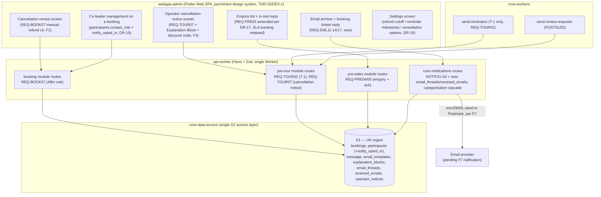

# EML → FOB Admin Reintegration — Gap Analysis & Implementation Architecture

| | |
|---|---|
| **Document** | Reintegration Analysis + Architecture Plan |
| **Date** | 2026-07-25 |
| **Status** | Reliable — findings; PROPOSED — the implementation plan (§6-8). **All five of §5's original ratification items are now resolved: DR-16 (2026-07-25, F1/F2/F3 → Owner-configurable settings, §5a) and DR-17/DR-18/DR-19 (2026-07-26, F5/F7/data-model, §5b), all implemented and live-tested in the POC except DR-17/DR-18's propagation into frob-admin-Bacon's own requirement files, which is this document's outstanding instruction to whoever owns that repository.** |
| **Compares** | This project's `B-documentation/EML.md` v0.11, `Data_Dictionary.md` v0.7, `Architecture_Allocation.md` v0.7, `C-prototyping/POC-e2e-fullstack-2026-07-25/` (DR-1..DR-15) **against** `/Users/will/flutterProjects/Exercises/26July/017-frob-dev-v1/ROME_framework/frob-admin-Bacon/ARTIFACTS/_requirements/*.yaml` (78 REQs) and `ARTIFACTS/_design/{architecture,architecture-impact-brief,data-dictionary,api-contracts,requirements-coverage}.md` (P3 Design, PROPOSED, rev 2) |

## 0. Headline

EML was built as if it were a standalone module. It isn't — it's the email-shaped slice of a system
(`frob-admin-Bacon`) that already has **78 ratified requirements across 11 modules**, several of
which independently cover the same ground EML covers, sometimes with a **different, already-ratified
business rule**. This is not a "bolt EML on" integration. Three of EML's own decisions (DR-3 reminder
cadence, BR-06 cancellation cutoff, and the EML05/06 split) directly **contradict** decisions frob-admin
already ratified independently (DR-T1, DR-B5, D-TOUR-5). Two of EML's requirements (REQ-EML08,
REQ-EML18) are **redundant** — frob-admin already has a better-specified equivalent. One EML capability
(REQ-EML17, in-tool reply) has **no equivalent and is genuinely new**, but originally sat in tension
with a ratified philosophy (REQ-PRE05: replies happen off-system). And EML's whole tech stack — a
standalone Cloudflare Worker + Ionic/React UI — was a POC vehicle only; the real target is a single Hono
`api-worker` and a Flutter Web `webapp-admin` (parchment design system), per frob-admin's own greenfield,
no-code-reuse rule (DEV-4).

**Update, 2026-07-26 — all open items resolved.** §5's five ratification items are now closed: DR-16
(§5a) turns the cutoff/cadence/remediation conflicts into Owner-configurable settings rather than a
fixed rule; DR-17 (§5b) reverses course on the enquiry-reply tension — in-tool reply now wins over
REQ-PRE05's off-system model, so REQ-EML09 is **not** retired after all; DR-18 (§5b) closes the email
provider question in Cloudflare's favor, retiring Postmark; DR-19 (§5b) retires `co_leaders` in favor
of frob-admin's own `participants` table, plus the one field it was missing. The look-and-feel question
needed no new decision — Track B/Parchment was already frob-admin's ratified plan. Everything except
REQ-EML08/EML05/EML06/EML18's retirements and REQ-PRE05's amendment is implemented and live-tested in
the POC; those four are text edits to `frob-admin-Bacon`'s own requirement files, which is this
document's outstanding instruction, not something performed here.

None of this means EML's work was wasted. The recipient fan-out model (F-18/F-19), the categorisation
cascade (REQ-EML11's 5 steps), the inbound-archive concept (REQ-EML12-14/17), and the live-tested
Cloudflare Email Sending/Routing integration are all genuinely new, validated ground frob-admin didn't
have. The job now is to keep exactly that, retire what's duplicated, and reconcile what conflicts —
with the sponsor deciding the conflicts, not this document.

---

## 1. Method

Read every `REQ-*.yaml` in `frob-admin-Bacon/ARTIFACTS/_requirements/` (78 files) plus its five P3
design docs, and cross-referenced every EML requirement (REQ-EML01–18), decision (DR-1–15), and data
entity against them by **intent**, not just by ID — several collisions were only visible once the actual
`Preconditions`/`Conditions`/`Invariants` text was read, not just the actor/intent line (e.g. REQ-CNA
turned out to be *Consent & Audit*, not *Cancellation*, despite the tempting abbreviation).

---

## 2. Findings — direct conflicts (need sponsor ratification, not a silent pick)

### F1 — Cancellation refund cutoff: 24hr (EML/BR-06) vs 48hr (frob-admin/DR-B5)
- **EML** (REQ-EML03/04, `classifyRefund()` in the POC): ≥24hr before departure → full refund minus
  deposit, computed by the system; <24hr → no refund, rebook offer — a **system-calculated** rule.
- **frob-admin** (REQ-BOOK07, DR-B5, ratified): >48hr before departure → full refund, automatic;
  **within 48hr, there is deliberately no automated calculation at all** — the Owner decides the refund
  amount manually, case-by-case. `REQ-BOOK07`'s own `OpenQuestions` explicitly closes this: *"no
  automated rule; the Owner decides manually, case-by-case."*
- **Why this happened:** EML's BR-06 was authored during this project's own A-gathering phase, in
  isolation, without checking the sibling `booking` module's already-ratified DR-B5. A real Bandy R6
  (independent gate-checker) miss — nothing in EML's own pipeline had visibility into `booking`'s
  Decision Records to catch it.
- **Determination:** **REQ-BOOK07/DR-B5 wins.** It's the earlier, sponsor-ratified rule for the actual
  refund mechanics; EML's BR-06 was never checked against it and has no standing to override it.
  EML's REQ-EML04 (Owner approves cancellation-request) needs to stop computing a refund_kind/amount at
  all inside the 48hr window — it should surface the request to the Owner for a manual figure, matching
  DR-B5, and only auto-confirm the >48hr full-refund case.
- **Needs sponsor sign-off:** yes — this is a business-rule change to EML's spec (not just a doc fix),
  since BR-06 was itself sponsor-ratified within this project's own pipeline (implicitly, via EML.md's
  Reliable status). Flag as a new Decision Record in the *reintegrated* spec, not a silent edit.

### F2 — Reminder cadence: two milestones (EML/DR-3) vs one (frob-admin/DR-T1)
- **EML** (REQ-EML02, DR-3): T-7 and T-24hr, two scheduled reminders per booking.
- **frob-admin** (REQ-TOUR02, DR-T1, ratified): **T-1 only** — "the light cadence decision," with a
  T-0 day-of reminder explicitly removed. `reminders` table has no milestone column beyond the single
  `t_minus_1` value.
- **Compounding factor:** frob-admin's own REQ-TOUR02 still has an **OPEN question** — *"which channels
  should carry the T-1 reminder? Blocked on D-NOTIF-1, tied to D-TOUR-2."* So even the one ratified
  milestone doesn't have a settled channel yet.
- **Determination:** **REQ-TOUR02/DR-T1 wins** on cadence (one milestone, T-1) for the same reason as
  F1 — it's the earlier, sponsor-ratified decision for the actual booking-reminder mechanics. This also
  means **DR-14** (this project's 2026-07-25 decision — a missed T-7/T-24hr check fires on next check
  rather than being skipped) needs to be **re-scoped, not discarded**: the catch-up principle DR-14
  established (never silently skip a missed milestone) is sound and should carry over to the single
  T-1 milestone, but the two-milestone premise it was written against no longer applies.
- **Needs sponsor sign-off:** yes, and it's a chance to close D-NOTIF-1/D-TOUR-2 in the same pass —
  this project's real, tested Cloudflare Email Sending integration is direct evidence for what a
  reminder channel could be (see F6).

### F3 — Cancellation-notice duplication: EML05+EML06 (split, always-full-refund) vs REQ-TOUR07 (unified, remediation-choice)
- **EML** split company-initiated cancellation (REQ-EML05, actor Owner, BR-04: always full refund +
  single-use discount code) from weather-initiated cancellation (REQ-EML06, actor System, BR-08: always
  full refund) as two separate requirements, each independently deciding "always full refund."
- **frob-admin** already has **one** ratified requirement for this: REQ-TOUR07 ("System submits
  cancellation-notice"), triggered whenever "the Owner has cancelled a confirmed booking's tour, for
  reasons such as weather, guide illness, or force majeure" — reason-agnostic — with remediation
  **chosen** as refund/rebook/credit (D-TOUR-5, closed as "choose-your-own remediation"), not
  hard-coded to always-full-refund. It's also explicit that the notice "is sent via every available
  channel given the urgency" — not email-only. The landing entity, `operator_notices`
  (`type`, `old_value`/`new_value`, `remediation_choice`), already exists in the data dictionary.
  REQ-BOOK13 (Owner cancels a departure) explicitly hands per-booking remediation to this same flow.
- **Determination:** **retire REQ-EML05 and REQ-EML06 as separate requirements; fold both into
  REQ-TOUR07.** EML's genuinely useful contribution here is the *content and mechanics* it worked out
  in detail that REQ-TOUR07 doesn't specify: the Explanation Block concept (freeform text, Owner-authored,
  attached to the notice) and the single-use discount-code/voucher issuance tied to the Party Leader
  (F-19: never to a Co-leader). Both should be folded into REQ-TOUR07's implementation as the concrete
  answer to its currently-unspecified "remediation_choice = refund/rebook/credit" content, **not** kept
  as separate requirements that re-decide "always full refund" against D-TOUR-5's actual "choose"
  decision.
- **Needs sponsor sign-off:** yes — REQ-TOUR07 currently has no `Explanation Block`/discount-code
  concept in its spec; adding them is new scope on top of an already-ratified requirement.

### F4 — Review-request duplication: REQ-EML08 vs REQ-POST01+REQ-POST02
- **EML** (REQ-EML08): "sent shortly after the tour, once per Booking," generic thank-you + review
  invitation, no platform or timing specifics.
- **frob-admin** already has this fully specified, in more detail, as **two** requirements: REQ-POST01
  (thank-you, configurable delay, default T+12h, review link + private-feedback link) and REQ-POST02
  (review-request, T+24h, TripAdvisor **and** Google links, private-feedback shown with equal visual
  weight). Both correctly exclude no-show and operator-cancelled bookings — an exclusion REQ-EML08
  never considered.
- **Determination:** **retire REQ-EML08 entirely.** It adds nothing REQ-POST01/02 don't already cover,
  and is strictly less specified. No sponsor decision needed here beyond confirming the retirement —
  this is a clean subsumption, not a conflict to arbitrate.

### F5 — Enquiry-reply model mismatch: in-tool authored email (EML09) vs off-system, any-channel (REQ-PRE05)
- **EML** (REQ-EML09): Owner composes and sends a reply *inside the admin tool*, implicitly by email,
  which marks the Enquiry `replied`.
- **frob-admin** (REQ-PRE05, ratified): the reply happens **off-system**, "via the prospect's stated
  preferred channel, not the Owner's choice" (which may be phone, WhatsApp, or email — REQ-PRE04 allows
  all three). REQ-PRE05's own scope is explicit: *"Automating the reply content itself"* and the reply
  itself are **out of scope** — the admin tool only marks the enquiry `responded` and tracks
  on-time/overdue against an SLA (`sla_due_at`).
- **Determination:** this is a genuine model conflict, not a duplication — EML-09 assumes something
  REQ-PRE05 explicitly says isn't how it works. **Recommend**: keep REQ-PRE05's off-system model as
  authoritative for *pre-booking* enquiries (it already handles multi-channel correctly, which EML-09
  never did), and retire EML-09's "compose and send in-tool" behavior for the enquiry stage. The
  Owner-facing "mark responded" surface REQ-PRE05 already describes is sufficient; no new requirement
  needed.
- **Needs sponsor sign-off:** yes, in principle, but the sponsor already ratified REQ-PRE05 before this
  project existed — the honest framing is "EML-09 was authored without checking REQ-PRE05, and
  REQ-PRE05 wins," not "these are equally valid, pick one."
- **RATIFIED 2026-07-26 — DR-17 (see §5b): reversed.** The sponsor has since directed that the
  in-tool, admin-composed reply (EML-09's model) takes precedence over REQ-PRE05's off-system model,
  for enquiries as well as booking-linked threads. See §5b for the full ratification and its impact
  on REQ-PRE05.

### F6 — Enquiry auto-acknowledgement duplication: REQ-EML18/DR-15 vs REQ-PRE04's existing acknowledgement
- **EML** (REQ-EML18, this project's own DR-15, ratified 2026-07-25): an Owner-controlled toggle that
  sends a generic holding acknowledgement to the Prospect when an Enquiry is recorded.
- **frob-admin** (REQ-PRE04, already ratified): submitting an enquiry **already, unconditionally**
  produces a Prospect-facing acknowledgement as a postcondition — *"Prospect sees an acknowledgement
  stating the response-time target"* — which is strictly better than EML-18's generic message (it states
  a concrete SLA, not just "we got it").
- **Determination:** **retire REQ-EML18 and DR-15's toggle entirely.** This was a real, defensible
  finding when raised in isolation (D-EML-5 was a genuine gap *inside EML's own scope*), but reintegration
  reveals the parent system already closed the actual gap, better, unconditionally, no toggle needed.
  This is the clearest single case in this whole analysis of doing real, valuable analysis inside a
  module that turns out to be moot once the module rejoins its parent system — worth remembering as a
  process lesson: **an isolated module's "gap" can be a false positive if the surrounding system was
  never consulted.**
- **Needs sponsor sign-off:** no — REQ-PRE04 already covers the outcome; this is a clean retirement.

---

## 3. Findings — genuinely new scope (no frob-admin equivalent, reintegrates cleanly)

- **Inbound email capture + categorisation cascade** (REQ-EML11/12/13/14, the 5-step cascade:
  reply-reference → thread inheritance → reference-extraction → sender-lookup → fallback). Nothing in
  frob-admin models an inbound-message archive at all — `enquiries` is a single status-tracked record,
  not a searchable thread archive. This is real, validated new capability (tested against real Cloudflare
  Email Routing this session) and should reintegrate as new entities (`email_threads`, `received_emails`)
  under `core-notifications`.
- **In-tool reply to a booking-linked thread** (REQ-EML17, DR-13) — tested live, genuinely new. Sits in
  tension with REQ-PRE05's "off-system" philosophy (F5 above), but the tension resolves cleanly by
  scope: REQ-PRE05 governs *pre-booking* enquiries (multi-channel, off-system); REQ-EML17 is
  specifically *post-booking, already-linked-to-a-thread* correspondence, which REQ-PRE05 never claims
  to cover (its scope is enquiries, not booking-linked threads). **Recommend keeping REQ-EML17 as
  ratified**, with its scope boundary made explicit against REQ-PRE05 so a future reader doesn't see it
  as a contradiction: enquiry replies stay off-system/any-channel; booking-linked thread replies stay
  in-tool/email, because the Owner explicitly asked for this exact capability and it was tested live.
- **Recipient fan-out model, F-18/F-19** — the *principle* (Party Leader + opted-in Co-leaders, Co-leader
  has no agency) is sound and has no frob-admin equivalent as a *behavior*, but the *storage* needs
  reconciling (see §4).
- **Real Cloudflare Email Sending/Routing integration** — genuinely new evidence, not yet reflected in
  frob-admin's architecture (see F7 below).

---

## 4. Data model reconciliation

| EML entity (this project) | frob-admin equivalent | Determination |
|---|---|---|
| `sent_emails` (id, template_id, booking_id, use_case, recipients, content_rendered, delivery_status, delivery_error) | `message` (id, message_type, recipient, event, idempotency_key, provider, provider_ref, status) — `core-notifications` | **`sent_emails` retires as a send-log.** Every EML trigger should call the shared `send()`/NOTIF01 path and let `message` be the one send-log + idempotency + delivery-status record, matching frob-admin's `no table written by more than one module` rule. `template_id`/`content_rendered`/`explanation_block_id` don't fit `message`'s generic shape — see next row. |
| `email_templates`, `explanation_blocks` | *(none)* | **Keep, EML-owned, genuinely new.** `message` has no concept of a template or an authored explanation block. These stay as `core-notifications` (or a new `email-content` sub-module) entities that *assemble* content, then hand off to the shared `send()` for actual dispatch/logging — content-assembly and delivery-logging are different concerns and frob-admin already separates them (assembly lives in whichever module owns the trigger; delivery lives in NOTIF). |
| `co_leaders` (id, booking_id, name, email, opted_in) | `participants` (id, booking_id, name, age_band, **contact_role** enum `leader`\|`co-leader`\|`attendee`, DR-B12a) | **RATIFIED 2026-07-26 — DR-19 (§5b): retired `co_leaders`, extended `participants`.** Implemented and live-tested in the POC (not just proposed): `co_leaders` is dropped; a unified `participants` table carries every booking's people, one row per person, `contact_role` (`leader`\|`co-leader`) plus the missing field this reconciliation surfaced — `notify_opted_in` (meaningful only for `co-leader`; a `leader` is always notified). `resolveRecipients()` and the co-leader CRUD endpoints were repointed at it; the API shape the frontend consumes was kept identical, so no frontend changes were needed. This is a small, additive change to frob-admin's already-ratified table+enum (DR-B12a), not a redesign of it. |
| `email_threads`, `received_emails` | *(none)* | **Keep, EML-owned, genuinely new** — see §3. Natural home: a new `core-notifications` sub-area, since inbound capture is a notifications concern, not a booking one. |
| `notification_settings` (single-row toggle) | *(none — and no longer needed, F6)* | **Drop entirely.** Existed only to gate REQ-EML18, which is retired. |
| `cancellation_requests` (EML POC stand-in for the real `bookings`/`payments` cancellation flow) | `bookings.status`, `payments.refund_amount_pence`, REQ-BOOK07's actual cancel endpoint | Already correctly scoped as *out of EML's ownership* in this project's own Module_Map — no change needed, just confirming REQ-BOOK07 (not a new EML table) is where this actually lives. |

---

## 5. Decisions requiring explicit sponsor ratification before reintegration proceeds

These cannot be resolved by this analysis alone — each changes or supersedes a decision either project's
sponsor already ratified:

1. **F1** — confirm REQ-BOOK07/DR-B5's 48hr/manual-within-window rule supersedes EML's BR-06/24hr rule,
   and that REQ-EML04 (cancellation approval) is amended to stop auto-computing a refund inside 48hr.
2. **F2** — confirm REQ-TOUR02/DR-T1's single T-1 milestone supersedes EML's two-milestone DR-3 cadence,
   and re-scope DR-14's catch-up principle to the single milestone. This is also the moment to close
   D-NOTIF-1/D-TOUR-2 (reminder channel) — recommend closing it as **email**, given this project's
   live-tested Cloudflare Email Sending integration (see F7).
3. **F3** — confirm REQ-EML05/EML06 retire in favor of REQ-TOUR07, and approve folding the Explanation
   Block + single-use discount-code mechanics into REQ-TOUR07's remediation-choice implementation.
4. **F5 — RATIFIED 2026-07-26 as DR-17, reversed (§5b):** in-tool reply now takes precedence over
   REQ-PRE05's off-system model, for enquiries as well as booking-linked threads.
5. **F7 — RATIFIED 2026-07-26 as DR-18, closed (§5b):** Cloudflare Email Sending/Routing supersedes
   Postmark; TDR-09/D-NOTIF-2 are closed.

### F7 — Email provider: Cloudflare Email Sending/Routing (tested) vs Postmark (ratified, TDR-09)
frob-admin's architecture explicitly names Postmark as the interim provider (TDR-09) and explicitly
records that an earlier PoC's use of Resend was **rejected** in favor of Postmark. D-NOTIF-2 is open:
*"Postmark is interim; a Cloudflare-native email path may supersede."* This project independently
built and **live-tested** real Cloudflare Email Sending (verified domain, real delivery to
gilespaulton@yahoo.com) and real Cloudflare Email Routing (real inbound capture, `poc-test@friendsonbikes.uk`).
This is exactly the kind of evidence D-NOTIF-2 was left open to wait for. **Recommend surfacing this
project's `CLOUDFLARE-ARCHITECTURE.md` to the sponsor as direct input to closing D-NOTIF-2** — not as
an automatic decision (Postmark is still the currently-binding choice, TDR-09, and switching providers
has cost/migration implications beyond this analysis's scope), but as real-world validation that the
Cloudflare-native alternative works, which didn't exist before this session.
- **RATIFIED 2026-07-26 — DR-18 (see §5b): closed.** The sponsor has directed Cloudflare Email
  Sending/Routing over Postmark. TDR-09/D-NOTIF-2 are superseded — see §5b.

---

## 5a. DR-16 — F1/F2/F3 become Owner-configurable settings, not a single fixed rule

**Ratified 2026-07-25**, superseding the "pick one side" framing §5 originally gave F1/F2/F3. Rather
than the sponsor choosing EML's rule *or* frob-admin's rule for the refund cutoff, reminder cadence,
and cancellation remediation, all three become settings the Owner can change from a Settings screen,
with frob-admin's already-ratified values (48hr, T-1 only, refund/rebook/credit all offered) as the
shipped defaults — not hardcoded constants baked into either module's code.

| Finding | Setting | Default (frob-admin's ratified value) |
|---|---|---|
| F1 (refund cutoff) | `refund_cutoff_hours` — hours before departure above which a full refund is automatic; below it, no calculation, Owner enters the amount | 48 |
| F2 (reminder cadence) | `reminder_milestones` — which milestones (T-7, T-24hr, T-1) get a reminder | `["t_minus_1"]` |
| F3 (cancellation remediation) | `cancellation_remediation_options` — which of refund/rebook/credit can be offered when the Owner cancels on the business's behalf | all three enabled |

**Why this is the better resolution than picking one side:** F1/F2/F3 were never really "which team's
number is correct" — they're genuine business policy that a real Owner may reasonably want to tune
(a different cutoff for a slower season, a lighter or heavier reminder cadence, restricting remediation
to just refunds for a while). Hardcoding either project's number would just relocate the same disagreement
into code instead of resolving it. A setting resolves it structurally: whichever number is right today,
the Owner can change it without a code change tomorrow.

**Implemented and live-tested** in `POC-e2e-fullstack-2026-07-25` (not just designed): a new Settings
screen exposes all three, backed by a single `notification_settings` row (extended with three new
columns rather than a new table, keeping the earlier DR-15 pattern rather than duplicating it). Verified
live against the deployed Worker: approving a cancellation inside the configured cutoff is now blocked
until the Owner supplies a manual refund figure; a cancellation-remediation type not currently enabled
in Settings is rejected server-side, not just hidden in the UI. This confirms the *mechanism* (a
settings-gated business rule, not a hardcoded one) works end to end — the specific default values above
still need the sponsor's confirmation per §5, since they're frob-admin's ratified numbers, not
independently re-derived here.

**Reintegration note:** in the target architecture (§6), this settings row belongs wherever frob-admin
puts Owner-configurable operational policy — likely `back-office` (BO), since it's Owner-facing
configuration rather than a `core-notifications` concern specifically. The three settings above are a
starting set, not a closed one — the Settings screen and its backing row are designed so a future
refinement (a new configurable threshold, a new toggle) is an additive column and a new form field, not
a new table or a new screen.

---

## 5b. DR-17, DR-18, DR-19 — sponsor ratifications, 2026-07-26

Three of §5's open items were ratified in a single follow-up round. Recorded here as the standing
decisions; §2's F5/F7 and §4's `co_leaders` row above are cross-referenced to point back to this section
rather than restating it.

### DR-17 · In-tool enquiry reply takes precedence over REQ-PRE05's off-system model
**Reverses F5's recommendation.** The Owner directed that the admin-tool-composed reply (EML-09's
model) governs, not REQ-PRE05's "off-system, prospect's preferred channel" model — for enquiries as
well as for booking-linked threads (REQ-EML17, which was never in question). **Impact on REQ-PRE05:**
its `Postconditions`/`Outcomes`/`ScopeBoundary` need amending — "the reply itself happens off-system" is
no longer accurate; the admin tool becomes the place a reply is authored and sent, at least for the
email channel. REQ-PRE04's phone/WhatsApp channel options are unaffected by this — DR-17 governs how an
*email* reply happens, not the prospect's initial channel choice; a phone/WhatsApp-preferring prospect
still gets contacted that way, off-system. **Not yet propagated into `frob-admin-Bacon`'s own REQ-PRE05
file** — this record is the instruction to do so; it hasn't been edited as part of this analysis (that
edit belongs to whoever owns that repository, not this project).

### DR-18 · Cloudflare Email Sending/Routing supersedes Postmark
**Closes D-NOTIF-2, supersedes TDR-09.** Following F7's evidence (this project's real, live-tested
Cloudflare Email Sending + Email Routing integration — see `CLOUDFLARE-ARCHITECTURE.md`), the Owner has
directed Cloudflare's own service over Postmark for the real build. **Impact:** `architecture.md`'s
vendor table drops Postmark; `NOTIF01`'s `internal send(message)` implementation targets Cloudflare
Email Sending instead; the "PoC's Resend explicitly not used" note in `architecture-impact-brief.md`
should be revisited too — that rejection was specifically Resend-vs-Postmark, made before a
Cloudflare-native option had been validated at all. Domain verification (SPF/DKIM/DMARC, bounce
subdomain) and the `remote: true` binding pattern this project validated transfer directly as the
concrete "how" for whoever implements this in `api-worker`.

### DR-19 · `co_leaders` retires; `participants` gains `notify_opted_in`
Covered in full in §4's updated table — recorded here for completeness of the 2026-07-26 ratification
round. Implemented and live-tested in the POC, not just proposed.

### Look and feel — Track B (Parchment) confirmed as the target, no new decision needed
The Owner asked that the reintegrated build use the main system's actual look and feel. This was
already frob-admin's own ratified plan (DEV-1/TDR-15: `webapp-admin` renders Track B — Parchment
neutrals, pink/lime/cyan/orange status accents, Playfair Display for titles/money, Plus Jakarta Sans for
functional text — as a full Flutter Web SPA), not a new decision this analysis needed to make. Nothing
in this project's own POC changes what gets built — the POC's screens stay a usability-testing
reference for *behavior* (what each screen needs to let the Owner do), consistent with §6 below; the
actual visual implementation is Flutter, built once, directly against the Track B tokens already
specified in `design-system.md` §8.

---

## 6. Target architecture (post-reintegration)

Per frob-admin's own binding rules (DEV-4 greenfield, TDR-01/02/03/13), **none of the POC's own
Cloudflare Worker code, standalone D1 database, or React/Ionic frontend carries over as code.** Only
the validated *behavior* and *decisions* transfer. The POC's actual deliverable was proof the design
works, not a deployable artifact — consistent with how this project's own `TC_*.md` disposal notes have
described every prototype in this session.

**What this changes vs. the POC:**
- One Worker, not a standalone `fob-e2e-poc` deployment — EML's routes become Hono handlers inside
  `api-worker`, sharing `core-data-access`'s migration runner instead of `wrangler d1 execute` run by
  hand.
- One D1 database (UK region), not a separate `fob-e2e-poc` D1 instance.
- Flutter Web (parchment tokens), not React/Ionic — the POC's UI was explicitly a usability-testing
  vehicle (per this project's own `TC_e2e-fullstack_2026-07-25.md`), never a candidate for the real
  `webapp-admin` codebase, consistent with DEV-4's no-code-reuse rule.
- Sends flow through the shared `message`/NOTIF01 path, not a bespoke `sent_emails` table.

---

## 7. Phased implementation plan

**Phase 0 — Ratification (blocking).** Take §5's five items to the sponsor. Nothing in Phase 1+ should
start until F1/F2/F3/F5/F7 have a ruling — several change what gets built, not just how.

**Phase 1 — Data Dictionary amendment (frob-admin side).**
- Add `notify_opted_in` to `participants` (§4), governed by an amendment to DR-B12a, not a new table.
- Add `email_templates`, `explanation_blocks`, `email_threads`, `received_emails` as new `core-notifications`-owned entities.
- Amend `operator_notices` (or its owning REQ-TOUR07) to model the Explanation Block reference and
  discount-code/voucher fields folded in from retired REQ-EML05/06 (F3).
- Retire `notification_settings` from consideration entirely (F6) — never gets authored upstream.

**Phase 2 — Requirements amendment (frob-admin side, AORDL format matching the existing 78).**
- Amend REQ-BOOK07: no change needed to its own text (it already states the rule correctly) — the
  change is entirely on the EML side, retiring BR-06/REQ-EML04's auto-calculation.
- Amend REQ-TOUR02: same — no change to REQ-TOUR02 itself; DR-14's catch-up principle gets re-authored
  against T-1 only, likely as a small addendum to REQ-TOUR02 or a new D-TOUR item.
- Amend REQ-TOUR07: add the Explanation Block + discount-code mechanics as new `Conditions`/`Postconditions`
  content (F3).
- Author genuinely new requirements (in frob-admin's own AORDL/YAML format, under a sensible module —
  likely `core-notifications` or a new `email-archive` sub-scope) for: inbound capture + categorisation
  (REQ-EML11-14's territory) and booking-linked thread reply (REQ-EML17's territory).
- Amend REQ-PRE05 per DR-17 (§5b): its off-system model no longer holds for the email channel — the
  reply is now authored and sent from the admin tool, same mechanism as REQ-EML17. REQ-PRE04's
  phone/WhatsApp channel options are unaffected.
- Amend `architecture.md`/`architecture-impact-brief.md`'s vendor table and NOTIF01's implementation
  per DR-18 (§5b): Postmark → Cloudflare Email Sending/Routing.
- Formally retire REQ-EML05, REQ-EML06, REQ-EML08, REQ-EML18 — each retirement recorded with a
  rationale pointer back to this document, the same way this project's own `_archive/` pattern retains
  superseded docs for audit rather than deleting history. (REQ-EML09 is **not** retired — DR-17 keeps
  its in-tool-reply behavior, now extended to cover the enquiry stage too.)

**Phase 3 — API-worker implementation (frob-admin's own P4/P5).**
- Hono routes for the two new requirements, sharing `core-data-access`.
- Wire the categorisation cascade and inbound capture as real code inside `api-worker`'s `email()`-equivalent
  handler (Cloudflare Email Routing invokes whichever Worker owns the account's routing rule — there is
  only one Worker now, so no separate deployment question).
- Wire outbound sends through whichever provider F7 lands on.

**Phase 4 — webapp-admin (Flutter) screens.**
- Build the archive/reply screens fresh in Flutter against the parchment design system — the POC's
  screen *behavior* (what each screen needs to let the Owner do, which fields, which validations) is
  directly reusable as a spec input; none of its Ionic component code is.

**Phase 5 — Re-verify.** Once built, re-run this project's life-cycle scenarios (§`ScenariosScreen.tsx`
in the POC) as manual/exploratory test scripts against the real `webapp-admin` + `api-worker`, since they
already encode the real-world situations worth checking (enquiry→booking→cancellation→refund,
late-cancellation, weather/company cancellation, co-leader opt-out, two-way exchange) — adjusted for
whatever F1/F2/F3 ratification changed (48hr not 24hr, T-1 not T-7/T-24hr, unified cancellation-notice
not a split).

---

## 8. What this means for this project's own documents

This project's `EML.md`/`Data_Dictionary.md`/`Architecture_Allocation.md` stay as the historical record
of how EML was analyzed and POC'd — **not retroactively rewritten**, per this project's own R7
(project log / archive-don't-delete convention). This document is the bridge: it records what
reintegration determined, and any future edit to `EML.md` for reintegration purposes should cite this
document as its source, the same way DR-13/14/15 cited the POC's own testing. If the sponsor wants this
project's own EML.md formally amended to reflect the retirements (F3/F4/F6) and rule changes (F1/F2)
rather than left as-is for history, that's a follow-on request — this document doesn't do that
unprompted, consistent with not editing more than what's been asked.
